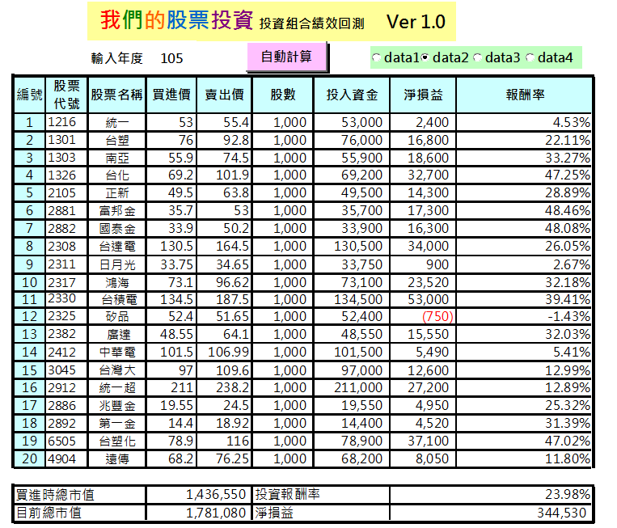

# 精選20 的買賣操作

多數人都想輕鬆投資,又有超額的報酬率。本人可沒這麼天真,也不這樣期待...
真正獲得高額報酬率多數屬於集中投資類型的人們,但需要花費相當的時間,研究分析個股,且要具備承受股價波動風險的能耐。只有極少數的人做的到!

用巴菲特的話來說：「我不會想要跳過七呎高的欄杆，我會找周圍有沒有我可以跨過去的一呎高欄杆。」

以分散在不同個股來取代集中投資所需要的專業分析能力。我認為分散投資比較適合多數人,投資風險較低...並且將投資報酬率目標設定在10%~15%範圍應屬合理。

良好的投資標的+合理的價格(或便宜的價格)+持有的時間
就會形成一筆好的投資!

不管買股票或是ETF 絕不能隨時買,因為價格偏高的後果經常讓投資人蒙受損失。千萬不要叫人台股萬點買股票啊!

##誰適合買精選20 ?

我們了解精選20各買一張股票需要的金額約在140萬元左右。對多數小資族而言偏高!因此我認為可投資股票金額在300萬元以下者,投資0050ETF就好。

可是300萬不是可以買兩次投資組合?為什麼勸人不要買。那是因為每個人風險承受能力不一,我們必須假設多數人害怕虧損,抗壓性不夠,避免有人因我們而受傷。簡單的說,資金越少者買0050ETF是比較安全的投資選擇。

回想一下,之前投資個股看到利空新聞會緊張到處尋求答案,甚至找人認同或背書。這類型投資人,本人強烈建議買0050ETF就好,否則20檔個股在未來也可能遇到利空新聞,豈不緊張兮兮,不知所措!

個股是否值得投資?在於對它的過去與現在的營運是否信任,且價格不貴的前提下。因此要堅信這些藍籌股未來長期表現優於市場水準才適合買精選20。

##如何買 ; 賣?
前面幾篇文章提到年初買,年底買 或年初&特定指數位置買,年底賣。從回測結果觀察 精選20 的十年期報酬率10~15%,0050ETF約5.7~9.6%。這樣符合我們的預期,也就是說投資組合的績效多數時刻高於市場報酬率。

但這20檔個股未必可以讓每個人認同?因此製作回測檔案給需要的投資人自行回測參考!

如果討厭原物料景氣循環股,可以刪除台塑,南亞,台化,台塑化 等於只剩下16檔投資組合,報酬率仍在10~15%的範圍並沒有變差。

如果討厭金融股,可以刪除國泰金,富邦金,兆豐金,第一金 也是剩下16檔投資組合,報酬率則略升到 11.23~17.38%。

或者自行組合認同的個股,但盡量不要少於12檔,否則失去分散的意義。

巴大講的這些回測結果我們都知道,但難道就這樣 年初買,年底買 或年初&特定指數位置買,年底賣。不必再參考個股股價位置嗎?

回答這個問題前,請再看一次。`<智慧型股票投資人 98頁的內容>對於個股型投資人而言保持適當的價格安全邊際是需要的`。但我又不想讓買進操作過於複雜。因此我的做法是.....

1.年初&特定指數位置買(例如 指數位置8300點)

2.個股市價不得高於上個年度的收盤平均價,若高於則該年度不買。
兩條件皆需符合才買入。

如此一來有可能每年買到的個股數量不一。

那實際操作需要年底賣嗎?
如果是<標準>的年初買,年底賣 且個股經過一年後營運也在預期內,確實可以繼續持有不賣。

如果是<進階>的年初&特定指數位置買,則年底一律賣出。除非年底指數低於買進時的特定指數位置才不需要賣出。

我們了解<進階>買賣法的投資績效勝過不看指數位置的固定時間買賣方式。這就是保持價格安全邊際帶來的好處。

如果你是精明又有智慧的投資者,可以用你習慣的買賣方式,創造更高的收益。相信網路上投資高手眾多,不用我代勞~

投資者的預期報酬,應該取決於他們願意且能夠付出的努力與智慧。如果是以安全為重，不想花太多心思的消極投資者,他們理應得到最低的報酬;至於那些精明又有智慧的投資者,由於他們拿出最大的智慧與技巧,因此理應得到最高的報酬。 ----- 智慧型股票投資人 98頁的內容