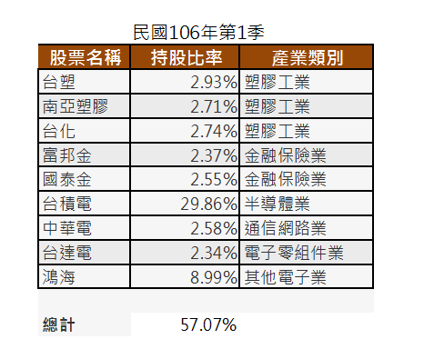
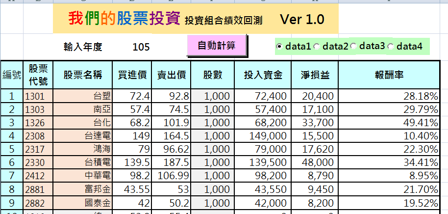
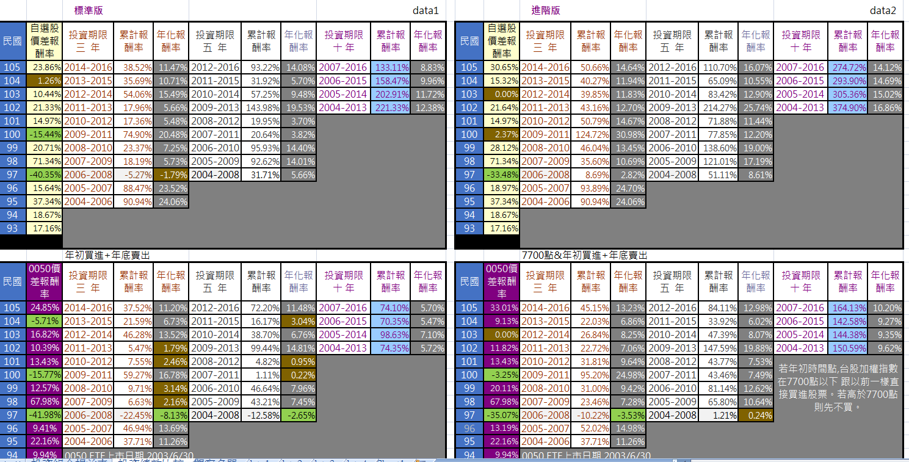

# 精選ETF 組合方式

昨日提過有27檔0050成份股從未被剔除!剛好前10大持股中有9檔符合這樣的資格,而且持股比率高達57.07%
今晚就把9檔個股組合起來做一個過去13年的績效回測。
可以發現 投資時間三年,五年,十年 皆贏過0050整體績效。
如果不喜歡0050持有太多拖累0050長期績效的個股,倒是可以考慮這個投資組合。呵呵...
綠色代表報酬率為負 ; 棕色代表報酬率低於5%
.
.

巴小智 2017.5.7

