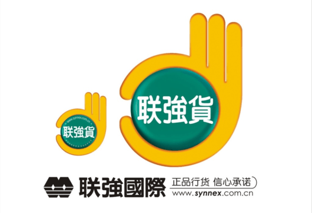
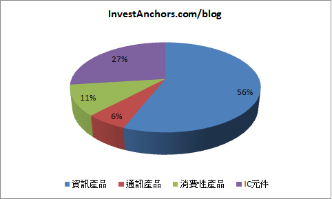

# 聯強(2347)：2016Q4財報簡評

##營收結構

)
產品別營收：主要分為資訊產)品、通訊產品、消費性產品、IC元件四大類別，資訊產品包括Consumer PC、Commercial PC、DIY Component、PC Peripherals；通訊產品主要是Smart Phone；消費性產品包括Tablet、Gaming；IC元件目前以Panel、IOT元件為主。

財報簡評

###1. 2016Q4營收906.43億元，QoQ -0.4%、YoY -3.8%，營業毛利35.05億元 (GM=3.87%)，營業利益13.48億元 (OPM=1.49%)，歸屬母公司稅後淨利13.25億元，EPS 0.79元，符合預期。

儘管資訊產品、通訊產品營收仍維持成長，但消費性電子、IC元件營收衰退幅度較大，拖累整體營收動能能。
2016Q2~Q3，因通路產業低價產品庫存堆積過多，廠商降價打銷庫存，連帶也影響到高階產品的價格區間，導致毛利率大幅下滑；在2016Q3季末，庫存堆積的問題已大致去化，故毛利率在2016Q4明顯回升。
因新台幣匯率相對人民幣仍較強勢，故2016Q4仍有匯兌損失2.6億元，租金收入減少至7,900萬元，但預期未來還是能維持每年5~6億元的貢獻度。

####2. 2016年營收3,426.96億元，YoY +6.4%，營業毛利121.31億元 (GM=3.54%)，營業利益42.69億元 (OPM=1.25%)，歸屬母公司稅後淨利48.76億元，EPS 2.92元，符合預期。

資訊產品營收YoY +9.6%，儘管PC產業持續衰退，但聯強專注在成長性較佳的產品線，如2-in-1 NB、Gaming、Data Center，故營收仍維持成長。
通訊產品營收YoY 14.8%，高階產品線越來越齊全，帶動營收成長。
消費性電子營收YoY -6.8%，受到Tablet、Xbox出貨量大幅衰退影響，整體動能較疲乏，但其他產品如Wearable、無人機，成長性仍不錯。
IC元件營收YoY +4.1%，儘管前三季表現不錯，但2016Q4受到Panel、DRAM、NAND Flash缺貨影響，拖累全年表現。預期Panel、DRAM供需失衡，在2017H2將獲得緩解，但NAND Flash仍會較吃緊。
2016年業外轉投資獲利達14.4億元，主要是美國子公司BPO (Business Process Out-soursing) 業務，在2016年大量換約，挹注營收成長動能。

###3. 董事會決議每股配發現金股利1元，配發率僅34%，遠低於市場預期。

海外事業體在年底都要進行評價，若因匯率變動導致資產價值減損，則需提列特別盈餘公積，這部份不得納入盈餘分配。
以2016年來看，本期稅後淨利48.76億元，扣除法定盈餘公積10%，以及特別盈餘公積27.1億元，則本期可分配盈餘16.78億元，在經過董事會討論後，決議全額配發，也就是每股現金股利1元。
若未來新台幣匯率走弱，海外事業體資產評價回升，則可回沖特別盈餘公積，並參與盈餘分配，有可能發生可分配盈餘高於當期盈餘的情況。
2016年增資Synnex Global Ltd. (掌管聯強海外事業體之控股公司)，主要是調整海外事業體資本結構，將借墊款轉作資本，以降低匯率波動對損益表的影響，並無實質現金流出。
過去累積未分配盈餘約32億元，考量公司仍積極尋找併購機會，並未拿來配發現金股利。

###4. 預期2017年營收仍將穩健成長，營業利益率將回升至較正常的水準，若沒有其他因素干擾，獲利成長率應能大於營收。

受惠於神州數碼分拆IT Distribution業務給深信泰豐，新公司的財務結構遠不如前，原廠及銀行團都頗有疑慮，加上地區性小型通路商逐漸退出市場，聯強在2016年得以擴張市佔率，中國地區營收YoY +10%，這項趨勢將延續至2017年。
海航集團併購全球最大IT Distribution公司Ingram Micro，目前已完成交割，初步看來並沒有大幅改變營運策略，2017年產業秩序應不會出現劇烈變動。
2017Q1營收會稍微偏弱，但2017Q2~Q3，隨著資訊產品、通訊產品都有新機種推出，營收動能會轉強，2017Q4目前還不明朗。
考量IOT在工業領域的應用逐漸成熟，但消費性領域尚未找到獲利模式，故未來會從工業領域優先開始拓展IOT產品線。
2016年推出之Cloud Service，將持續拓展品牌客戶，Commercial PC營收將持續成長。