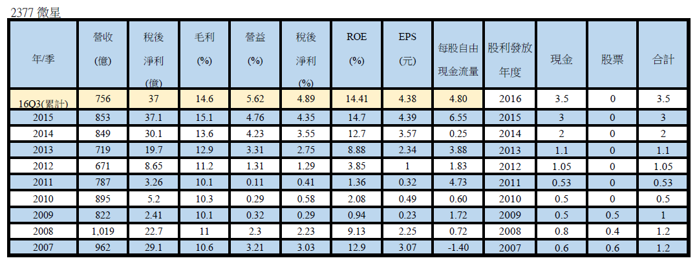
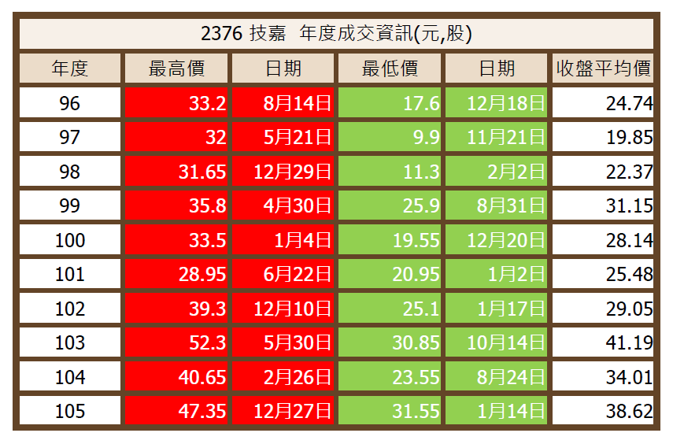

# 兩檔股票內挑選一檔投資

如果這兩檔股票內挑選一檔投資,你會選哪一家?
2376技嘉 VS 2377微星
微星為國內前四大主機板廠，競爭對手包括華碩 （2357） 、技嘉 （2376） 、華擎 （3515） 等，主要產品以MB、VGA、NB 以及系統產品為主。銷售地區區分，歐洲佔約30％、亞洲佔比重最高，約45％、美洲約20~25％、其他地區0~5％。公司於2010年即著手研發電競相關產品，為國內最早布局電競NB的廠商之一，2016年產品佔營收比重分別為：主機板（MB）23％、VGA 27％、電競NB 28％、一般NB 6％、系統及其他16％。
好友詢問為什麼2377微星股價漲這麼高啊? 因為他在99年度買在18元當時樂觀告訴我,他說要長期投資!問他為什麼買微星而不買技嘉,好友回答說微星價格較低。他可以買較多張股票。
隨著時間的流逝,來到102年度整整抱了三年,他非常生氣的告訴我 微星真爛! 最後賣在16元。買了20幾張股票就這麼結束投資,聽說沒甚麼賠錢,因為有發股利的關係。
我也蠻好奇微星的股價怎麼這麼高?印象中技嘉長期以來多數時候優於微星。因為28年前我在主機板廠工作的主機板廠排名就是如此。當時這兩家公司還沒上市.但已經成立。
稍微整理了一下發現微星近三年ROE爬上10%以上關卡,跟之前年度的營運表現有天壤之別。屬於轉型成功的股票。而技嘉過去十年則呈現相對穩健的獲利紀錄。
問題來了,目前微星營運正好,股價也站上過去十年高檔區。我猜微星應該是佈局電競桌電,筆電成功導致獲利大增。不過這並沒有很高的技術門檻,技嘉早晚會追上。
多數人看到會漲的股票很興奮!這種股票多數處於營運正好階段,但能好多久?就需要對這個產業更進一步的分析。不過以我的投資屬性,比較偏愛股利發放穩健的技嘉。只要買在25-30元 退可領股利;進可賺價差。
也不會想花時間去了解微星的營運優勢可以撐多久?是不是買高賣更高?因為這不是我的能力範圍可以理解的事。呵呵...
不過網友可以針對這兩檔股票提出你的觀點,不必理會我。歡迎參與討論!!
PS:2376技嘉的圖表不完整,刪除!重新PO在留言內。

