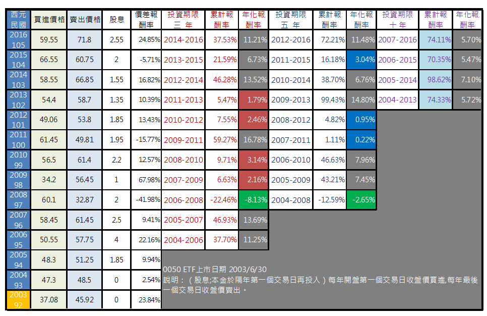
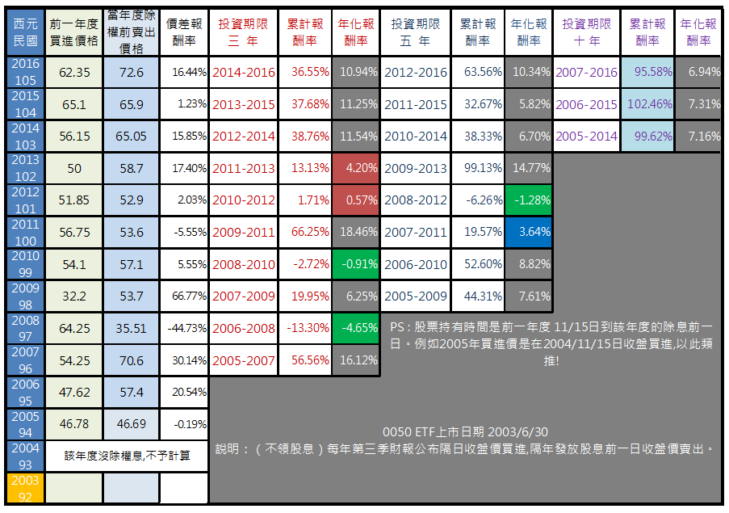

# 如何回測投資績效

不少網友私訊問我如何回測投資績效,因為不同的觀察時間可能會產生完全相反的結論。
請大家放心這些細節我都知道,也會謹慎評論!
下面是0050 ETF 不同時間進出產生的投資績效差異。參考看看...
還是照原定計畫將在五月初推出一系列投資組合完整說明。當作送給大家的一份禮物~
一 .
0050 ETF上市日期 2003/6/30 說明：（股息;本金於隔年第一個交易日再投入）每年開盤第一個交易日收盤價買進,每年最後一個交易日收盤價賣出。
二 .
0050 ETF上市日期 2003/6/30 說明：（不領股息）每年第三季財報公布隔日收盤價買進,隔年發放股息前一日收盤價賣出。
PS : 股票持有時間是前一年度 11/15日到該年度的除息前一日。例如2005年買進價是在2004/11/15日收盤買進,以此類推!

