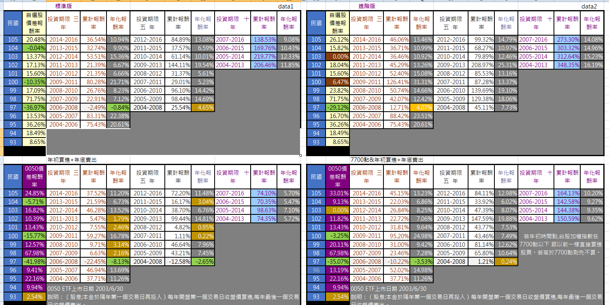

# 找出0050長期表現一直良好的公司來投資

下面這張圖表就是從0050成立至今一直留在成份股內的股票,營運良好的大型股他們的投資績效。

不管是傻傻年初買,年底賣 或 設定一個指數才買。都超過0050ETF 的報酬率。

這就是找出0050長期表現一直良好的公司來投資。多數時候他們的報酬率將高於整體0050ETF的報酬率,

至少過去14年是如此。

特別說明,絕對沒有任何股本低於100億的高股價公司。因為只需大型權值股就夠打敗0050

不管三,五,十年 期間 都是上面的自選股勝出!

