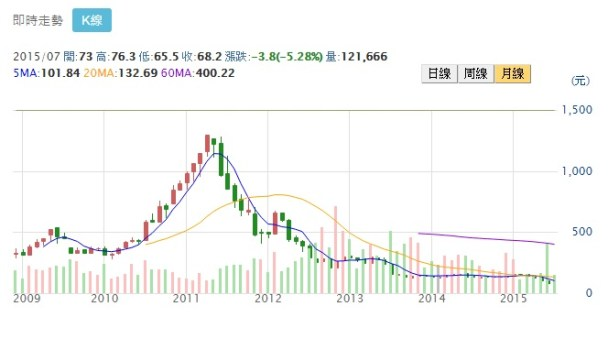

# 「10 元 ~ 80 元」的股票最好

##想穩健的投資，
### 就要排除高價股和雞蛋水餃股

我和 2 位朋友聊起他們的投資方法。
其中 1 位很喜歡買「雞蛋水餃股」，
另 1 位則很喜歡買「高價股」

不過 Emily 最喜歡的，
則是`股價在 10 元 ~ 80 `，

到底是為什麼呢？
讓我們繼續看下去…
 
 

###愛買雞蛋水餃股的理由:
####股價已經跌無可跌？？
A 朋友的投資方法是買股價 10 元以下的股票，
我問他 :「為什麼要這樣做?」
A 朋友說 :「我的薪水不高，
因此只能買的起雞蛋水餃股，
另外我覺得股價已經這麼低了，
應該再跌也有限，
萬一漲了就算我賺到！」
 

###愛買高價股的原因:
####貴的東西才是好東西？？
而另一位 B 朋友的方法跟 A 朋友剛好完全相反，
他在電子業工作很多年，
很喜歡追逐產業趨勢買股票，
因此常買熱門的高價股，
曾經買過的股票有:
聯發科 (2454)、宏達電 ( 2498 )…等。
 
B朋友認為高價股就是最有前景的成長股，
題材熱門、
通常財報數據也不錯，
認為就像好東西總是價格比較昂貴一樣，
覺得高價股 = 好股票 = 成長性高。

### 真相到底是什麼？
#### 讓數據說話…

但事實真的是這樣嗎?
我們來看統計數據….
 
我們統計 2009 年 ~ 2014 年台股多頭時期，
水餃股與高價股未來 1 年的平均漲幅，
以及大漲和大跌的機率。
( 2007 ~ 2008 年這 2 年震盪過大，
會影響整個統計的品質，所以暫不討論)。
 
`高價股在我的定義裡至少是 80 元以上的股票`，
而所謂的`雞蛋水餃股，
就是指每股 10 元以下的股票`，
因為價格很便宜，
就像通常每顆雞蛋、水餃都不到 10 元一樣，
所以就得到了這個暱稱。
 
此外有一些設定：

- 以每年1 / 1開始為基準，衡量未來 1 年績效。
 

- 排除成立不到 5 年的公司， 這些公司的股價波動太劇烈，高低不具參考價值。
 

- 排除半年來每日平均成交金額低於 100 萬的股票，如果不能順利買賣，勝率高也沒有價值。

### 原來…雞蛋水餃股漲跌波動大， 而且最大的風險是「下市」！

雞蛋水餃股在多頭年間，
每 100 檔中有 15 檔跌幅會超過 20 % 以上，
而大漲的機會 ( 漲幅 50 % 以上 )也有 15 %，
股價波動比較劇烈。
 
雖然在統計上，
雞蛋水餃股的看起來比高價股好一些，
但追求「穩健」的投資人最好也不要碰這個族群。
 
因為大部分會淪為雞蛋水餃股的公司，
都是經營不善的公司，
甚至長年 EPS 都是虧損的，
所以它們的下市機會頗高！

### 原來…高價股很難漲得高， 但卻更容易下跌， 比雞蛋水餃股更慘！

如上表可以看到，
在 2009 年 ~ 2014 年這段幾乎是多頭的期間內，
80 元以上的高價股平均報酬率竟然只有 3.1 %，
而且大漲的機會 ( 漲幅 50 %、漲幅 100 % )，
甚至還低於雞蛋水餃股！
 
除此之外，高價股虧損 20 % 以上高達 27.1 %，
比起雞蛋水餃大跌機率反而高出很多。
 
簡單來說，如果我們在 2009 ~ 2014 年間，
每年買進 80 元以上的股票，
每 100 檔才有 1 ~ 2 檔會翻倍，
但卻有 27 檔以上可能會跌超過 20 %。
 
高價股呈現這樣的統計結果讓人很訝異！
我想原因可能跟某些高價股有時源於炒作，
所以下跌的力道也比較驚人。
另外，有很多高價股，
是某些時期的熱門成長股，
不過以台灣來說，
企業很難維持長期成長！
 
我們觀察過往歷屆的股王都能映證這一點，
像一代股王宏達電，
最風光的時候股價有 1300 元，
現在的股價 70 元不到。
 
圖說: 2009 年 ~ 2015 / 7 宏達電股價月 K 線圖。

##結論:
###追求穩定的投資人， 最好買股價在10 元 ~ 80 元之間的股票！

很多散戶由於資金不足，
因此喜歡從雞蛋水餃股下手，
不過這個方法只能當成買樂透，
反正大漲就賺到、最糟就下市，
所以絕對不能壓身家，
而且也要清楚，
這是投機而不是長期穩健的獲利模式。
 
而高價股很多都是成長股，
而台灣的環境很難有讓企業維持長線成長，
更多的是暴漲、暴跌的「一代股王」，
股價波動非常大。
而且股價太高這個特點，
很不利於一般投資人執行資金控管、分批進場。
 
由於在艾蜜莉的投資方法中，
要的是「長期穩健」的投資方法與股票，
大漲大跌的股票實在「不是我的菜」，
所以在實務買股中，
我多會排除高價股與雞蛋水餃股，
買在 10～80 元 這個價格區間的股票最好！
