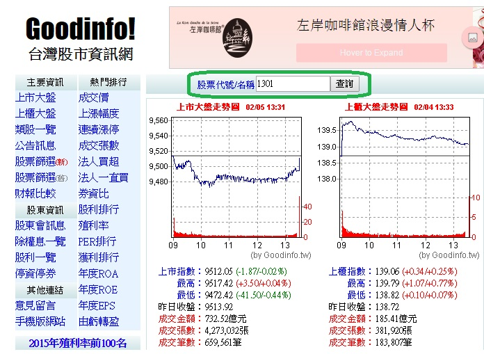
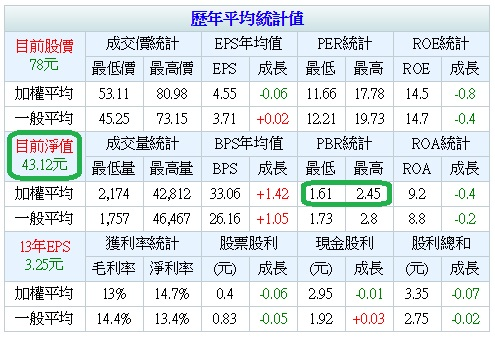
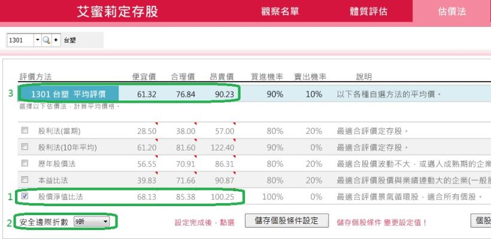

# 3分鐘學會用股價淨值比法算出合理價


###股票淨值比法最適合用來評價景氣循環股
一家公司到底值多少錢？
大家的心中的認定可能都不同，
除了之前幾篇文章提到的，
可以用股利法、本益比法、歷年股價法...等方法來估價之外，
###股價淨值比法也是一種既簡單、又方便的估價方法喔！
 
每一種估價的方法都不是萬用的，
例如以「股價淨值比法」來說，
它`最適合用來評估景氣循環股`，
至於業績持續成長的小型股票較不適用。
 
###每股淨值和股價淨值比可以用來算出合理股價
###淨值就是一間公司最基本的價值
淨值是什麼呢？
以新創的公司來說，就是原始股東出的錢，
我們可以把它想像成一間公司最基本的「價值」。
 
例如:蔡一零 和 周結輪 等10位好朋友 ，共組一間公司，
每個人各出 10 萬，共 100 萬，
這就是這間公司的「淨值」。
又假設市場上就只有 10 張股票在流動，
那麼每張股票的淨值就是10 萬元 ( 100 / 10 = 10 )。
 
###股價、淨值與股價淨值比之間的關係
股票的「價格」和「價值」之間的比值常常不是固定的，
而且會隨著市場的供需力量、恐懼與貪婪等因素產生波動，
股價與淨值之間的比值，就是「股價淨值比」，
有些股票每年的最低或最高股價淨值比，
常常落差數倍。
 
既然股價 / 每股淨值 = 股價淨值比，
那麼回推公式:

####股價= 每股淨值 X 股價淨值比


###3分鐘學會用股價淨值比算合理股價
我們以塑化產業的龍頭台塑 ( 1301 ) 來舉例，
學習一步一步算出他的合理股價:


###步驟1.先找出台塑最近一期的淨值及歷年股價淨值比資料。


```sh
(1)打開台灣股市資訊網 ( http://goodinfo.tw/StockInfo/index.asp ) 。 
(2)在上方的框格中，輸入要查詢的股票代碼，EX: 1301，再按查詢。
(3)跳出台塑的頁面後，用滾輪往下滑， 在下方可以找到「歷年統計均值」表。
(4)在表中可以找到「目前淨值」。
```







###步驟2.找出台塑歷年最高與最低股價淨值比的資料。

```sh
(1)在「歷年統計均值」表中找到「加權平均最低PBR」和「加權平均最高PBR」。
(2)找到歷年最低與最高股價淨值比之後，再算出歷年平均股價淨值比:
台塑歷年最低股價淨值比 = 1.61
台塑歷年平均股價淨值比 = ( 1.61 + 2.45 ) = 2.03
台塑歷年最高股價淨值比 = 2.45
```
 
###步驟3.算出便宜價、合理價、昂貴價。
```sh
(1)套入公式
便宜價: 最近 1 季每股淨值 43.12 X 歷年最低低股價淨值比 1.61 倍 = 69.42
合理價: 最近 1 季每股淨值 43.12 X 歷年最低低股價淨值比 2.03 倍 = 87.54
昂貴價: 最近 1 季每股淨值 43.12 X 歷年最低低股價淨值比 2.45 倍 = 105.64
 
(2)加入安全邊際折數，算出最後估值
台塑是台灣 50、中型 100 的成分股之一，
所以是大型績優股，安全邊際折數我們大約抓 9 折
最後的便宜價估值 = 69.42  X 0.9 = 62.48
最後的合理價估值 = 87.53  X 0.9 = 78.78
最後的昂貴價估值 = 105.64 X 0.9 = 95.08
```

###最簡便的方法:使用艾蜜莉定存股來算合理價

雖然我們使用的算數，都只是很簡單的加減乘除，<br>
但追蹤的股票一多，也需要花很多時間。<br>
所以不如把這運算的工作，交給免費的軟體，<br>
省下來的時間，可以更多的了解企業的經營情形！<br>
 
眼尖的讀者可能會發現，<br>

我們自己手動算出來的估值: 62.48 、78.78、95.08 ，<br>
和理財寶軟體算出來的估值: 61.32、 76.84、90.23 好像略有不同，<br>
這是因為取得的資料年度不一樣的原因。<br>
 
不過，這並沒有關係，<br>
因為股價是一個範圍區間，並不是一個精確的值，<br>
所以你我算出來的數字並不需要完全相同。<br>
 
圖說:艾蜜莉定存股軟體的「估價法」頁，會直接算出計入安全邊際 9 折之後的最後的估值。




###快速結論:
今天( 2015 / 2 / 5 )台塑的收盤價是 78 元，在合理價附近。
哇！！！難道已故的經營之神王永慶所創立的台塑，
現在可以買進嗎？！
 
###可惜如果以艾蜜莉來說，現在並不會買進台塑，
原因有2:

####我通常買在便宜價附近，而非合理價附近
以我個人來說，至少要等到便宜價 61.32 元左右再來考慮是否買進。
我的意思並不是買在目前這個價格(合理價)就一定不會漲，
只是買在便宜價，
既賺股息、又可以賺價差，風險也比較小。


####近年是原物料的相對高檔區，長線需慎防修正
另外，要特別注意 近幾年是很多原物料的高檔期，
買在短線低點雖然可能會反彈，
但長線來說，小漲大跌的可能性很大，
由於我是一個注重風險過於利潤的人，
因此不會選擇在此時買進台塑。
 
註:以上個股判斷，僅為個人投資心得，非為任何形式的買賣建議，
投資之前請獨立思考、審慎評估，勿以跟單模式進行。