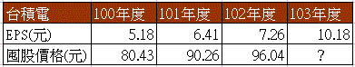

# 股票分3類 各有適用估價法

以我的選股策略而言，都是獲利穩健的成熟大型績優股，我把可能會買的股票類型分成3類：定存股、景氣循環股、一般股票，分別適用不同估價法。讀者還要注意，以下方法不代表適用於所有股票，例如新產業、成長股、轉機股等，因為未來業績不穩定，並不在可預估的範圍內。

##股票類型1》獲利與配息穩定的定存股
適用估價法：當期股利法、10年平均股利法

股利法適合每年配發利息穩定的個股，例如，中華電。

##股票類型2》大型原物料景氣循環股
適用估價法：股價淨值比法

大型原物料的景氣循環股，如航運業、鋼鐵業、水泥業、塑化業、石油燃氣業、營建業等，這些產業受到景氣影響很深，獲利波動也相當劇烈，因此我對景氣循環股的投資很謹慎。一般而言，電子業的景氣循環較短，約2~3年，大型原物料相關產業如台塑(1301)、台化(1326)等，一次循環大約要10年以上的時間。企業若獲利不好，股利也會不好，因此在該產業的景氣尚未明顯回春時，我會盡量避開。

##股票類型3》一般個股
適用估價法：混合平均法

在「艾蜜莉定存股」除了景氣循環股與定存股之外的股票，都是歸類為「一般個股」，也就是將上述5種估價模式算出的便宜價、合理價、昂貴價，分別加以平均。

結語
評價股票的方式有許多種類，我的價值線資料主要評估方式是採用`《散戶大反擊》`書中的方式，很像巴菲特採用的方式，原理請參考：巴菲特的企業價值評估法。

另外我又多採用了`「現金殖利率法」【請參考：現金殖利率法（找到雪球股，讓你一萬變千萬）】`。

因為所得出的便宜價格約等於殖利率6.25%，這種方式可跟銀行定存的利率作個比較，我覺得不錯。

讀者曾有問過我，若這兩種方式評估的價格差異太大時，該怎麼辦？這個問題我已回覆過了，請參考：http://wawafinanceessais.blogspot.tw/2015/02/2015-2-2-eps.html。這裡我就不再詳述了。

在之前的文章我有提過【請參考：價值是含糊的正確（在號子遇到凱因斯）】，無論你採用何種方式，股票的內在價值，必定無法精準評價，正如巴菲特的觀察，一檔股票的潛在及基本價值是「無法確知卻必須估算的數值。」內在價值計算的優點是提供清單，確保投資者考慮到所有可能影響一證券的因素，同時又能確定股價的實際範圍。

##成長型價值投資

此書作者有提到「成長型價值投資」【有關成長型價值投資，請參考：成長價值】。這裡我舉一個簡單的例子來說明。

範例：台積電

台積電每年價值線資料評估的囤股價格都會遞增，主要原因是台積電近年來`EPS持續成長中`，投資人`很難等到股價會跌到評估的價值之下讓你買到`。所以投資這種類型的企業，有時必須稍微提高你的買進價格。

例如：我在2013/09/02 以101元買進台積電，當時的手上只有101年度的價值線資料評估的囤股價格為90.26（因為102年度財報資料在2014年3月底才會正式公佈，價值線資料要等到4月10日才出刊）。

因為我當時推估台積電在102年度的囤股價格可能會成到100元左右（因為100年度為80.43、101年度為90.26，所以推估102年度為100），所以稍微提高了買進價格。雖然後來102年度評估的囤股價格為96.04，但也和我預估的差不了多少。目前台積電股價為150.5(2015-3-3)，而我當時買的台積電還持有中。

今年103年度價值線資料預計會在4月10日出刊，所以訂閱的讀者最好不要把舊的102年度的價值線資料給丟掉，因為你可以從中對比，找出那些個股是「成長型價值」。