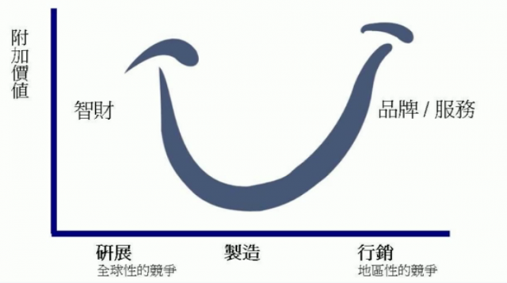

# 股神巴菲特使用的「投資法」竟然分「2 種」！

##基本面投資法分為：
成長型投資 與 價值型投資
25 K小資女艾蜜莉
使用價值投資法，6 年獲利 400 萬元，
是近年價值投資的典範。
 
投資素人 羅仲良
靠著持續買進`成長股`，
累積到 1500 萬身價，
實現成為專職操盤人的夢想。
 
股神巴菲特
則是 2 種投資法`交互運用`。
 
成長型 vs 價值型
2 種投資法都是好方法。

用「好價格」買「好股票」，
用耐心、紀律一步一步的執行價值投資 SOP，
克服「恐懼」與「貪婪」的影響，
堅持下去，長期下來
就能當 80/20 法則中，少數的贏家！
 
2 種基本分析， 

##價值型還是成長型？
投資大不同

`" 成長型投資 " 的假設邏輯是 「趨勢會延伸」`

相信「強者恆強、弱者恆弱」
所以買進強勢股、成長股
並且在個股失去成長動能之後賣出
 
成長型投資 SOP：
1. 選擇財務優良的「成長型」公司。
2. 分析公司獲利的「成長力道」。
3. 估算「成長股」的內在價值，
當股票未來價值>目前股價，就買進。
4. 評估何時成長趨緩就出場，
若一直維持高成長則續抱。
5. 停損時機：個股並未如預期般成長，
此時宜當機立斷馬上賣出或停損。
 
最該注意的地方
就是`「趨勢何時停止」`，
而且要具備良好的財報分析能力
找到獲利不斷提升的`「成長股」`。

`" 價值型投資 " 的假設邏輯 建立在「均值回歸」上`

由於`「股市」就是「人心」`，
人是不理性的動物，
有時會過度樂觀、
有時又過度悲觀，
因此造成股價的超漲或超跌。
但那只是一時的，
長期來說終將回歸應有的價格，
所以， `股價 < 價值，買進； 股價 > 價值，賣出`。

最後買賣的軌跡就有如「微笑曲線」。

##價值型投資 SOP：
1. 選擇財務「穩健」(或衰退不大)的公司。
2. 分析公司持續穩定獲利的能力。
3. 估算內在價值(股利法、股價淨值比法…等)，
當目前股價<目前股票內在價值，就買進。
4. 耐心抱股、逢低加碼，直到利空遠去。
股價回到內在價值以上，則分批賣出。
5. 停損時機：
剛開始便錯估誤把壞公司當成好公司
以及 好公司基本面變壞長期沉淪，
需要立即停損。

股價越跌，應該買越多，
屬於往下買的逆勢操作。
最該注意的地方就是
分辨股價被低估

是`好公司一時之間遇到麻煩事
還是 企業永久的沉淪 `。
 
這種操作法通常
買進長期經營數十年
幾乎年年發股息的龍頭股。
由於有長久穩定的獲利紀錄，
也有大型的法人長期觀察財報，
因此遇到地雷股停損的機會很小。
看財報時只要注意，
最近的財報和過去的財報
相比差不多或衰退不多即可。

##投資策略 是一套縝密的 SOP
不管是用成長型或價值型投資
來分析、操作股票，
都要有明確的操作準則，
從頭到尾建立起一套 SOP，
才能幫助你征戰股海。

`股神巴菲特：
「我有 15% 像費雪
85% 像葛拉漢」`

費雪是經典之作「非常潛力股」的作者
這本書道出了成長股的精隨
他用的投資法就是`「順勢」X「價值投資」`。
 
葛拉漢是巴菲特的老師
也是「安全邊際」
與 低估型價值投資 等概念的始祖
他用的投資法就是`「逆勢」X「價值投資」`。
 
而巴菲特則融合兩家所長
走出自己的風格後，
從 1965 年起至今，
投資年複合成長率在 20% 以上，
被封為「奧瑪哈的先知」。

##投資邏輯不要混淆
往上買和往下買的邏輯和重點不同，
一般人同時使用很容易混淆。
這兩種方法都可以賺錢，
但要特別注意的是

`策略要做就要做整套，
不要用 A 邏輯買股票，
然後又用 B 邏輯出場`。
 
舉例來說：
當我們看好
智慧型手機市場的成長趨勢買進時，
`在成長趨緩後就要勇敢停利或停損`，
才能保住利潤或老本，
而不是要催眠自己要逢低加碼。
 
而當我們評估面板業的衰退，
`只是景氣循環的一部分時，
股價越是下跌就要越高興，
一直往下分批低接到銀彈打完為止`，

千萬不要因為股價直直落就「停損」。
 
所以到底是
要`「逢低加碼」還是要「停損」`，
就取決於你的投資策略。
 
投資股票要選對適合自己的方法
選對方法才能事半功倍！

##想知道如何穩定獲利嗎？
簡單的「存股」
獲利優勝定存 9 倍！
有 30 年的投資經歷的 溫國信
最初登上股市戰場的他 ...
投資 股票型基金 慘賠 60%。
溫國信不氣餒，他苦心研讀，
最終研究出一套
【必勝穩賺獲利法】
用 1 年賺進別人 8 年！
成功把 一萬 翻倍 千萬！
溫國信即將要把 30 年的投資功力
不藏私的傳授給您，趕快來上課吧！
