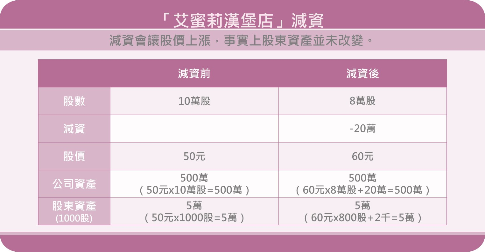
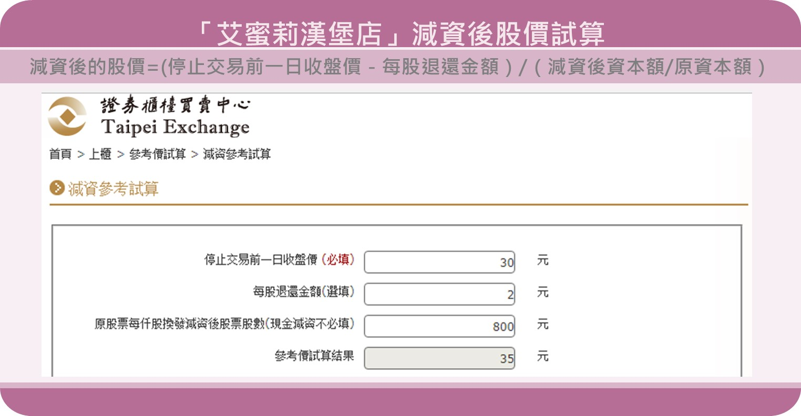
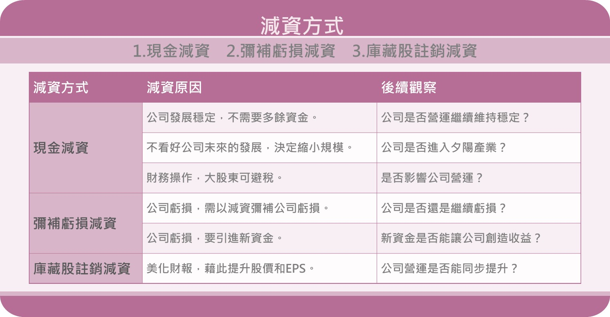

# 減資分 3種，絕對不是每種減資都是利多！

這幾年好多公司加入減資的行列，
鴻海上市27年也首次減資，
引起市場關注，
有人說減資是好事，
可以拿到現金，
股價還會上漲？
但有些公司的股東，
參與減資拿不到現金，
股價也毫無起色…
為什麼同樣是減資，
卻有完全相反的結果呢？
究竟減資是利多？還是利空呢？
那我們一起來了解吧！
 

##什麼是減資？
 
以「艾蜜莉漢堡店」為例，
當初發行了每股10元，共10萬股股票，
(10×10萬=100萬)
籌措100萬的開店資金，
艾蜜莉經營五年以後，
發現其實只要80萬資金就夠了，
於是艾蜜莉決定減資，
退還20萬給股東，
相當於在外流通股數減少2萬股，


###減資就是減少公司的資本額，
###也就是減少公司在外流通股數。

## 所以減資是利多，因為可以拿到現金？


「艾蜜莉漢堡店」減資的原因，
是因為艾蜜莉經過長期經營，

###發現公司其實不需要那麼多資金，
###所以將資金退還給股東，
###這屬於「現金減資」。

例如：2010年中華電（2412）減資案，
公司發展穩定，不需要多餘資金的減資，

另外一種「現金減資」，
股東一樣可以拿到現金，
但減資原因卻是不看好公司未來的發展，
所以決定縮小規模而減資，
例如：協益（5356）大客戶，
因為被陸廠Apex艾派克收購導致公司掉單，
業績銳減進而減資，
這一類型的減資，
就算股東現在拿到現金，
但公司對未來不樂觀，
也未必可以為股東創造利益。

鴻海（2317）的減資也是「現金減資」，
但我覺得這次的減資是財務操作，
對於公司經營而言沒有太大影響，
只是將原本欲發放的股利，
拆成股利+減資的方式，
對於要繳稅的大股東而言，
可以免除股利要繳交的稅(避稅)。
對公司經營本質來說不會有太大影響。

##為什麼我也參與減資，卻沒有拿到現金?


###減資雖然是減少公司的資本額，
###但未必是將資金退還給股東，
###有的則是將資金拿去彌補虧損，
###屬於「彌補虧損減資」

這一類型的減資，
通常是不好的減資，
如果彌補完這次虧損，
公司經營仍然沒改善，
之後又產生虧損，
就有可能再次減資，
例如：旺宏（5356）2006年減資41.63%彌補虧損，
去年又為了彌補虧損減資幅度高達50%。

公司彌補完虧損後，
通常就沒有多餘資金改善營運，
加上如果手上有資金的投資人，
通常也不會願意投資有虧損的公司，
因此通常這類型的公司減資完，
接著就會再辦理增資，
例如：「高鐵財改案」就是先減資再增資，
以改善公司財務，
但同時也會造成原始股東股權被大幅稀釋，
股權結構被改變。

最後一種減資案，
雖然沒有拿到現金，
但卻可以美化財報，
就是「庫藏股註銷減資」，

有些公司認為股價被低估，


###實施庫藏股，
###之後在做減資變更登記，
###將庫藏股註銷，
###這屬於「庫藏股註銷減資」。

以減少在外流通股數，
藉此提升EPS、ROE和股價。
例如：訊連（5203）今年的減資案。


##減資後股價上漲，是不是賺到了？
 
我們再以「艾蜜莉漢堡店」為例，
假設「艾蜜莉漢堡店」減資前股價是50元，
減資後上漲為60元，
從下圖可以發現（圖1），
如果減資前股東手上有1000股，價值5萬元，
減資後股價上漲到60元，
但手上只剩800股，
加上拿到減資的2千元，


##因此減資前後股東資產並沒有改變。




##減資股價上漲，「艾蜜莉定存股」也會跟著調整嗎？
 
「艾蜜莉定存股」的估價法，
目前並不會隨著減資而調整估價，
但可以利用「權證櫃買中心」的「減資參考試算」功能得知，
假設「艾蜜莉漢堡店」的便宜價是30元，
先在「停止交易前一日收盤價」輸入30元，
每一張(1000股)退還2元(現金2000元)，
因此在「每股退還金額」輸入2元，
試算結果為35元，
也就是減資後「艾蜜莉漢堡店」的便宜價是35元。

▼圖2－「艾蜜莉漢堡店」減資後股價試算



##結論
▼圖3－減資方式



減資主要有三種方式為：

```
1.現金減資
2.彌補虧損減資
3.庫藏股註銷減資
```
 
減資究竟是利多還是利空？
必須了解公司減資的原因，
以及觀察減資後公司的營運狀況，
千萬別因為可以拿到現金，
或是看好減資後股價會上漲，
就盲目的買進唷！
 
