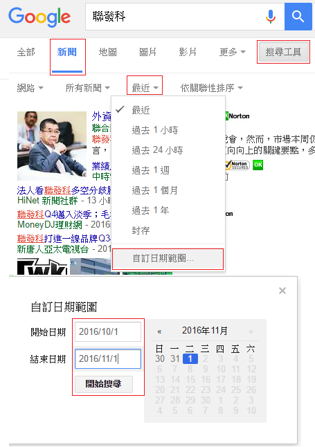

# 確認利空原因是否會傷及公司筋骨（艾蜜莉教你自動化存股小資也能年賺15%）

在本書中，艾蜜莉分享她這幾年來從儲蓄開始，靠理財拉高儲蓄率至5成，並存股擴大資產的過程。讓完全無基礎的讀者，也能跟隨艾蜜莉的腳步，打造個人的財務自由現金流。本篇只介紹「確認利空原因是否會傷及公司筋骨」。

每次遇到公司股價大跌，甚至跌到便宜價，我還是會進一步檢查。檢查什麼呢？我會去確認這次利空的原因，會不會傷及公司的筋骨，會不會讓它以後永遠爬不起來，從好學生變成壞學生。

而最簡單的方法就是用Google，但使用Google有個缺點，就是資料太多看不完，所以我會利用「自訂日期範圍」去限制新聞資料的時間點，如下圖：

使用步驟，就是你輸入公司名稱按下「搜尋」鍵後，再按下「新聞」，再點擊「搜尋工具」→「最近」→「自訂日期範圍」，設定好「開始日期」和「結束日期」後，最後按下「開始搜尋」即可。

`釐清利空原因，才能對症下藥`

##一、短暫性利空
- 匯損
- 被剔除台灣50成分股
- 單次性法律訴訟賠款
- 原物料上漲
- 一次性打消過往轉投資損失
- 會計原則轉變
- 人工成本上漲
- 工廠失火或工人罷工

若平時為績優股，則可趁此利空造成股價跌到便宜價以下時，分批買進。

##二、永久性衰敗
- 企業在同業競爭中落後
- 產業趨勢改變，未來產品的需求被另一產品取代
- 企業爆發誠信問題
- 本業連續1~3季虧損
- 護城河被破壞，加入大量競爭者

執行停損，若持有成本很低，也有機會不賠錢，停利出場。

##三、其他
- 企業經營者炒股、炒匯、、炒房乙、炒原物料，不專注本業以致造成虧損
- 股本膨脹，營收卻未能跟上

先留校察看，若情況未見好轉，則執行停損，或在不賠錢的情況下出場。

※出處為《Smart智富》出版之《艾蜜莉教你自動化存股小資也能年賺15%》

##結語
一般我在買進股票前，一定會搜尋近期新聞資料，最好是對未來展望也是樂觀的，新聞可信度方面，由公司發佈的可信度會高一些，而法人發佈對公司看法的新聞，則可信度會低一些。

但無論如何，我看完這些新聞資料後，會和我的「成長力資料」核對一下，看看是否呈現一致，這個動作很重要，可以過濾掉很多的「倒貨文」【請參考：用EPS反推營收之合理性】。

因為之前文章提過，我們的大腦很容易會預設系統一的思考方式，也就是會被新聞利多所矇騙，所以這個核對的動作是讓你把投資思維正確切換到系統二。【請參考：智力構件缺陷（巴菲特的勝券在握之道）】