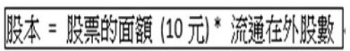
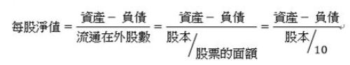
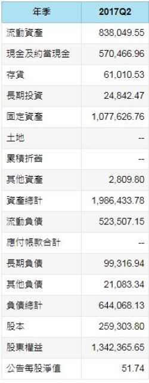
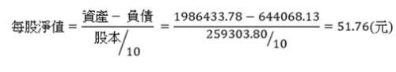
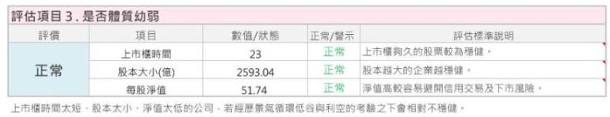
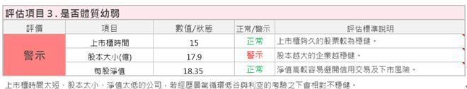

# 找到 安全穩健的「好股票」！

體質優良的股票，
就像是強壯的孩子般，
比較經得起考驗。

 

那麼如何在茫茫股海中找到體質優良的股票呢？
而一檔股票的體質到底要怎麼判斷呢？
讓我們繼續看下去。

## 一、如何評斷體質幼弱

透過「艾蜜莉定存股」的第3項指標「是否體質幼弱」，

3個步驟，帶你一次搞定股票的體質。

### 步驟一、上市櫃時間 > 7年

我們說路遙知馬力，日久見人心。

而股票呢？

則是看能否經過 時間＆景氣循環 的考驗。

 

一般景氣循環通常 3年一小循環，

7年到 10年一大循環。

 

所以我希望公司上市櫃時間能至少 7年，

代表公司至少經歷過一次大的景氣循環，

投資時，也比較安心。

 

###步驟二、股本大小 >  50億

我希望公司的股本規模能大於新台幣 50億元，

因為股本較小的公司，

流動性較低，

易受到市場中特定的主力炒作，

在景氣不佳時，易受到打擊。

 

但實際投資時，

若遇到股本小於 50億元的中小型股，

但其他條件經過仔細研究後都很理想時，

我還是會買，只是資產配置上，資金比重會壓低。

### 步驟三、近一季每股淨值 > 15元

淨值= 資產- 負債。

 

淨值是公司的資產償還掉他的負債後，剩餘的價值，

若淨值太低，公司經營的能力就有疑慮。

我希望一間值得長期投資的公司，

每股淨值能大於 15元。

 

若每股淨值小於 10元，不只代表這間公司可能是虧損的，

該股票還會被取消信用交易，甚至下市。

###【實例】

 

以台積電(2330)為例，

近一季 2017Q2 資產負債表 (單位:百萬)

如果想自己計算的公式如下：

約等於公告的每股淨值 51.74元。

## 二、如果個股出現警示，是不是就要完全避開

以豐藝(6189)為例。

 

上市櫃時間 > 7年，

每股淨值也 > 15元，

但因股本 < 50億元，而出現「警示」。

 

一旦指標出現警示，

就必須去細查它的情況是否嚴重。

 

由於豐藝的類型屬於電子通路股，

一般股本都較小，

因產業特性不用投入龐大資金建廠

及購置機器設備，

所以評估此嚴重性不大。

 

不過因豐藝為中小型股，

所以我的投資的配置上最多只會投入 10%資金喔！

 

 

##結論：

 

「是否體質幼弱」能幫您快速掌握個股的健康。

 

`上市櫃時間 > 7年、`

`股本大小 >  50億、`

`近一季每股淨值 > 15元。`

 

這三個指標都達到表示股票體質相對較穩健，

只要其中一個指標不符合，就會跳出「警示」，

提醒我們要多注意，但也不用太過擔心，

屆時就需細查原因並搭配其他條件多方評估，

警示的嚴重性大不大！