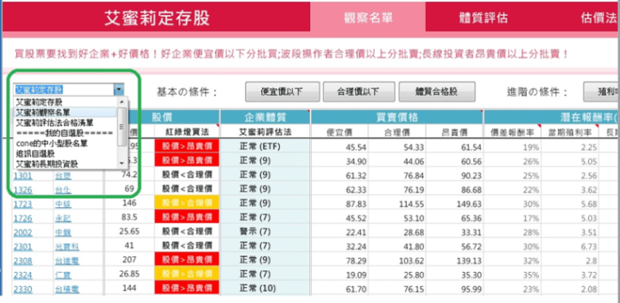
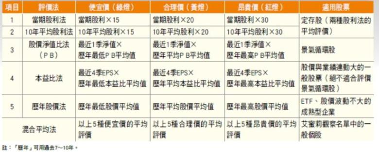
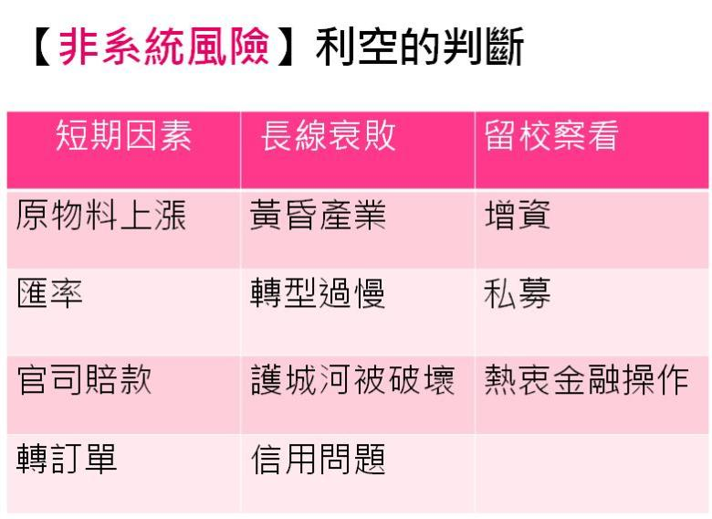
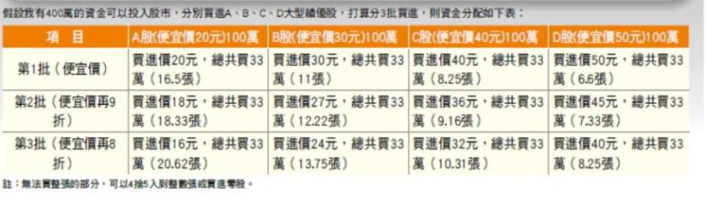
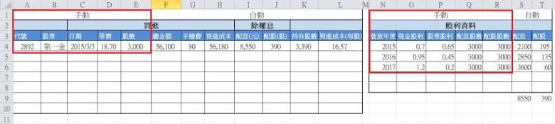
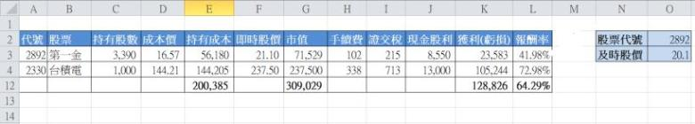

# 遵守 SOP 5步驟，買進績優好公司、做好資金控管、避開風險，穩健獲利，不再是難事！

「艾蜜莉～什麼是 價值投資？」
這句話是很常在跟新手大大聊天時被問到的問題。

對於投資，大家似乎知道 觀念，
但要實際了解好像又是另一回事！

其實簡單的說，價值投資

`就是買進價值被低估的股票 (標的) ， 
並於價格 (市價) 高於 內在價值時賣出，`

是一種簡單、穩健、勝率高的投資策略！

這時很多網友大大又會覺得那麼 實務上又該如何操作？
所以今天艾蜜莉就來分享價值投資的 5大 SOP給大家～

###1. 尋找「好公司」

台股 1000多檔的股票，
茫茫股海又該如何篩選出好公司 ?

這裡所指的好公司是指穩健獲利的績優龍頭股，
如果是初學投資者還未建立自己的口袋名單，
不妨可以先參考艾蜜莉定存股名單，
篩選的方法是從台灣50以及中型100成份股裡挑選出：

`「上市10年以上」、「 年年賺錢」、`

`「 年年發股息」 … 等條件的公司。`

###2. 買在「好價格」

所謂的「好價格」是指等到好股票跌到便宜的價格才買進，
我將股票區分為三種：分別為定存股、景氣循環股、及一般股。

依照不同股性，
尋找出適當的方式來估算內在價值 (詳見下列表格)，
由於各種評價模式各有優缺點，

`所以艾蜜莉會使用「混合平均法」，`

或取最大的幾個值和最小的幾個值平均，
注重安全邊際的投資人可以再設定更高標準的「安全邊際價格」，
把以上混合模式的值再打 9折 或 8折 ～

###3. 判斷利空

通常好的股票要落入便宜價並不容易，
通常都要等利空發生時，才能趁機撿便宜。

因此需學會判斷利空所

造成公司的業績與股價下跌是短暫的或是長期衰敗，

若只是短暫的影響，就可以把握機會，擬定買賣計畫。

###4. 資金控管

資金控管有助於分散風險，不單壓或重壓某一檔股票，

建議將股票分散 3~5檔，

資金較多的人最多也不要超過 10檔，

除此之外，投入每檔股票時再將資金分 3~6批投入，

不會一次買進，降低平均成本。

###5. 賣股時機

賣股的時機大約分成兩種：

####1.價格貴了：

到達合理價或昂貴價以上，
或者到達個人設定的停利點 (如20%)，則分批賣出。

#### 2.體質壞了:

個股利空發生造成公司體質永久性的衰敗時，要適時停損。

`做好投資紀綠`

藉由EXCEL的試算功能能掌握投資狀況，
也有助於累積財務的過程中更加踏實，
若能再記錄下進出場的依據，

`也能藉此做為調整或改進策略的依據。`

以下是我自己使用的
「股票成本計算」EXCEL檔案供大家參考，
主要用於登錄股票買賣紀錄，計算出持有成本與報酬率，使用方式如下，

1.輸入股票、買入日期、單價、股數，
可計算出每一檔持有股票的買進成本。

2.如果有參加除權息則填入歷年現金股利與股票股利，
可計算出目前的配息金額  及配股股數。

