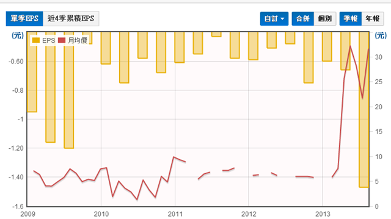
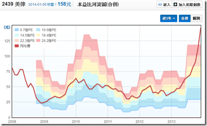
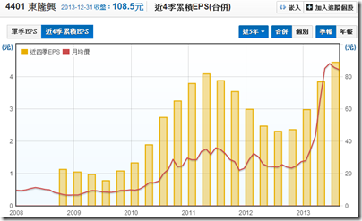
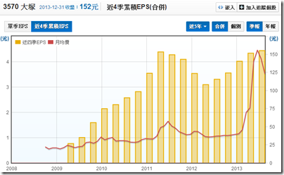
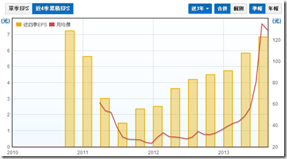

# 2013十大飆股 – 財報與產業分析

2013年已告一段落了，不知道大家的投資績效如何呢？有沒有抓到「飆股」呢？講了你可能不信，`2013年漲幅超過一倍的公司竟然高達123家，佔所有上市櫃公司將近一成了！`投資人只要能抓到1~2家，2013年的投資績效就不至於太差了。

那麼，這123家公司中，表現最好的十家公司，漲幅是幾倍呢？有沒有什麼共通點？`我們有機會從財報發現端倪，提前佈局嗎？`還是這些公司都是亂漲一通，毫無道理可言？相信看完這篇分析文後，你的心裡就會有個底囉！

### 第一名：愛山林(2540)，漲幅9.1倍！

2013年的股價漲幅冠軍是…愛山林！相信鄉民們都聽過愛之味、愛台灣，但就是沒聽過愛山林吧！愛山林在短短一年的時間裡，漲幅竟超過9倍！若有鄉民在2013年買入愛山林的話，肯定會十分的愛台灣。

一般來說，公司的股價會和獲利(EPS)成正相關，但有趣的是，愛山林的股價是在第二季起漲，但其EPS卻毫無起色，到第三季虧損甚至創歷史新高。究竟愛山林有什麼不為人知的祕密呢？

愛山林原名金尚昌，是一家從事營建業的公司，2012年以前連年虧損，但2013年甲山林董事長借殼入主金尚昌後，改名為愛山林(細節大家可以自己google，我沒有太大興趣研究，因為我不會投資這類公司)。從財報來看，愛山林2013第三季以前的獲利都很差，一直要到11月的營收才開始大幅成長，但股價早已提前反應了。

讓我們看看另一個有名的例子-桂盟(5306)。桂盟原名訊康科技，是一家做網通產品的公司，本業同樣是虧損連連。然而腳踏車鏈大廠桂盟於2012年入主訊康後借殼上市，獲利在2012第三季才出現大幅成長，但股價卻早在一年前就已大幅反應。

由以上兩個例子可以發現，借殼上市的公司股價多半已提前財報反應，原因也不用多說了。再者，投資借殼上市最大的風險就是…..金蟬脫殼，也就是蟬(欲借殼者)自己跑掉了，只留殼(被借殼者)下來，那投資殼的人就要欲哭無淚了。

由於對外部投資人來說，投資借殼上市公司的風險太大，故接下來幾支和借殼有關的「飆股」我們就不予分析了。記住，價值投資者只賺自己賺得到的錢，沒買到這種股票，我們一點都不心疼(好吧，有一點點心疼，9倍耶)。

### 第二名：冠華(8077)，漲幅4.7倍！

與愛山林比起來，冠華的走勢就更詭異了！剛拉線圖出來看，連續二十幾天漲停，但目前進入連續第四天跌停….。

冠華雖然不是借殼上市的公司，但也是經過大規模的組織重整與再造。基本上，這類公司也是不在我們的投資清單上，有興趣的朋友請自行google囉！

### 第三名：華亞科(3474)，漲幅4.7倍！

分析到第三名，終於來個正常點的公司了。啊，老實講，這家公司一點也不正常。在大家都認為四大慘業快沒救時，DRAM大廠華亞科的股價卻悄悄的從不到3.87元飆漲至22元，漲幅高達4.7倍，榮登台股2013年漲幅第三名！

2012年第四季時，華亞科單季虧損仍達0.71元，但2013第一季時虧損已縮小至0.11元，第二季順利轉虧為盈，第三季EPS甚至超過1元！為何會如此呢？DRAM不是四大慘業之首嗎？怎麼開始賺錢了呢？

首先，大家要一個觀念，產業分析是個動態的觀念，不是靜態的，現在是慘業，不代表未來仍是慘業。DRAM經過長期競爭與廝殺，2013年只剩三大集團，未來再大幅殺價競爭的機率已降低不少。話雖如此，別忘記DRAM的本質還是景氣循環股，獲利不可能一路往上，未來獲利仍將大幅波動，投資風險仍高，切記！

另外提醒大家一點，景氣循環股的投資與成長股不一樣，不可用本益比法判斷合理股價喔！(對景氣循環股有興趣的朋友，請參狗站狗另一篇文章：彼得林區談景氣循環股的邏輯與操作)

### 第四名：晟鈦(3229)，漲幅4.3倍！

晟鈦與愛山林一樣，都是借殼上市的公司，這裡就不再深入討論了，有興趣的自己google囉。

### 第五名：陽程(3498)，漲幅3.8倍！

陽程在2012第三季前，還是處於長期虧損狀態，但第四季EPS突然跳升為3.82元，連帶使近四季EPS轉虧為盈。一般來說，EPS會出現這麼劇烈的波動，泰半是由業外造成的，但仔細看陽程的利潤比率，可發現陽程的毛利率、營業率大幅提高，代表獲利是來自於本業。

由於本業大幅成長，陽程的近四季EPS已飆升至10元左右，這也是陽程的股價可以漲這麼多的原因。不過話說回來，陽程的本業為何大幅成長呢？

原來，陽程是一家做「自動化設備」的廠商，相關產品包括PCB自動化設備、LCD自動化設備、鞋子組裝機、伺服器滑台、CNC自動化設備、手機電池組裝設備、自動貼膜機、自動清洗機等。陽程的主要市場在中國，由於中國的人力成本持續以每年15~20%的速度成長，自動化是不可避免的需求。搭著這股趨勢，也讓陽程的股價與獲利扶搖直上。

不過提醒大家，陽程的自由現金流量有較低，加上設備公司的營收波動大(設備拉貨都是一波波的)，投資人還是要謹慎。

### 第六名：美律(2439)，漲幅3.7倍！

相對於陽程，美律的獲利波動就沒有這麼戲劇性了！近四季EPS從之前的3元提升至4.5元而已。話雖如此，美律的股價表現同樣是相當兇悍，從年初的不到40元飆漲至年底的174元，漲幅高達3.7倍！

先來解釋一下美律基本面的改變。美律是一家做電聲元件的公司，2012年以前公司的產品集中在技術層次較低的免持聽筒，主要客戶為Nokia’、Motorola、Sony等，但2013起，公司陸續出貨Apple PC的揚聲器、頭戴式耳機、行動電源等毛利較高的產品，以致獲利在第三季起出現明顯的躍升。

但單從獲利來講，或許可以解釋美律為何從不到40塊漲到80塊，但卻難以解釋美律為何繼續飆漲到超過170塊。若人是理性的，那麼可以理解，買進的人認為美律的獲利可以持續攀升，因為那些高毛利率的產品都是美律佈局很久的產品，經過長時間才認證通過，並且會與客戶長期配合。此外，美律未來可能打入Apple的平板供應鏈或許也是個重要因素吧！

不過總歸一句話，美律2013獲利雖然有成長，但股價漲幅遠超過獲利，本益比已偏離正常值了。

### 第七名：凌越(6236)，漲幅3.4倍！

借殼股。

### 第八名：東隆興(4401)，漲幅3.1倍！

講到2013的飆股，紡織類股是不可能缺席的。以紡織股王-成衣大廠儒鴻為例，從年初的102.47(還原股價)飆漲至年底的336元，漲幅高達2.3倍。但其實2013最飆的紡織股不是儒鴻，而是它的上游-紡紗大廠東隆興，東隆興的股價從年初的26.34(還原股價)飆漲至年底的108.5元，漲幅達3.1倍！光這兩檔股票就讓大家對紡織股很牛皮的印象完全改觀。

東隆興與儒鴻的故事其實差不多，儒鴻是做機能布、機能衣的廠商，而東隆興則是儒鴻的上游，做機能紗的廠商(欲詳細瞭解紡織產業上中下游，請參考我們另一篇文章：紡織產業上中下游介紹)。所謂的機能衣(機能布、機能紗)，就是用在特殊材質的衣服，像是運動衣、瑜珈衣、發熱衣、登山衣、防水衣…等。近年來歐美對衣服的專用性越來越講究，以致上述機能衣的銷量都非常好，像瑜珈服大廠Lululemon今年前三季的營收年增率就高達20%，連帶使供應商儒鴻與東隆興的業績都成長不少。由於機能衣的需求大幅成長，而短期內能提供高品質機能衣、布、紗的公司並不多，促成了2013儒鴻與東隆興的榮景。

雖然東隆興去年股價與業績都大漲，但有幾點要提醒大家注意：(1)短期：Lululemon第四季財測不如預期，(2)中期：東隆興的獲利與競爭原料CPL連動，代表東隆興的景氣循環特性強，投資人需留意，(3)東隆興與儒鴻近期獲利飆漲，與它們的技術領先有關，但技術領先可以持續多久，投資人也需留意。

### 第九名：大塚(3570)，漲幅倍3.1倍！

相信大家在2013年以前，一定沒聽過大塚和實威這對驚奇兄弟吧！這兩家公司的故事很像，我們就一起介紹吧！

大塚和實威的本業都是3D繪圖軟體的代理商，像是CAD、CAE、CAM等軟體，實威的主要合作廠商是Solidworks，佔實威總營收超過六成；大塚的主要合作廠商是Autodesk，佔大塚的營收同樣超過六成。3D繪圖軟體的需求雖然會隨景氣與製造業的循環波動，但還算是穩定，加上競爭廠商少，所以代理商大塚與實威都還能穩定獲利。再說，近幾年3D繪圖軟滲透率加速取代2D繪圖軟體，算是這兩家公司近幾年主要的成長動能。

在2012年以前，故事應該到這裡就結束了，由於是代理商，市場給的本益比並不高，大概就是10~15倍之間，然而進入2013後，有個很夯的最新科技出現了-3D列印，把實威和大塚的本益比一下拉到超過30倍。

其實3D列印並不是什麼新的技術，已經存在很久了，但直到去年全球最大3D列印公司3D Systems的股價出現飆漲，這個題材才逐漸受到投資機構的重視。實威與大塚都有代理3D列印相關的產品，像實威就是3D Systems的代理商，但3D列印產品佔兩家公司的營收均不到10%，尚未產生顯著的貢獻，但股價卻早已漲翻了。只能說是`有夢最美希望相隨了`

### 第十名：F-貿聯(3665)，漲幅3.0倍！

講到去年最夯的題材，相信大家都不會忘記所謂的「特斯拉概念股」。特斯拉其實也不是新公司，已經成立10年了，不過五年前Elon Musk接任CEO後，讓特斯拉在技術方面有了不小的突破(當然行銷也是)，像是充電時間、續航力、性能的，讓電動車不再只是受保護產業，已有與傳統汽車一較高下的實力了(要詳細瞭解特斯拉，請參考我們另一篇文章：財報狗看世界 – 特斯拉帶起的電動車旋風)。從股價表現來看，雖然最近出現了回檔，但2013年初至今漲幅也是超過3倍了！

回頭來看F-貿聯。貿聯在2013年以前也是間沒沒無聞的公司，主要業務是各式連接器線。至於股價，除了剛掛牌時本益比較高外，2012年後都維持在10倍左右，2012年中以後甚至降到只有7 倍多，但其實就獲利來看，貿聯的近四季EPS從2011年第四季起就從谷底回升，無奈股價與本益比還是很低，一直到特斯拉大漲後，貿聯的股價與本益比才被拉高。

不過，仔細拆解貿聯的營收，發現特斯拉佔貿聯營收只有5%左右，尚未對公司產生顯著的貢獻。不過看到這，相信客官已經明白了，股市是個做夢的地方，會在100塊以上買貿聯的人就是相信，隨著特斯拉未來放量出貨，貿聯的獲利也會跟持續成長。但，未來特斯拉能否仍在電動車界一支獨秀？貿聯是否仍為特斯拉的唯一供應商？這些都對是投資人需要持續思考與研究的議題。

##總結：

我們必須承認，這完全是一篇`事後諸葛的文章`，我們在年初時並不知道這些股票會有如此驚人的漲幅。但循著這些飆股上漲的跡象，你在未來或許也可以領先市場發現一些明日之日喔！
