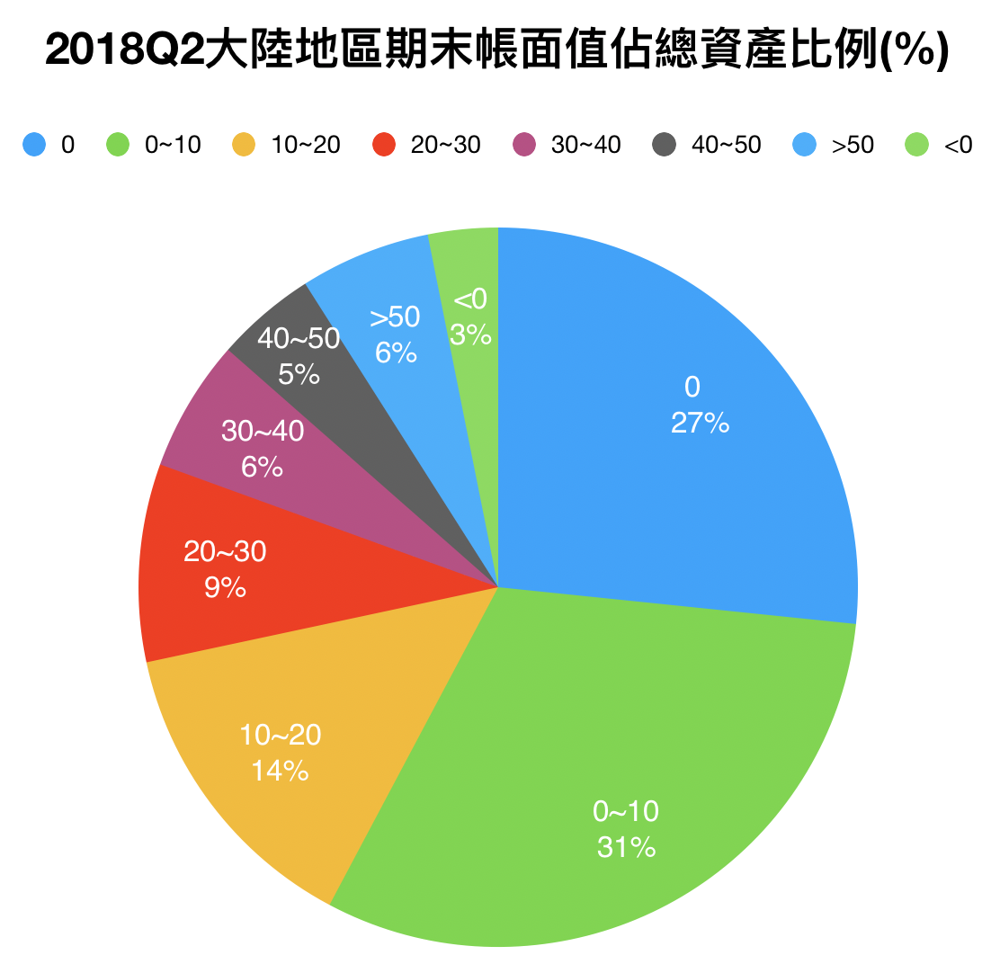
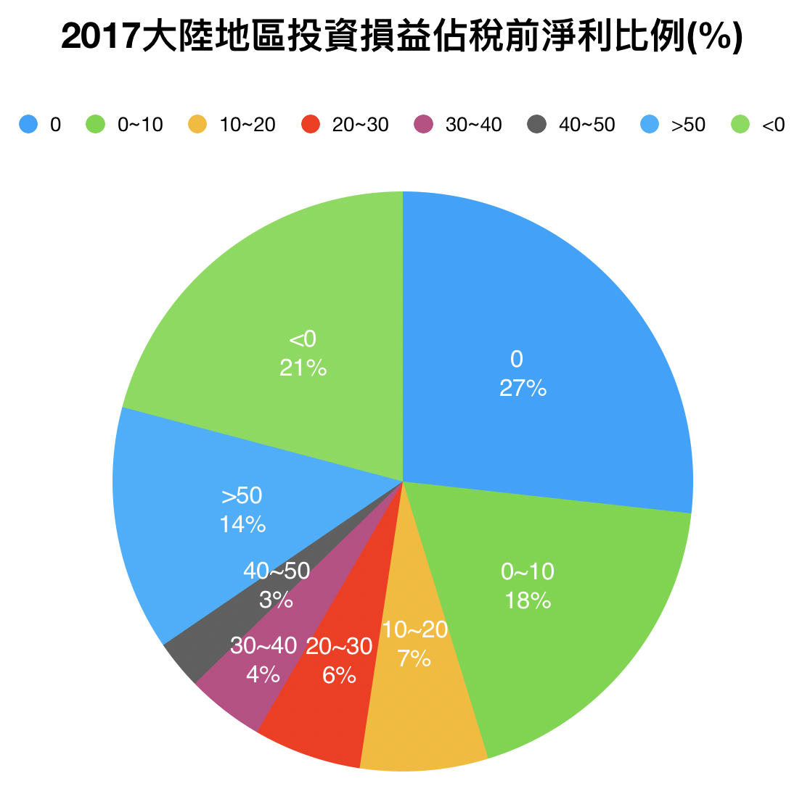

# 因應中美貿易戰的持股對策

10 月的大跌相信大家餘悸猶存，對台股投資人來說，近期要注意的風險有兩個，**一個是這幾年的多頭循環可能已經到了尾聲；另一個影響重大的，就是中美貿易戰帶來的影響。**

簡單描述一下中美貿易戰，中國和美國互相對從對方進口的商品加徵關稅，這會使得美國企業進口中國商品的成本大增，讓他們轉而向其他國家進口原物料。換句話說，如果貿易戰加徵的關稅在未來繼續維持，**那麼製造這些商品的公司，未來銷售到美國的比例會大幅降低，進而影響到營業收**入。

這件事不只牽涉到中美兩國，對台灣的廠商也有很大影響。**台廠這幾年在中國大量設廠，其中有很多公司就會受到這次貿易戰的影響**。根據新聞報導，蘋果供應鏈包含和碩、仁寶、緯創、台郡、欣興、美律、可成等廠商，都有意降低中國大陸生產比重。

台灣這幾年在中國大量設廠，以 2018 第二季財報來看，有 276 家公司「大陸地區期末帳面值佔總資產比」超過 1/3，也就是有 1/3 的資產在中國。

有 354 家公司「大陸地區投資損益佔稅前淨利比」超過 30%。

##投資人該做什麼？
對於投資人來說，不確定性就是風險的主要來源。 想要趨吉避凶的投資人，可以做以下幾件事：

- 最直接受害的就是在中國設廠，銷往美國的公司，這種持股要盡可能降低投資部位。
- 就算不論中美貿易戰的影響，中國近期房市跟車市都有消費趨緩甚至衰退的跡象，中國的消費力道減弱，對於主要獲利來自於中國的公司也會有影響。
- 在中國沒有廠房，但產品也銷往美國的公司，是最有可能在這波貿易戰受惠的股票。
 