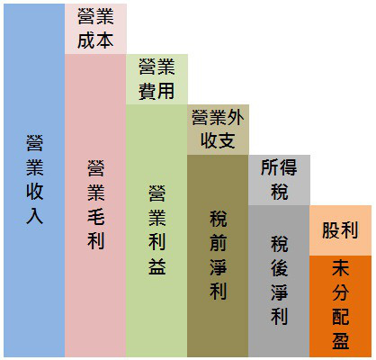

# 操盤人教你看財務報表重點整理

###第5章 損益表

損益表科目：

- 收益分兩種：跟本業有關的，就叫做銷貨收入（營業收入，營收）；與本業無關稱為利得（利息收入，投資收入）。
- 費用損失也分兩種：與本業有關的，就叫做費用；與本業無關的，則稱為損失。
- 為了賺取營業收入而產生的銷售產品或提供勞務成本，稱為營業成本；其他與經常營業相關的費用，例- 如銷售、廣告、管理、總務、研發等費用，則屬於營業費用。
- 營業成本的明細可以從財務報告書中的「重要會計科目明細表」中查到。
- 想看到營業費用明細，可從半年報及年報中查到

#####1. 營業費用沒有隨營收大增而大增，表示管理能理控制良好（←但需注意是不是將研發費用縮減）(P.54)

#####2. 打破產業淡旺季循環：就是觀察當傳統旺季結束時，單月營收不但不跌，反而一路往上衝高。（P.62）

#####3. 出貨對象如果多數是公司的關係企業，不是子公司、就是孫公司，這種情況就必須小心，因為可能會有假出貨、塞貨的情況，特別是一些產品世代週期很短、產品售價下跌速度很快的產業，特別需要小心。

#####4. 高毛利的產業多半表示這個產業門檻較高，市場跟随者不容易或是還沒有成功切進這個市場。

#####5. 營業費用大增的四種情況：

- (a) 組織不良，效率低落。
- (b) 產業競爭激烈，公司為擴大市場占有率而增加廣告費用等支出。
- (c) 公司大量支出，擴建生產線，當然，後年度的折舊費用也會開始增加。如果之後公司業績不能同步上揚，營收增加有限，就是決策錯誤。
- (d) 公司進入新產品領域，初期必順投入大量人物力（之後成效需觀察）
#####6. 獲利結構儘量避免業外收益比重過高。（業外收益有也要盡量與本業有關）

