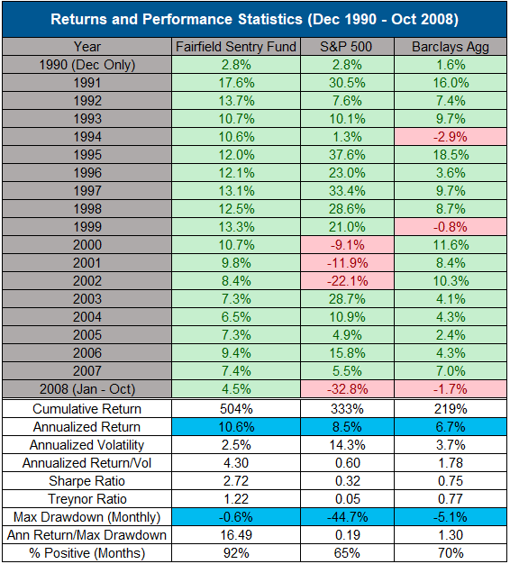
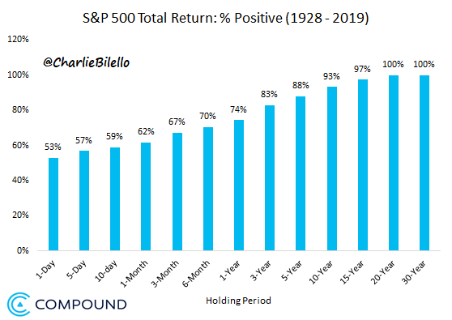

# 20個關於投資非常重要的觀念

 
2019年即將結束了，不論你今年的投資成績如何，更重要的是你從過去的經驗中學到了什麼？在2019年最後剩下的幾天中，我要跟大家分享20個重要的投資觀念，這個原文是美國財經專家<a href="https://compoundadvisors.com/2019/20-rules-for-markets-and-investing" target="_blank"><b>Charlie Bilello</b></a>所寫的： 

 

<b>(1)</b><b>面對市場要謙卑，不要認為自己能夠掌握市場脈動，否則最終市場會讓你認知到這點並讓你付出慘痛代價</b><o:p></o:p>

當我們做很多事情的時候，有信心是很重要的，但偏偏這點不適用於投資上，許多人都認為自己能夠判斷市場的漲跌，進而導致交易頻繁，最終導致投資績效低落，而且研究發現，男性比女性在投資人更具有信心，結果男性平均投資績效比女性更差<o:p></o:p>

 

<b>(2)</b><b>天下沒有白吃的午餐，高報酬必然伴隨高風險，看起來太好的事情通常都是假的</b><o:p></o:p>

從下圖可以看到，從1991年到2007年之間，美國S&amp;P500指數有三年的報酬率是負值，但你看到有一檔基金Fairfield Sentry Fund這段期間每年都提供正的報酬，是不是非常完美呢？想不想投資這檔基金呢？這檔基金的操盤人叫做伯納馬多夫(Bernie Madoff)，也就是馬多夫騙局的主角，之後的故事相信大家應該都知道了<o:p></o:p>

 

 

<b>(3)你持有投資的期間越長，你投資成功的機率就越高</b>

投資其實就是一個機率的遊戲，從下圖可以清楚的看到，投資成功的機率與你的聰明才智或是知識都無關，而是與你的持有投資的時間有關，而且兩者是呈現正相關，你持有投資的時間越長，投資成功的機率就越高<o:p></o:p>

 

 

<b>(4)每一次的市場都不一樣，不要用過去的經驗來推測未來發展</b>

人們總是喜歡在市場中尋找特定的模式，因為人們習慣一個有模式且規律的世界，當我們面對一個無規律的世界時就會感到手足無措，不知道該如何反應，也因此人們喜歡用各種統計數據或圖表來推測股市未來會如何發展，但是這麼做是非常危險的，因為股市可能根本就沒有任何的規律可言<o:p></o:p>

 

<b>(5)</b><b>價格目標完全沒有意義，預測股價是愚蠢的行為</b><o:p></o:p>

每年到了年終的時候，無數的金融機構都會發表對來年的經濟與股價預測，儘管這樣的預測不僅準確率極低，甚至對投資人是有害的！但每年金融機構還是會持續做這件事情，原因很簡單，因為投資人"想要"這樣的預測，特別是如果是知名人物的預測(例如羅傑斯)，更是媒體喜歡報導的，但聰明的投資人應該要知道，這類的預測完全是毫無意義的<o:p></o:p>

 

<b>(6)</b><b>計畫好過於預言，證據好過於評論</b>

大家應該都還記得，2016年的11月美國進入重要的總統大選，選前所有的主要媒體(甚至連台灣的央行總裁)都預測如果川普當選的話，全球股市將會大跌，結果呢？美國股市只跌了一天就開始上漲，川普當選之後到目前為止，美國S&amp;P500指數上漲了60%，Nasdaq
100指數上漲了86%，千萬不要再讓這類的預言阻礙了你的投資計畫！<o:p></o:p> 
 
 

 

 

<b>(7)</b><b>股市下跌是很正常的情況，想要成功投資就是去適應股市的下跌，而不是離開股市，因為你不會知道下跌何時會發生？會跌多少？</b><o:p></o:p>

今年初的時候，市場普遍預期今年的股市表現會很差，甚至可能大跌，因為中美貿易戰正殺的難分難解，結果呢？一年過去了，中美貿易戰也沒有結束，但股市卻大漲了！從下圖可以看到，自從2009年低點開始到現在，美國股市共出現了25次超過5%的下跌，每一次都伴隨著很負面的訊息，都好像市場即將要大跌，但市場依然是驚驚漲，屢創新高，所以我常常在演講的時候提醒投資人，當你在坐飛機的時候，如果飛機正遇到亂流時，你一定會聽到飛機機長的廣播：我們正在通過一段不穩定的氣流，請回到位子上做好，等待通過亂流，你絕對不會聽到機場廣播說：我們正在通過一段不穩定的氣流，請準備好跳飛機！投資也應該是如此，碰到亂流無可避免，耐心的等待通過，而不是跳飛機！

 

 

<b>(8)</b><b>投資單一股票是快速累積財富的好方法，卻也是快速喪失財富的好方法</b><o:p></o:p>

媒體經常都喜歡說，如果幾年前投資人買進ｘｘｘ股票並持有到現在就會有多少多少錢？講的好像要快速致富就必須去挑選到未來的飆馬股，雖然這些例子或許都是對的，但媒體沒有告訴投資人的是，要挑選到未來的飆馬股是難上加難的，根據統計，72%的美國單一公司股票長期的投資報酬率比存款的報酬率還低，超過50%的股票甚至長期的績效是負的，成功的機率是如此的低，聰明的投資人根本不需要冒著風險去投資單一股票！<o:p></o:p>

 

 

 

 

&nbsp;<b>(9)</b><b>金融市場充滿著高度的不確定性，任何你無法想像到的情況都可能會發生</b><o:p></o:p>

為了理解的方便，人們常常會用常態分配圖形來解釋市場的變動，這雖然是個便捷的方式，但同時也會誤導投資人，因為金融市場並不是屬於標準常態分配模型的，特別是在尾部事件發生的機率遠高於常態分配所描述的機率，例如2016年英國脫歐公投的時候（下圖），英鎊兌美元的匯率當日下跌了超過8%，按照英鎊過去的走勢，這是一個"15個標準差機率的事件"，理論上幾乎根本是不會發生的，但是它就是發生了！<o:p></o:p>

 

 

<b>(10)要累積財富，時間遠比資金更為重要</b>

很多人經常都會說：等我累積了一筆資金再開始投資！事實上，何時開始投資才是更為重要的，近年來只有我有空的話，我都很樂意去跟年輕人分享投資理財的觀念，因為年輕人擁有最寶貴的資產就是－時間，如果年輕人不懂得掌握這個寶貴的優勢，那麼年輕世代將會很難累積到財富，因為時間過去了就永遠不會再擁有，我很希望自己年輕的時候就能夠知道這點！<o:p></o:p>

 

<b>(11)</b><b>多存錢比投資報酬率更為重要</b><o:p></o:p>

很多人談到投資，關注的焦點就在投資報酬率，想像一下有兩個人，他們賺的錢一樣多<o:p></o:p>

甲：每年將所得的８％存起來，每年１％的投資報酬率 
乙：每年將所得的１％存起來，每年８％的投資報酬率<o:p></o:p>

請問３０年之後，誰的資產累積比較多？<o:p></o:p>

很多人直覺都會認為是乙，但答案卻是甲（下圖），所以盡可能的多存錢才是成功累積財富的基石<o:p></o:p>

 

 

<b>(12)一般來說，低費用率的基金績效表現會比高費用率的基金好，一般來說，被動式基金的績效表現會比主動式基金的表現好，一般來說，結構簡單產品的績效表現會比結構複雜的產品表現好</b>

要預測單一基金未來的表現是很困難的，但是根據晨星(MorningStar)公司的研究顯示，有一個單一的指標能夠很有效的預測某個基金未來的表現，這個指標不是基金經理人的學經歷如何？也不是基金得到幾顆星？而是－該基金的費用率！不論是哪種金融資產，低費用率的基金通常勝算都更高（下圖），我經常舉的例子是，想像一下有兩匹賽馬比賽，Ａ賽馬的騎師體重２００公斤，Ｂ賽馬的騎師體重５０公斤，請問哪匹馬獲勝的機率高呢？不論這兩位騎師過去的經驗或成績是如何，答案應該都很清楚了！<o:p></o:p>

 

 

&nbsp;<b>(13)</b><b>選擇一個適合你自己的投資方法，即使短期表現不佳也要堅持下去，這是投資成功很重要的關鍵</b><o:p></o:p>

成功的投資方法不只是一種，就好像你觀察職業高爾夫球選手的打球姿勢，你會發現很多人的姿勢都不太一樣，甚至有些人的姿勢還有點怪異，但他們同樣都打得很好，所以不是每個人都應該學習老虎伍茲的打球姿勢，只需要找到最適合自己的姿勢，投資也是如此，一旦決定了自己的投資方式，接下來的就是堅持下去，這樣才會成功，很多人投資失敗就是經常變換投資的方式，看到原本自己選定的方式好像一段期間表現不好，就開始想換個方式投資，這樣的結果一定不會好<o:p></o:p>

我們看看巴菲特的情況，巴菲特的價值投資法也不是所有的時候都表現很好，從1998年6月到2000年3月期間，網路科技股票狂飆，Nasdaq 100指數這段期間上漲了270%，而巴菲特公司的股價同時間卻下跌了49%（下圖）

 

 

換成我們一般人此時可能早就改變了投資方式，但巴菲特對自己的投資方式非常有信心且堅持下來了，之後當網路科技股泡沫破了之後，巴菲特公司的股價開始有好的表現（下圖），所以能夠忍受短期的"失敗"是巴菲特能夠成功很重要的因素

 

 

<b>(14)</b><b>一旦投資組合設定好了之後，放著不動（或很少變動）往往比經常變動更好</b><o:p></o:p>

說到投資，人們總是覺得好像需要經常去關心市場的變動，要隨時採取行動，要買低賣高，要波段操作，要停損停利，其實往往最正確的作法卻是什麼事情都不要做，從下圖可以看到，如果按照投資人交易次數的頻繁程度分成幾個群組，我們可以清楚的看到，投資績效與交易次數是呈現反比的關係，也就是越少交易的投資人，績效會越好！<o:p></o:p>

 

 

<b>(15)</b><b>不要害怕去說:"我不知道"</b>

我經常在演講中都說，當投資人（特別是理財人員）能夠勇敢地承認"我不知道"，你的投資績效就會開始好轉，因為只有承認自己不知道，你才會採取正確的方法，所以現在請跟著我唸一次：我不知道明年哪個市場／國家會表現較好？我不知道明年股票／債券／外匯市場會上漲還是下跌？我不知道明年哪支股票／基金會表現很好？<o:p></o:p>

 

<b>(16)</b><b>回歸平均值是金融市場很重要的特性</b><o:p></o:p>

當股市上漲的時候，我們通常會感覺市場還會繼續上漲，反之，當市場下跌的時候，我們也會感覺市場還會再下跌，這是人性很正常的反應，但是歷史經驗告訴我們，漲多了會跌下來，跌多了也會漲回去，回歸平均值這個特性才是金融市場的不變的定律！<o:p></o:p>

 

<b>(17)</b><b>沒有人有任何科學的方法能夠準確的預測市場的高點或低點，所有這些的預測都只是個人的猜測而已</b><o:p></o:p>

每當民間有人傳說"大地震"即將到來的時候，政府機構都會第一時間就跳出來告訴民眾，不要相信這種傳言，因為目前為止人們還找不到科學的方法來預測大地震的發生時間，但很奇怪的是，同樣是無法準確預測的股市，卻經常都有人公開預測市場即將大跌，即使屢次證實這些預測都毫無根據，卻可以一再的出現在媒體上而不會受到制止！<o:p></o:p>

 

<b>(18)</b><b>最好的投資策略不是去選擇投資報酬率最高的產品，而是能夠讓你長期持有並享受到"複利"好處的產品</b><o:p></o:p>

每當談到投資產品，投資人總是喜歡問過去的績效如何？好像過去的績效越高就是越好的產品，其實這是完全錯誤的思維，美國在2000-2009年期間有個基金很出名，這個基金得名稱是CGM Focus Fund，此基金被稱為該１０年最傑出的基金（下圖），因為該基金在這１０年中創造出平均每年超過１８％的績效（比美國S&amp;P500指數每年還高出3%），你會不會想如果我們也能夠投資該基金是不是很好呢？先別羨慕，因為該基金的投資人不僅沒有享受到高報酬，反而平均每年虧損１１％！你說怎麼可能會這樣？原因其實很簡單，因為投資人是在該基金大漲之後才紛紛湧入投資，但之後卻又在該基金大跌之後紛紛撤出，追高殺低的結果讓大多數基金投資人都賠錢了，所以投資產品的報酬永遠不會等同於投資人的報酬，唯有能夠讓你長期持有的產品才是你應該擁有的產品！<o:p></o:p>

 

 

<b>(19)</b><b>分散風險的投資組合與資產配置是我們無法預測市場走勢的情況下保護自己的最佳投資策略</b><o:p></o:p>

即將到來的2020年哪個資產會表現最好？最差？如果我們能夠事先知道，那投資就很簡單了，我們都去買會表現最好的，避開表現最差的，但就是因為我們無法用任何方法事先知道，所以我們才會需要採用分散風險的投資組合並做好資產配置，如同前面我們講過的，只有承認"我不知道"，然後才能夠開始採取正確的做法！<o:p></o:p> 
 

<b>(20)</b><b>學習控制你的情緒，否則你的情緒將會控制你</b><o:p></o:p>

愛因斯坦曾說過：世界上三種最大的力量就是愚蠢，恐懼與貪婪，巴菲特也一再提醒我們，投資成功的關鍵因素並不是聰明才智，而是能夠控制自己的情緒，投資很難的主要原因之一就是必須與自己的情緒抗衡，當我們看到市場下跌的時候，我們會害怕市場會下跌更多，並造成我們更大的損失，因此我們會想要逃離市場 
 

 

反之，當市場不斷上漲的時候，我們會想買更多，以免後悔沒有賺到更多的利潤

 

 

會有這種想法是很正常的，因為這是人類大腦在經過數萬年演化過程之後所得出的反應，這種功能讓人類順利的存活下來並主宰著地球，但偏偏卻會讓我們投資失敗，所以學習控制自己的情緒是很重要的，下次當你衝動的（不論是因為恐懼還是貪婪）想做出投資決策時，建議你先停一下，出去走一走，看一本書或是運動一下，等你回來的時候，市場依然還會在那裏，而此時你應該能夠做出比較正確的判斷了！

