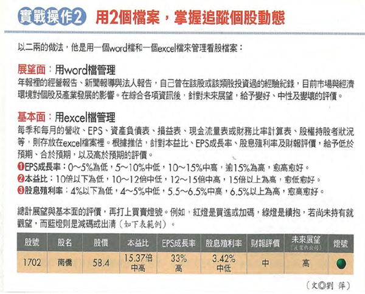
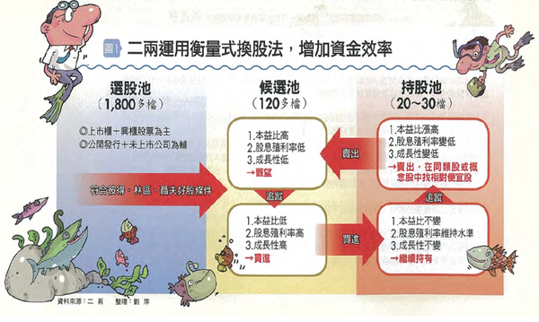

# 不動心投資法6---14年大賺47倍的投資法

介紹一個非典型的價值投資法
為什麼說非典型呢？
所謂的價值投資法就是評估一檔股票的合理內涵價值，然後用(遠)低於內涵價值的價格買進，等到它回升到內涵價值時再賣出賺取價差。
Wiki的定義是
價值投資是投資策略的其中一種，由Benjamin Graham和David Dodd所提出。和價值投資法所對應的是趨勢投資法。其重點是透過基本分析中的概念，例如高股息收益率、低市盈率（P/E，股價/每股淨利潤）和低市淨率（P/B，股價/每股淨資產），去尋找並投資於一些股價被低估了的股票。
 
所以一個價值投資者必須注重基本分析用來評估投資標的的內涵價值，評估的方式通常用本益比、股價淨值比、股息利率以及現金流量折現法。
 
其實主要就是要估計未來的盈餘與股息，那些用過去的資料，或者用歷史資料的平均數的所謂後視鏡的評估方法，還是用歷史資料或平均數來預估未來的盈餘與股息，不論你是主動蒐集產業的資料、公司的資料等非財務資訊，抑或直接採用公司已公佈財務資訊目的無他，就是要估計公司未來的盈餘和股息。然後用適當的方法評估其內涵價值，例如用合理本益比乘以估計的每股盈餘，或估計的現金股息除以合理的股息殖利率，或用未來的現金流量哲憲法來評估合理的股價，都是用來做分析，做預測。
 
另外一種價值評估的方式是評估公司所擁有資產的合理價值，轉投資賣掉有多少錢，土地不動產賣掉有多少錢？減去負債後就可以求出平均每股所擁有的合理時間內變現可獲得多少錢，然後目前的股價和這個如果在合理時間內變現美股的淨值比較，看其價值有沒有低估。
 
二兩投資法比較沒那麼複雜，他只是估計次一年度的每股盈餘，然後低於12倍的本益比或者高於5%現金殖利率買進前景看好的EPS成長的股票股票，在本益比來到15倍(只適用於非生技股)以上時，如何評估股票該買還是該賣，對二兩來說很簡單，就是為每檔股票打分數。與傳統的價值投資法不一樣是二兩注重企業的盈餘成長，再評估股票的燈號時，盈餘成長站3分之一的比重，而且未來的展望也和盈餘成長有關，基本上不成長的公司或前景不好的公司，不是二兩的理想投資標的。
 
 
對二兩而言，所有的股票都變成燈號，紅燈買進或加碼，綠燈續抱，藍燈則減碼或出清。

第二件二兩投資的獨特方式，就是以滿(100%)持股為原則，以其持有現金不如持有股票，股票會增值，現金只會被通膨消化殆盡。
 
 
 
滿持股有甚麼好處？就是在多頭的時期滿持股會賺很多，幾乎股票市場多頭時期是空同時期的2-2.5倍長的時間，基本上在人類的心理厭惡賠錢是喜好賺錢的2-2.5倍是一致的。
 
 
 
所以大部分的時間二兩都是賺錢的，但是遇到崩盤怎麼辦？這個就是二兩利害與敢買手股票的原因，因為在崩盤時，二兩會持續不斷的轉換股票，通常在崩盤的時期是經濟不景氣的時期，所以前景比較好的是防禦型的股票，例如中保或大統益等股票，此外兩山在換股票是用相對貴的去換相對便宜的，例如某一檔股票由於獲利不佳盈餘大幅下滑，使得本益比由原來的12倍提高到14倍，另外相類似的公司本益比卻只有12倍，他就立刻從A公司轉到B公司，以二兩在金融海嘯前大幅擁有的一檔工具機股票股價由80元跌到20元，跌了70%，但是二兩在金融海嘯那一年僅虧損了30%，這更加強二兩滿持股的信心。
 
二兩在操盤時有一個資金的停泊點就是防禦型的股票，在股市可能崩盤時他會加重防禦型股票的比重，所謂跌時重質，防禦性股票有個特色就貝它值比較低，貝它值是0.5的意思就是大盤跌20%它只會跌10%，所以在崩盤時它跌得比較少，有人會說既然會崩盤空手就好了，幹嘛還持有股票？二兩認為，如果低檔沒有持滿股票空手的人，在景氣回溫時，也不可能滿持股，可能空手或僅投入小部份股票，為了回溫時可全時參與，滿持股還是必要的。此外二兩認為之所以擁有防禦型的股票，是他在當時的評估認為持有防禦型股票還是會賺錢。
 
由於金融海嘯期間滿持股還是防禦成功，景氣回升時則是大大獲利(2002-2008，2010-2014)，導致二兩短短的13年獲利47倍，更增加了它持股的信心。
 
一旦股市往上，二兩會間停泊的資金由防禦股(貝它值較小)轉換為成長股這是耳兩的經常持股，貝它值較大的成長股可以讓二兩加速獲利。

二兩的衡量式換股法，讓他好的股票越換越多，但是要滿持股，必須要有很多投資標的可以選擇，二兩既不電訪也不參加法說會及股東會，他所擁有的資料都是公開的資訊，尤其是年報，每次年報公布時，二兩會將電話停機，用2-3周的時間持續閱讀分析年報，
 
用聯想法發現新的投資標的，例如投資新麥發現南僑也賣85度C烘焙油，對於不熟的股也會去試單，與股票交手後就會慢慢了解，對股票才會有感覺，就曾經有一檔股票過去三年交易沒有輸贏，最後一年大壓大賺一筆決勝負，二兩13年來買進出所接觸的股票高達200-300檔，這就是候選池裡面有100-200檔觀察股的原因。
 
 
 
二兩如何保護他的投資組合？
 
二兩有三把保護傘保護他的投資組合，就是股息的殖利率要大於5%，讓他在市場跌時仍然有收入而且有信心持股，市場漲時也可以拉高報酬。第二把傘就是分散投資組合，二兩過去幾次重壓個股受傷慘重，事後檢討就是沒有分散投資組合，所以他的單一持股不超過20%的水位，第三就是二兩絕不融資，融資會使人頻繁交易，因為要按日計息，所以賺了一點也會賣，賠了一點也會賣，大賠時會斷頭抬出股市永遠退出戰場。
 
 
 
二兩為何不考慮巴菲特投資法？
 
巴菲特式的價值投資法強調找好股，等到好的價格買，長抱不賣。對於資金小的投資人無法快速滾大本金，而且持有期間產生的現金流實在不多，就算你投資100萬元，找到好股殖利率達8%的股票，每年的現金流也不過8萬，當市場崩盤時，遇到好價錢你也沒有錢可買進。
 
 
 
二兩如何換股
 
雖然二兩擁有燈號投資法，但是基本上還是依據下面原則進行換股，股票越換越多張，股票越換越好。
 
1賣出高本益比股買進低本益比股。
 
2賣出低成長股買進高成長股
 
3賣出低配息股買進高配息股
 
4賣出財務品質變差股買進財務體質變好股
 
5看壞大盤時賣出成長股買進防禦股
 
6看好大盤時賣出防禦型股買進成長股
 
 
 
 
 
二兩會不會對投資標的的未來獲利及前景估計錯誤？
 
不用怕估錯，通常估計的都不準，但是依據估計的數字做為投資原則，當實際的狀況與估計的狀況不符時，再做加減碼，二兩對於他的投資方法很有保握是因為，謥始有一兩檔看錯的投資，整體而言淨值仍然是增加的，不會在同一時期的10幾檔投資投時看錯，通常只有一到兩檔看錯，整體的報酬率仍為成長。
 
 
 
 
 
二兩投資法與傳統的價值投資法有何不同？
 
二兩投資重成長，而傳統的價值投資法只注意市價是否低於內涵價值
 
二兩持股滿檔，而且會衡量式的比較，只看相對值不看絕對值，就是持續的執行上面介紹的六種換股方式。
 
通常是先衡量兩檔股票的獲利成長性、合理價值，在比對本益比，賣掉部分本益比高的股票，資金轉入本益比相對地的股票。這種頻繁換股讓二兩的週轉達六倍。
 
 
 
資料來源  智富月刊189期
 
 
 
 
 
二兩如何決定股票的買進及賣出決策？
 
為什麼二兩要維持滿倉的股票？
 
當景氣來臨或不景氣來臨時，二兩要如何進退？
 
崩盤時二兩要如何避免傷害
 
二兩在做預測不準時會如何
 
為什麼二兩有很多檔觀察股可以做為買進賣出的參考
 
為什麼二兩認為巴菲特投資法不適用小資呢？
