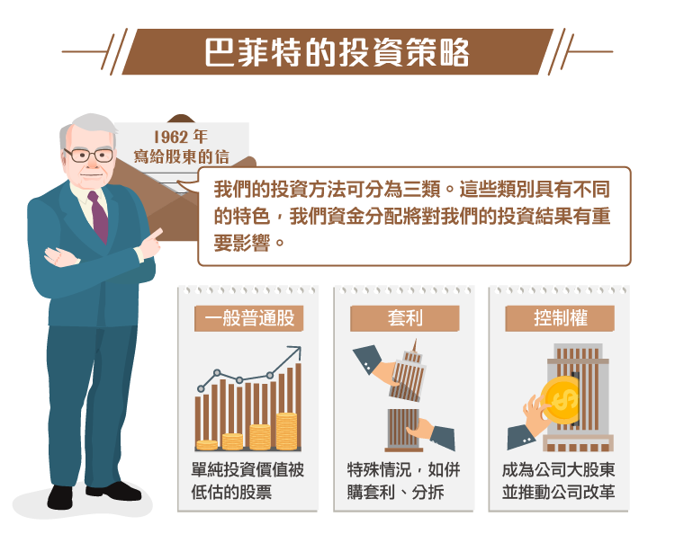
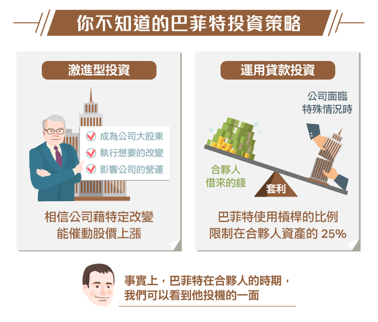

# 顛覆認知 你不知道的巴菲特投資策略

上週末，我再次花了幾個小時閱讀巴菲特 ( Warren Buffett ) 寫給合夥人的信。我在找一個他談論過的東西，再找到這東西時，我決定順便再讀一次巴菲特寫的信。我一直覺得閱讀巴菲特的信是非常有價值的。雖然我已經讀過很多次合夥人的信和波克夏（Berkshire Hathaway, BRK.A-US） (Berkshire) 的信，但每次閱讀我都會有新的收穫。我可能會發現一些對我投資情況有幫助的東西。

我認為投資人想學習和進步，最好的方法就是真的進場投資。你也可以通過研究公司，學習到很多東西。除了進場投資外，你可以做的第二件事是閱讀和進行反向研究。 在巴菲特的信中雖然沒有很多這樣的案例，但也有提到幾個。在巴菲特 1963 年的信中，我發現有趣的是信中列出了一個石油股套利案例，並說明了那時進行此併購套利將有可觀獲利。當時，巴菲特會購買小型而且將被大石油商併購的石油股，並預期這筆投資的年化報酬率將達到 20％。

未來，也許我會回過頭來檢視上述這些投資案例。 現在，我想評論的是關於巴菲特早期在信中提出的一些觀點。我個人認為，巴菲特寫給合夥人的信非常很有趣，當時巴菲特的資本額相較現在小很多，從事的投資方式與他後來在波克夏的幾十年也截然不同。

巴菲特在 1961 年管理著 400 萬美元，這是一個非常小額的資金，不過對當時的巴菲特而言已經足夠讓他進行主動投資。

我未來將與朋友撰寫關於巴菲特早期股東信的完整文章。但現在這篇，只會是我的片段想法。

##1962 年的股東信
巴菲特在這封信中，講到了他的投資策略。我一直很喜歡他將投資想法分類這點。雖然我之前說過，我不會在特定類別中尋求投資機會，但我認為將投資想法分類還是有幫助的。巴菲特在 1961 年的信中描述了他的投資方法。我應該會在別篇文章裡總結他的投資策略，因為我認為多數投資人都誤解了巴菲特的投資策略 (特別是早期的策略) 。

在 1962 年的股東信中，他簡要總結了他的投資組合策略：

“我們的投資方法可分為三類。這些類別都具有不同的特色，我們資金在這些投資組合的分配比例，將對我們的投資結果有重要影響。三種類別的實際投資比例，在某種程度上都已經是規劃好的，但這些規劃在很大程度上還是會根據現況進行調整。”

巴菲特列出了三種類別的投資策略：

- 一般普通股：沒有特殊催化劑，單純投資價值被低估的股票
- 套利：有一些特殊情況，如併購，分拆等…
- 控制權：這類投資中，巴菲特會成為公司的大股東，並推動公司改革。這種方法現在會被稱為激進投資。

##巴菲特和激進派投資
當在討論一般普通股的投資時，巴菲特曾說過：

`“普通股”`的投資類別，一般來說代表`”搭順風車“`。我們會認為，主要股東將會對無利可圖或未充分利用的資產進行改變，使這些資產運用在更好的用途上。我們在 Sanborn 和 Dempster 的投資上曾這麼做過，但我們寧願讓別人來做這件事。很顯然，這種投資不僅需要有充分的內在價值存在，還必須小心我們正持有的公司，它的大股東是誰。

這段話聽起來很像現在被稱為的“激進型投資人”。這種投資人，會成為公司的大股東，並執行他們想要看到的“改變”。通常，他們會做出一些很有創意的舉動，如要求公司增加債務，然後以“增加股東價值”的名義回購股票。相信這種“激進型投資者”的投資人，會假設事情將變得更好，公司的運營會改善，股票價格將上漲。而若是股票價格下跌的話，這些激進型投資人也將繼續增加持股， 並影響公司營運，直到公司狀況改善為止。上述方法得出的理論認為，這將為股價打出一個比較安全的底部。

我從來不是這種策略的支持者，我也不會依據上述理論做出投資決定。但我明白，在現實中這種情況是存在的。 一、兩年前，當巴菲特宣布他會在股價淨值比為 1.1 倍回購股票時，市場上甚至還出現了“ Buffett put ”的說法。

因此，激進投資以取得改變權是真實存在的，但我不會將此當作我投資的主因。正如巴菲特所說，價值必須存在。而且最重要的是，當你要評斷激進型投資者的行為時，要小心這間公司的大股東是誰。

##使用貸款來投資
有些人可能不知道的另一件事是，巴菲特會運用跟合夥人借來的錢來投資。他不會借很多，也不會用借來的錢進行“一般普通股”的投資。但在特殊情況下的投資，如套利時巴菲特就會使用槓桿。

巴菲特對套利的描述是，“股票的表現結果取決於公司行為，而不是市場上買賣雙方的供需。公司面臨如併購，清算，重組，分拆等等情況…都會導致套利的產生。”

巴菲特接著描述了投資特殊情況的好處：

“在很大程度上，無論道瓊工業指數的表現如何，這種特殊情況的投資每年將產生相當穩定的收益。很顯然，如果我們全年中大部分的投資都是屬於“套利”，那麼當道瓊工業指數正在下跌，我們的表現將看來相對優異很多，但當道瓊強勢上漲時，我們的表現則會看來相對差一點。”

因此，正如投資組合的學者所說，套利提供了不相關性，以及有吸引力的風險調整後報酬。雖然任何種類的交易都可能變壞，但持有一籃子的這種投資一段時間，將產生較可預期的報酬。

這就是為什麼巴菲特決定增加槓桿來投資：

“多年來，套利成為了我們第二大類型的投資。在任何時候，我們可能都有 5 到 10 個這樣的投資，有一些套利才剛開始，有一些則已經處於發展的後期階段。我相信使用槓桿能抵消套利在我們投資組合中佔的比例，不論是最終獲利結果或是暫時的市場狀況，套利都有高度的安全性。”

巴菲特表示，這些特殊情況通常能提供 10% 到 20％ 的年化報酬率，這是使用槓桿之前的報酬率。巴菲特將槓桿使用的比例，限制在合夥人資產的 25％。

##巴菲特的投資轉變
顯然，巴菲特在波克夏時也會使用槓桿。但有趣的是，他在合夥人時期，我們可以看到他較為投機的一面。在 1950 和 1960年代，巴菲特的投資策略絕不是買入並持有可口可樂（Coca-Cola, KO-US） (Cola) 幾十年。

巴菲特的投資想法隨著時間進化，但我認為進化的主因其實是管理資產的增加，而不是大家常認為的原因–被查理‧蒙格 (Charlie Munger) 影響。蒙格肯定是一個大因素，但資產的增加才是改變巴菲特投資策略的最大主因。到了現代，巴菲特的投資生涯又進入了新的階段，他投資更多和 3G 有關的公司，而且更注重影響企業營運層面的投資方法。

我認為在巴菲特心底，他應該很渴望過去撿雪茄屁股的日子、石油股的套利交易，以及投資可量化的廉價股。但這就是大家爭論的焦點，畢竟巴菲特一直是機會主義者，任何時候只要有機會出現在他眼前，他一定會去投資，並以最小的風險來達到最大的報酬。 (編譯/John)

