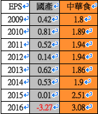

# 景氣循環股不適合存股  華倫老師

台股有一、兩千家公司，但真正適合長期存股的股票並不多，大家不要看到高殖利股就買進，一但景氣趨緩或公司競爭力下滑，股價跌的還不夠領的股息，像長虹 (5534) ，裕民 (2606) 、…等，也不要以為產業龍頭或者官股公司不會倒，錢放在那裏很安全，但安全不代表可以抗通膨，不代表會成長，有時候存到前景不好的公司還可能造成虧損，比如說鋼筋大廠東和鋼鐵 (2006) 、水泥大廠國產實業 (2504) 、…等景氣循環股，就算是很有紀律的存股，也討不到甚麼便宜，有些科技股就更不用說了，友達 (2409) 、晶電 (2448) 早已跌破金融海嘯低點。

先談談營建股，營建股常因為建案完工入帳，造成單季獲利暴衝，但是在推案銷售不佳時，也常造成虧損。就以長虹建設為例，長虹算是營建股的績優生，業績好的時候單季就可以賺一個股本，但近年受到政府打房影響，單季也出現虧損，2013 曾創下 131 元的歷史天價，當年度配息 9.97元，隨後股價急轉直下，一直跌到 2015 年的 39.45 元，用 100 多元買到的朋友看到股價下跌，可能不以為意，心想「反正領股息」就好，有 8％、9％ 的高殖利率保護，「應該不會有問題」，但其實問題很大。

航運股績優生裕民航運也有類似的狀況，裕民在 2007 年創下 123.5 元天價，當年度配息 8.5 元，因為具有高殖利定存股的概念，所以曾經是報章媒體追捧的對象，但隨後景氣反轉，如今股價僅剩 30 元左右。

接著來談國產 (2504) 這檔股票，我們先看看國產算不算景氣循環股，光看國產歷年來獲利起伏不定就知道了，近年來國內、外景氣走緩，國內又受到政府打房影響，公共工程預算又連年減少，如此勢必減少水泥量需求，價格下跌就會衝擊到國產的獲利，假設你存國產存了十年、八年，看到股價直直落會做何感想？

另一檔股票是筆者常推薦的股票，這檔股票的成交量很小，而且股價波動不大，就算大盤漲、跌超過一、兩千點，他的股價都不太會動，他就是中華食 (4205) ，大家試想，如果今天很不景氣，會不會影響你們家購買豆腐的習慣，中華食提供王品旗下石二鍋、爭鮮旗下餐廳的豆腐，還有全台灣火鍋店、小吃店、便利超商也多半提供中華食的各式豆腐和豆花，豆腐是便宜又富含植物性蛋白的營養食品，所以對景氣變化衝擊不大，2016 年公司獲利創歷史新高，股價也創下 61 元歷史新天價。

國產因為景氣衰退，股價頻頻破底；而中華食不畏景氣走緩，股價穩步向上攀升，後者應該是存股者比較喜歡的類型。

