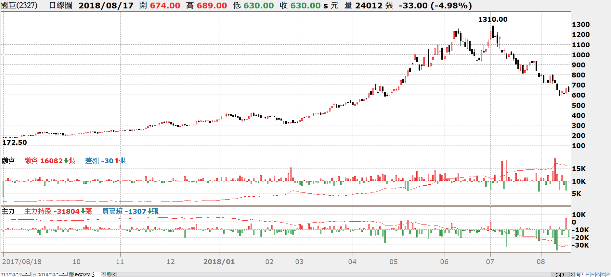
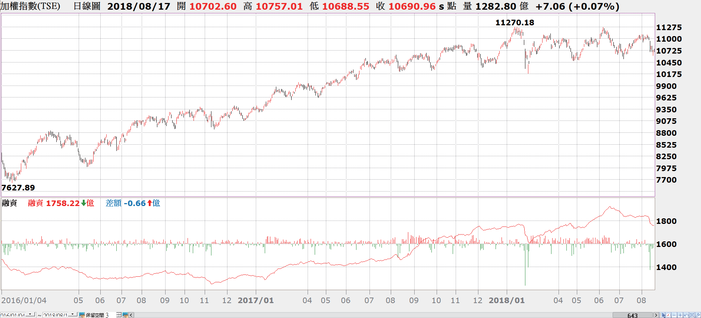
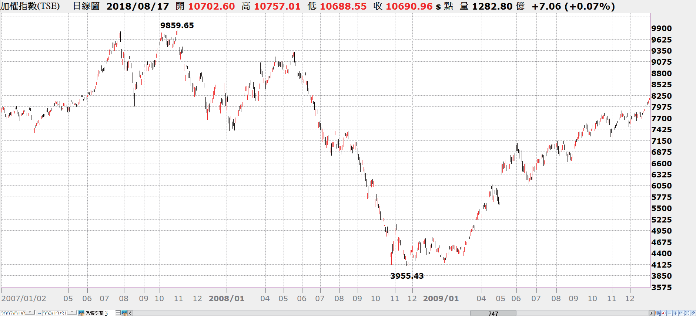
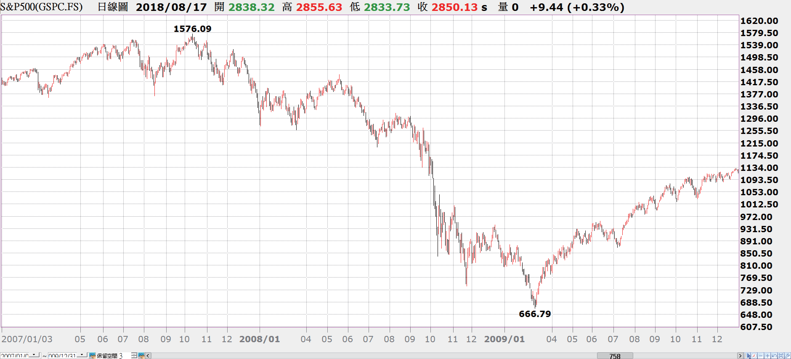

# 絕對不要借錢買股票！股神科斯托蘭尼

股市投資人的心理狀態決定了中短期的股市走勢，也就是說，股市的中短期表現，要看股票是掌握在資金充裕且固執的投資人手中，還是在猶豫、容易驚惶失措的投資人手中。
—科斯托蘭尼，《一個投機者的告白之證券心理學》，第6章〈群眾是無知的〉

科斯托蘭尼認為：「固執的投資者須具備4種要素：金錢、想法、耐心，還有運氣。」以上4者也就是成功投機家的4要素，而與固執的投資者相對的，就是猶豫的投資者。即便一個人具備了上述好幾項的條件，但只要是因為缺乏金錢、或者缺乏想法、或者缺乏耐性，也終將淪為猶豫的投資者。

**其中「有金錢」是無論投資或投機，都必須具備的基本要件，絕對金額的多寡並不是關鍵，而是有閒錢可以無壓力且具充裕時間，讓自己的部位去驗證自己看法的對錯**。如果用來投資或投機的資金並不是自己的，是借來的（有負債），或者並非毫無時間壓力，這種情況下的資金，並不配與一位好的投資家或投機家並肩作戰，甚至，這樣的資金來源反而可能是造成虧損的主因。我們可以說，沒有閒錢的人，沒有資格固執。

**
股票掌握在什麼人手裡，決定了後市的漲跌表現**。如果股票從猶豫的投資者手中流入了固執的投資者手中，讓穩定的籌碼支持股市上漲；反之，如果股票是從固執的投資人手中流向猶豫的投資人手中，那麼股價易跌難漲。短期來說，股價取決於籌碼的供給和需求，因為短期籌碼數量是固定的，只要買方的急迫性高於賣方的急迫性，股價自然會漲；反之，股價會跌。

2018年台股最經典的個股案例為被動元件龍頭廠國巨（2327），其股價在2018年上半年狂飆大漲了數倍，並且在2018年7月3日股價創下1,310元的新高，成為台股的股后（股價之高，僅次於股王大立光），然而從〔圖6-1〕國巨最近一年的股價、融資餘額與主力持股可以觀察到，**當股價漲過1,000元以上高價時，主力持股明顯下降，站在賣方，然而融資餘額卻持續竄高；當2018年7月上旬股價從1,310元跌回1,000元附近時，融資餘額暴增，顯示有許多散戶在1,000元左右選擇勇於承接。
**

然而，到了2018年8月中旬股價跌破600元，在1,000元融資買進的人，早已斷頭（若持續補繳保證金是不至於斷頭，然而當股價下跌40%在融資的槓桿2.5倍之下，也賠光了100%的原始本金）。

圖6-1：國巨（2327）最近一年的股價、融資餘額與主力持股（資料來源：XQ 操盤高手，2017 年8 月18 日至2018 年8 月17 日）
為什麼是固執的投資者主導股市多空的主要力量呢？100個散戶有100條心，而10個主力有時是1條心，無論當時主力是公司派大股東、還是外資法人、還是市場派有錢的大戶，只要是主力，通常是資金雄厚而且資訊充足，並且有耐心可以等待。

股票從猶豫者手中流向固執者手中時，往往籌碼會呈現集中，因為固執者可能只進不出，持續吸收來自市場的籌碼，當多數籌碼集中在少數人手裡並且持有不出脫時，股價便很難跌；反之，主力出貨時，儘管有為數眾多的散戶們來承接，也撐不住股價，這是用基本面無法解釋的，全憑籌碼面決定，而反映在價量上便是技術面所呈現的結果。

以台灣股市為例，往往藉由融資餘額的多寡做為觀察猶豫投資者的心態，因為融資的錢是借來的，有還錢的時間壓力，因此使用融資而持有股票的人，相對較無法擁有耐心來等待。

在股價大漲時，融資者因為有槓桿的效果，使利潤加成快速，往往不會急著馬上離場，而是認為自己有足夠的獲利引為保護，而續抱以期獲利更多，這是一種貪婪的心理；相反的，當股價大跌，融資者虧損的程度是以倍數放大，往往又急於出場，這是一種恐懼的心理。基於上述可知，股價上漲時融資者並不會賣，只有虧損時會賣，因此融資者多半以虧損收場，當然是不言而喻的結果。老手們都清楚，融資並不會放大一個人的實力，而只會放大一個人的貪婪和恐懼。

由〔圖6-2〕台股大盤指數和融資餘額的關係，我們可以觀察到兩個現象，其一是指數在大漲時，融資會跟著增加，而且指數漲得愈高，融資餘額就會愈多，這就是前述的「貪婪」現象，只要股價上漲融資持有者是不會出場的，他們必須虧損才願意離場；其二是融資餘額有落後指數的現象，往往指數高點已經過了，融資餘額隨後才會創下新高，而當指數低點已經過了，融資餘額還會持續創新低一陣子，這意味著，融資者普遍具有後知後覺的現象。

圖6-2：台股大盤指數和融資餘額的關係（資料來源：XQ操盤高手，2016年1月4日至2018年8月17日）

## `不要借錢買股票`

**科斯托蘭尼強調：「絕對不要借錢買股票。」因為即便你的看法是對的，往往無法撐到最後證明自己是對的那一刻，而在中途已經斷頭或被迫出場**。在股市當中，只有贏家和輸家，你就算懂得再多，若最後是以賠錢離場，那麼頂多也只是個愚蠢的專家。

許多專業人士，包括醫師、律師、工程師，在現實的股市交易當中損傷慘重，並不是因為他們懂太少，`而是他們懂得愈多專業知識，就愈容易陷入事事都應建立在理性邏輯判斷的泥淖，然而股市往往充滿著不理性的現象`，**股市裡的邏輯和我們真實世界裡的邏輯截然不同，因此，愈是篤信科學根據的人，到了充滿人性貪婪與恐懼的市場當中，愈顯得格格不入。**

科斯托蘭尼說：「2×2＝5－1，這條公式剛好將藝術與科學分開，因為科學工作不可能用這樣的公式計算，從數學角度看，他的計算必須準確無誤。⋯⋯但還沒等到得出4的結果，橋就已經在5的時候倒塌了。」

事實上，從2000年科技泡沫、以及2008年金融海嘯的股市實際走勢來看，「2×2＝5－1」這算術公式還是過於理性了，因為在這兩次空頭市場當中，即便是最穩健的美國股市也被攔腰斬斷，只剩一半，所以是「2×2＝8－4」。

我在華爾街工作的同事跟我說，2008年金融海嘯發生的時候，美國人都笑稱他們的退休金制度變成了201(k)，就是在挖苦美股的表現幾乎讓他們的帳戶總值腰斬。由〔圖6-3〕美國S&P500指數在2008年金融海嘯期間的表現，可以觀察到即便是美國股市當中最穩定的前500大企業，股價也難逃腰斬的命運。

圖6-3：美國S&P500指數在2008年金融海嘯期間的表現（資料來源：XQ操盤高手，2007年1月3日至2009年12月31日）

在2008年金融海嘯期間，台灣加權股價指數從2007年10月30日高點9,859點，跌到2008年11月21日低點3,955點，僅僅13個月的期間，大盤指數跌掉了六成，如〔圖6-4〕所示，因此我們可以說在台灣的現象是「2×2＝10－6」。

圖6-4：台股指數在2008年金融海嘯期間的表現（資料來源：XQ操盤高手，2007月1月2日至2009年12月31日）

`愈是散戶比重偏高的市場，猶豫的投資人相對就愈多、市場愈顯不理性，往往在上漲的時候超漲過多，而在回檔修正時摔得更重，這就是猶豫的投資人典型的傑作。`

無論在全世界哪一個洲、哪一個國家，只要是猶豫的投資人多的地方，那個國家的股市暴漲暴跌的現象也就愈發明顯，拿出這些國家的股市走勢圖來比較，彷彿人種和氣候的差異都不重要了，唯有散戶的畫作近乎如出一轍。散戶無國界，世界一家村。

