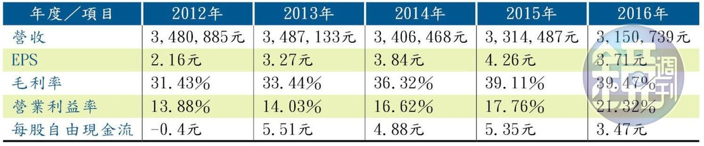

# 專買冷門股 物理博士投資6年累積千萬資產


說起話來慢條斯理，散發文青氣息，這是物理博士巫明帆給人的第一印象。不過聊起投資，他的說話速度卻變得飛快，「一家公司的營運，不太可能在短短的幾天內有什麼重大變化，既然如此，又何必在意短期的股價波動呢？」一句話看出巫明帆的價值投資思維。


##效法巴菲特　找低估標的
 
在成為專職投資人之前，巫明帆是一個在國際知名期刊發表過嚴謹學術論文的理論物理學家，「為了這個頭銜，我花非常多的時間，學習專業、但現實生活中卻沒什麼用的知識。

不過，當物理學家遇上巴菲特的價值投資學，卻擦出了火花，巫明帆2012年10月買進人生的第一張股票後，短短6年，他已累積近千萬元的資產，年領息收近40萬元。

「巫明帆個性固執又理性，習慣獨立思考，我們曾討論金洲這檔漁網業公司，他不只觀察金洲財報，還會比對國內、外競爭對手的財報，仔細推敲公司的實力。」國中同學徐逸亭說道。


有別於多數價值投資人偏好大型績優股，巫明帆卻鍾情投資「冷門股」，他點出二個簡單理由：

####一、熱門股價格容易被高估，而價值投資的精神在於，`買進價值被低估的公司股票，持有直到回歸合理價格`；

####二、冷門股表示還沒被市場關注，只要公司`持續維持良好獲利`，未來上漲的空間與力道相對強勁。而巫明帆對冷門股的粗略定義是：`一天成交量不超過100張`。

當然，冷門股必須要有硬底子才值得投資。巫明帆喜歡的公司是，公司產品需求穩定，產品具競爭優勢、不易被取代。

您       也許有興趣 ：
 
```
1. 富豪教賺錢,25種快速賺錢方法

2. 中古屋淘金術 
```

講到這，他以長年觀察的一檔股票為例，「新巨是唯一在台灣、甚至有能力在美國生產電源供應器的公司，其他同業幾乎皆為中國製造，且新巨客戶分散、客戶規模小、單子也小，彈性生產能力強，連一台的單都能接。講求客製化的結果，客戶依賴程度相當高。」


##重視3指標　看財務健康

除釐清公司的獨特性與競爭力，巫明帆還會特別留意公司財務體質是否健康，而他最在乎的3個指標是：每股自由現金流、毛利率、營業利益率。

####一、每股自由現金流，5年平均大於0。「資金就好比一家公司的氣，而經營比的是氣長，所以即便公司年年賺錢，若沒有控制好現金流量，也可能一時周轉不靈而破產。」

####二、毛利率需較同業高。毛利率的觀察必須與同業相較，通常比同業高者，具較高的定價能力及較低的成本。

####三、營業利益率與同業相較，愈高愈好。營業利益率是觀察公司管理能力的重要指標，「有效率的公司，相同營收的營業費用，會比同業低且穩定。」


以新巨為例，2013至2016年期間，每股現金流皆為正；另外，毛利率同一期間從33.44％提升到39.47％，營業利益率也從14.03％提升至21.32％，皆符合標準，「雖然近幾年電源供應器的營收持續下滑，但是營業費用也大幅下降，公司出現根本性的轉變，使得毛利率、營益率不降反升，這反映公司持續降低成本與提高產品附加價值，加深自身的護城河。」


巫明帆強調，價值投資的重點就在於`護城河`的分析，所以不光是單純看財報數字的變化，一定要把`數字變化背後的因素找出來`。經常與巫明帆密集研討投資的小賴也佩服地說：「他會把公司從接單製造到出貨的週期統整，找出數據佐證，甚至研究公司薪資變化，這都是相當費時的工程。」


##設安全邊際　尋進場時機

至於進場時間點，巫明帆會用`安全邊際`判斷，他舉金洲為例說明，2015年從當時資訊研判，當年每股獲利可達4元，以15倍本益比判斷，有機會達到60元，「打個折扣來說，若實際只漲到50元，買在30元左右，就算是安全邊際，能賺到20元價差，還有承受誤差的空間。但若股價漲到40元，我就不會考慮買進了。」事實上，巫明帆當年的買進價是32元，之後金洲股價雖一度漲至近60元，但後來一段時間維持在50元以上。


另外，`「人棄我取」`也是巫明帆認為的最佳買點，他說就算是判斷公司的護城河足夠，短期內還是可能受到挑戰，造成獲利起伏，「但只要對於公司長期獲利能力有一定的信心，當獲利下滑的時候，也可能出現好買點。」

像是新巨，2013年起每股獲利都在3元以上，雖然不是節節攀升，而是有下滑的情況，「但如果未來都能維持在這樣的水準，30元左右我就會考慮加碼。除非看好的理由消失，或找到更好的投資機會才會賣出。」


## 靠自我問答　求證投資路

其實投資初期，巫明帆也曾看走眼。2012年他看好具有大量生產規模優勢的電源供應器廠全漢，加上是旭隼的原始股東，有潛在保護，所以大膽買進。結果受到PC產業衰退影響，全漢的營收、毛利率持續下滑，讓他獲利歸零，「雖然沒虧到本金，但投資4年的時間成本全泡湯，也是很傷。」

從物理學家變專職投資人，這個人生彎道轉得夠急，巫明帆笑說：「做學術研究，方向、方法都是老闆設定，我喜愛自由零框架，覺得工作乏味。」他決定當起自己的老闆，走進只需向自己負責的投資路。


「我常待在房間角落自問自答，為什麼某家公司獲利那麼好？競爭力在哪？如果有人闖進我的房間，看到我這樣，一定覺得我很奇怪。」巫明帆自嘲：「投資冷門股不太可能有知音，所以很多答案都是靠自我問答求證而來。」

有趣的是，喜愛研究的人，走到哪裡都具有研究精神，「我對中醫超有興趣，有時候家人小感冒，我會自己開帖子去抓藥。」巫明帆笑說，最近他改研究食譜，「我現在是超級奶爸，家務事一手包辦，邊做邊研究，能增加不少的樂趣。」


## 巫明帆價值投資選股術--以新巨為例

###step１　觀察公司

新巨為唯一在台灣、且有能力在美國生產的電源供應器公司，講求客製化，彈性生產的能力不易被取代。

###step2　檢視財報

（一）每股自由現金流5年平均大於0：自由現金流為公司靠自身帶回的營業現金流入，和投資擴廠花掉的投資現金流出相抵銷後，最後剩餘的現金流量。多出來的自由現金流可讓公司在資金應用上多份彈性。→新巨每股自由現金流符合5年平均大於0的條件。

（二）毛利率較同業高：毛利率是衡量盈利能力的指標，代表企業創造附加價值的能力。→新巨毛利率維持在30％以上，相較同業的17％左右高出一大截。

（三）營業利益率較同業高：營業利益率為公司每創造1元的營收所能得到的獲利，與毛利率的差別，在於毛利率只考慮直接因為生產產品所需要的成本，而營業利益則是考慮了在取得收入的過程中，所耗用的一切成本。→新巨營業利益率持續走高，2016年甚至來到21.32％，高出同業1倍。



### step3　操作投資

`營收下滑，但毛利率、營益率不降反升，這代表公司持續降低成本與提高產品附加價值，加深了護城河`。→2016年底至2017年初大量布局，買進價格約35元，持有至今。
