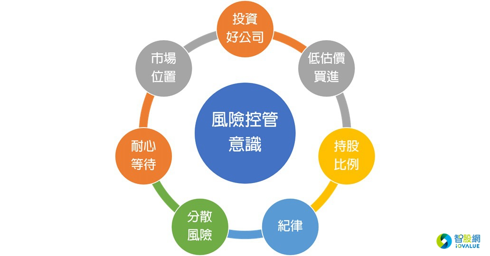
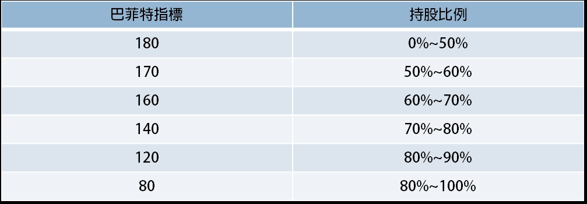

# 價值投資七大法則




巴菲特名言：「第一條規則：永遠不要虧損；第二條規則：永遠不要忘記第一條。」

```sh
1.     極大化「報酬率/風險」比。
2.     想盡辦法長久留在市場。
```


```sh
1.     投資好公司：只投資具有競爭優勢的好公司。
2.     低估價買進：只以被市場低估的價格買進。
3.     市場位置：了解目前市場站在什麼樣的位置。
4.     持股比例：做好資金/股票配比。
5.     分散風險：適度分散風險，建立優質投資組合。
6.     耐心等待：耐心等待時機的到來。
7.     紀律：堅持執行的投資紀律。
```

`價值投資法 + 複利 + 時間 = 財富`

##選股篩選的財務條件?

```
好公司的財報數據得符合我們制定的七項財務指標標準：
1).實質盈餘表現優異：過去八年實質盈餘的趨勢、平穩or成長。
2).ROE表現優異：ROE長期維持至少10%以上。
3).資盈率：長期維持在100%以下。
4).獲利含金量：長期維持80%以上。
5).配息率：長期維持至少在40%以上。
6) & 7).實質盈餘利益率&毛利率(20%以上)：穩定。

以上為基本過濾條件。
```

#### 觀察`獲利含金 & 資盈率`可避開地雷可能做假帳的公司


## 總體經濟的基本面 <- `持股比例依據`
- 巴菲特指標     `＠重要  `
- 台灣百大優質企業的總體營收趨勢。 `＠重要  `
- 美國央行的利率政策。
- 市場投資大眾的氛圍。
- 美國長短期公債利差。


所謂`股市的位置`，可以分為兩個層面來判讀：

- 基本面：目前總體經濟的發展趨勢。
- 價格面：總體市值相對價值，偏高或偏低。

### 巴菲特指標




例子:
2016年3月25日總市值：25,632,082(百萬)

2016年主計處預估GNI(GNP)：17,715,723(百萬)

GDP指標：25,632,082 / 17,715,723 X 100% =144.68%

依照資金持股原則，此時的持股比例應該維持在60%~70之間。
 
 

## 護城河

- 第一關卡 : 理解產業
    - 一個可以容易理解的事業，或自己本身對某特定事業有深度了解。
    - 產業本身前景是否具有`成長`的空間、具有`穩定`的基礎需求、並`非高度競爭化`的產業`(看毛利率可判斷)`。市場商機
    

###競爭優勢為什麼這麼重要?
分辨一家公司是否為好公司，`財務指標的重要性為30%，競爭優勢的分辨為70%`。投資是投資未來，並非投資過去，財務指標為過去式，競爭優勢為未來式，一家公司過去的財報表現優異，並不等於他未來也將表現優異，唯有確保他將繼續表現優異，得了解他是否具備長期競爭優勢，也就是巴菲特所說的經濟護城河。

我們都知道，投資房市最重要的三項因素：`地點、地點、地點`。

投資個股最重要的三項因素：`護城河、護城河、護城河`。


進入觀察名單的競爭優勢條件?
競爭優勢的分辨需要更多層面的思考，但並不難。智股網建立了一套`護城河觀察模組`，只要符合其中幾項重要條件，就可判定此家公司是否具備某總競爭優勢，例如：


```sh
1). 規模優勢。
2). 網絡效應。
3). 小眾利基型。
4). 法規保護。
5). 特定資源開發。
6). 生產技術成本優勢。
7). 地利之便。
8). 顧客轉換成本高。
9). 品牌效應。
```

除此之外，我們還得分辨公司的`內部能力`，例如：

```
1). 公司是否具有持續創新的能力。
2). 公司是否具備可重複複製的經營模式與管理系統來擴張市場。
3). 公司是否具有提高市佔率或開發新市場的野心與計畫。  ＠重要  
4). 公司發展策略的執行力。
5). 公司管理制度上的嚴謹。。
6). 公司是否具有積極的行銷策略。
7). 顧客關係的深度。
```

然而競爭優勢有分高與低，投資人得自行判斷。


## 估價

TODO

