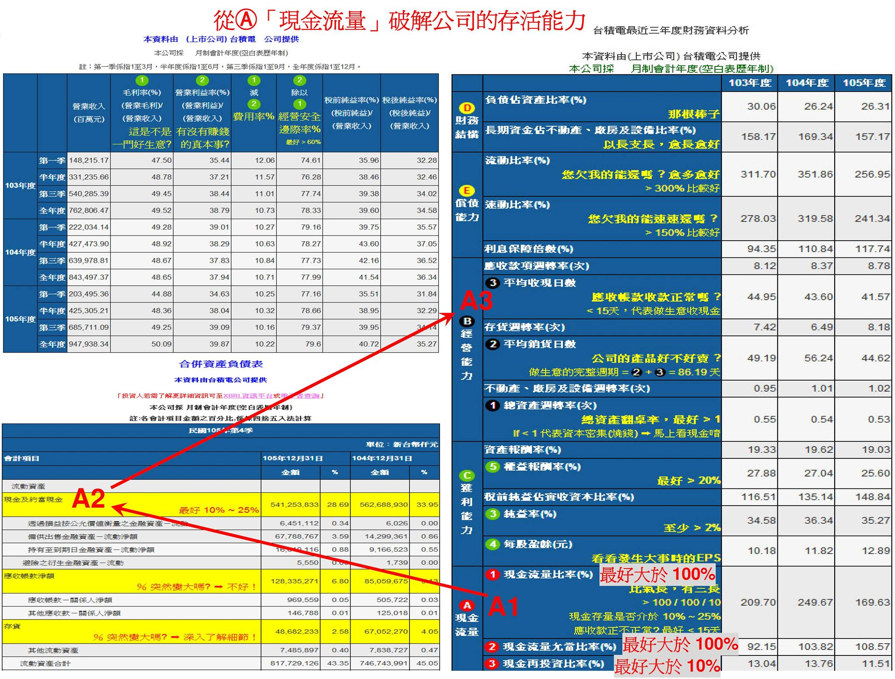
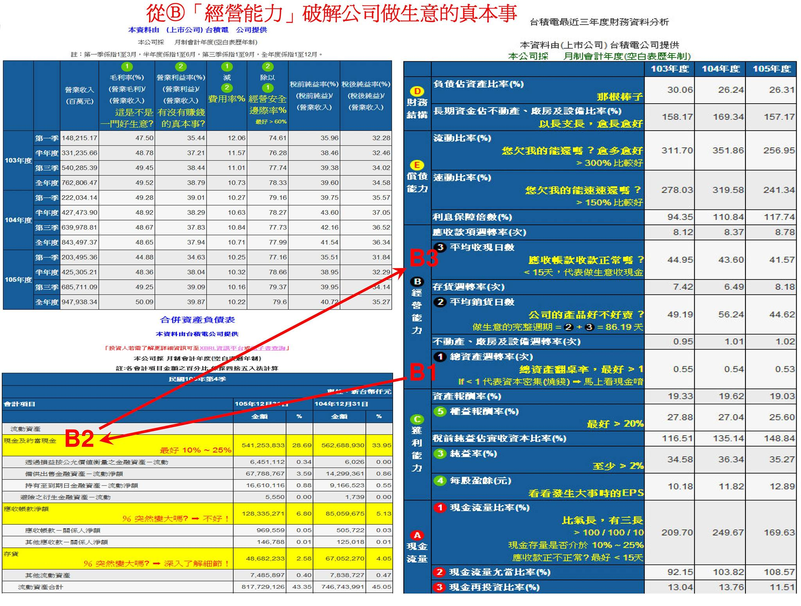
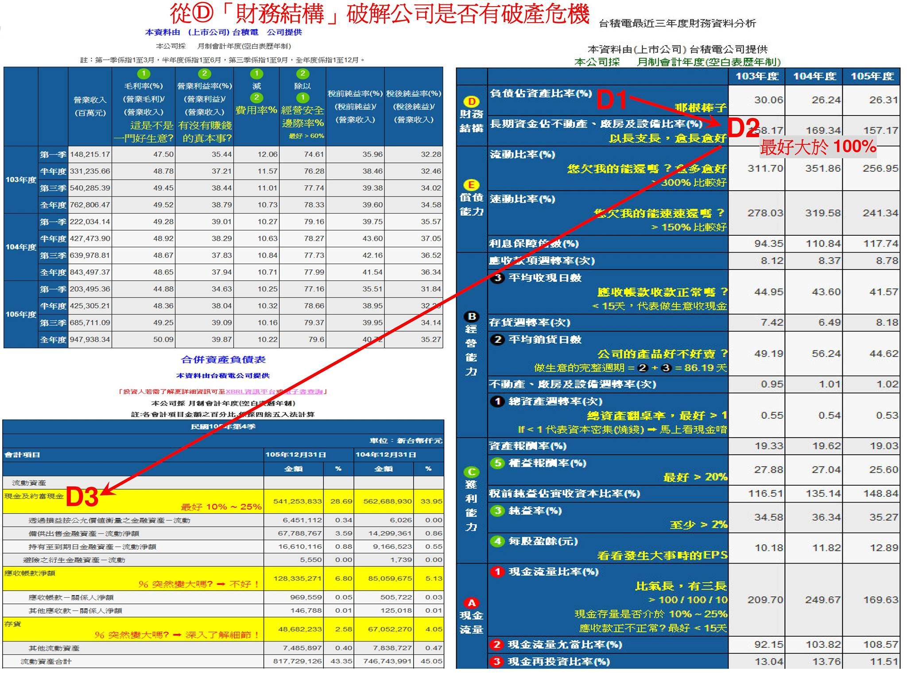
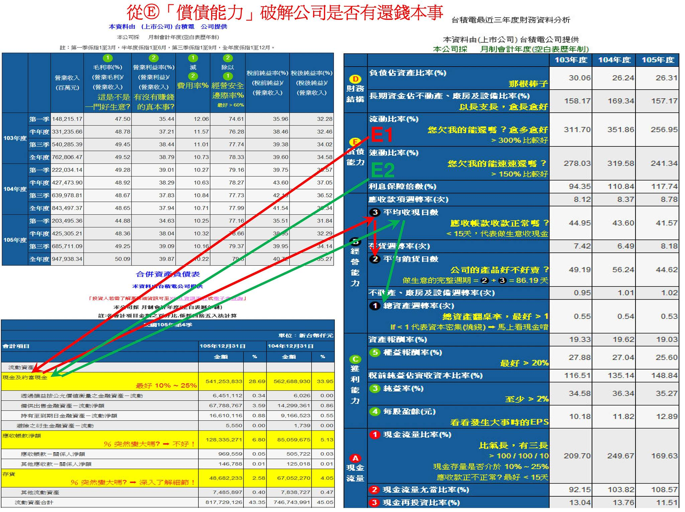

# 五大關鍵數字力

1.基本理財觀念： 
◎投資理財前應先做兩件事－適當的節省開支，存下理財第一桶金；購買一些基本保險，確保未來身體發生狀況時，有一定的保險理賠幫自己度過財務難關。 
◎不要投資任何沒生產力的資產－如外匯、期貨、選擇權、原物料(金、銀、銅、鐵、和石油等)。 
◎投資的錢，絕對不能與生活所需的基本開銷混在一起，最好是3~5年不會用到的錢，才能拿來投資。 
◎配合人生階段，隨著年紀增長，所能接受的風險應越來越低，尤其退休後，更是少碰高槓桿的金融商品。 
◎善用時間力量，只要慎選好公司，複利的威力會使資產創造出奇蹟，因而美夢成真。 
2.財務報表並不是萬靈丹，但卻能幫助投資人迅速判斷一家公司的好壞與體質狀況，有趨吉避凶的功能，只要仔細研讀，大致上就能看出公司整個經營面貌，不僅提早預判出有問題的企業，更能遠離大部分的「地雷股」，避免辛苦存下來的錢血本無歸，讓投資人在投資理財時，少走些彎路，少花點冤枉的學費。 
而閱覽一家公司的財報時，要一次看最近5年的資料，才能看出一家公司是否具備【長期穩定獲利能力】。 
「損益表」：公司是賺錢，還是虧錢的報表。 營收多少？成本多少？費用多少？稅後淨利是多少？
「資產負債表」：公司在做這門生意時，擁有哪些資產、借了哪些負債，以及股東出資多少錢等資訊。 
「現金流量表」：了解公司是否有能力把獲利，轉換成現金流回公司，提供持續成長運作之所需動能。 
3.「資產負債表」：
【左邊】放的是資產相關類別的會計科目。 
【右上角】放的是負債類的會計科目。 
【右下角】放的是股東權益科目。 
資產(左邊)＝負債(右上角)＋股東權益(右下角)。 
負債(外面欠人家的錢＝外部資本)與股東權益(股東出資的錢＝自有資本)中間的【那根棒子(橫線)】，就是「財務槓桿」。 
當「財務槓桿」往上移，表示股東出資增加，全體股東對公司未來有好的看法。 當「財務槓桿」往下移，就代表借貸資金來源佔大多數，股東們不願意出錢投資，只能透過增加負債來經營，這時公司可能就會出現財務問題。 
4.`不同行業別的公司，應收款項週轉率的數字會明顯不一樣`，但只要是現金交易的行業，其【平均收現日數】通常小於15天，而資產負債表中的【應收帳款】佔總資產比例也會很少。 
大部分一般台灣企業的平均收現日數，約在60~90天之間才算正常，表示應收帳款在60~90天之內會變成現金，若遇到較特殊之行業別，就不能只單純看個別公司的數據，必需從行業的平均表現進一步分析。 
如果一間公司經營穩健，【平均收現日數】也會相對穩定，不會有太大起伏。 但少部分心術不正的公司高層，為了美化損益表的獲利情況，進行假交易，使業績營收看似大幅成長，不過銷貨出去的貨品，是無法變成現金回流，而這些假交易幾乎都是在【應收帳款】這個會計科目上動手腳，此類公司的財報會有五項明顯特徵： 
◎營收會有大幅成長的假象。 
◎稅後淨利也會大增。 
◎應收帳款的金額會大幅增加。 
◎因為是假銷售額，故現金無法等比例大幅成長。 
◎平均收現日數也會越拖越長。 
5.【平均銷貨日數＝平均在庫天數】，表示存貨平均在公司倉庫待得越少天，在庫天數越短，其產品就越暢銷。 
◎平均在30天內銷售出去，代表這家公司非常優異，如Alppe公司。 
◎平均介於30~50天，通常屬於流通業的模範生，如7-11、好市多，或擁有熱銷產品的品牌公司，如UNIQLO，或存貨管理能力相當優秀的公司，如鴻海。 
◎平均介於50~80天可賣出，也算是經營不錯的公司。 
◎平均介於80~100天的行業，如化工、塑膠、農產品等。 
◎平均介於100~150天，多屬工業性或原物料產品，如工業電腦、鋼鐵、石油，其需求比較不旺盛，客戶久久才下單一次。 
◎平均大於150天，則表示公司經營能力不佳，或屬於較特殊行業，如造船通常大於250天、飛機製造通常大於300天、精品業Tiffany大約在400天以上、房地產業幾乎是1000天起跳。 
6.一家公司從買材料到投入生產，到產品製作完成放入倉庫，再由業務賣出產品，最後到收回客戶貨款，整個流程就叫「做生意的完整週期」＝【平均銷貨日數(存貨在庫天數)＋平均收現日數】＝【應付帳款付款天數＋缺錢天數(現金週轉期) 】。 
假如整個「做生意的完整週期」小於35天，表示這間公司經營能力非常出色的，因為基本上向供應商進貨所需之【應付帳款】，平均在40~60天後才需要付款，如果做一整趟生意的天數，不超過付給廠商帳款的時間，表示只要靠供應商給的錢就能週轉營運，公司不用再傷腦筋籌錢經營，假如要突然倒閉的機會，就大大減少了。 
7.公開資訊觀測站之財務報表取得：http://mops.twse.com.tw/mops/web/t05st22_q1。 
輸入「公司股票代號」後之閱讀順序： 
Ⓐ「現金流量」－比氣長，越長越好。 流進公司的現金越多，公司的底氣就越充足，氣力就會越長，才值得長期投資。 
Ⓑ「經營能力」－翻桌率，越高越好，一年幫公司做越多趟生意，表示經營能力越好。 
Ⓒ「獲利能力」－這是不是一門好生意，毛利率是否夠高？毛利越高，代表這真是一門好生意。 毛利越低，代表這是一門艱困的生意。 如果毛利是負的，那就代表真是一門爛生意。 
Ⓓ「財務結構」－那根棒子(橫線)，位置越高越好。 能夠看出一間公司股東們，對這家公司的普遍性看法，是否會出錢投資？
Ⓔ「償債能力」－欠人家錢，有能力還嗎？能還越多越好。 
8.從Ⓐ「現金流量」破解公司的存活能力：

Ⓐ①以「大於100/100/10」的觀念來分析。 
第一個100，指的是【現金流量比率＝營業活動淨現金流量÷流動負債】＞100%比較好，代表公司真正賺進來的現金，足夠償還對外的短期負債。 
第二個100，指的是【現金流量允當比率＝最近5年度營業活動淨現金流量÷(最近5年度的資本支出＋存貨增加額＋現金股利)】＞100%比較好，代表公司最近五個年度不需要對外借錢融資，所賺的錢已經能自給自足，不太需要跟銀行借錢或股東增資。 
第三個10，指的是【現金再投資比率＝(營業活動淨現金流量－現金股利)÷(固定資產毛額＋長期投資＋其他資產＋營運資金)】＞10%比較好，代表公司手上真正留下來的現金，最低應佔總資產10%以上。 
Ⓐ②手上是否有足夠的現金，能否安全渡過不景氣時的危機時刻？
看資產負債表上【現金佔總資產的比率】，現金與約當現金最好佔公司總資產的25%以上，最少也應該大於10%，尤其是屬於高資本密集(燒錢)的行業，現金佔總資產比例最好要高於25%。 
Ⓐ③公司銷貨過程中，是否能即時收回現金？
看「經營能力」中【平均收現日數】，一般來說，只要小於15天，基本上算是收現金的行業，如便利商店、百貨公司、鐵路運輸、航空等，或其產品價格波動很大(一日三市)，如原物料的金、銀、銅、鐵、石油、農產品、DRAM等。 
閱讀財務報表順序為Ⓐ①＞Ⓐ②＞Ⓐ③，但三個指標重要性是Ⓐ②(占70分)＞Ⓐ①(占20分)＞Ⓐ③(占10分)。 
9.從Ⓑ「經營能力」破解公司做生意的真本事：

Ⓑ①看「經營能力」中【總資產週轉率】，大於1以上還不錯，但如果小於1，代表是資本密集(燒錢)的公司。 
Ⓑ②看資產負債表上【現金佔總資產的比率】，如果是高資本密集公司，它的現金占總資產比例，最好高於25%以上。 
Ⓑ③看「經營能力」中【平均收現日數】，而手上缺現金的話，那至少得確保這家公司能天天收現金，最好是在15天以內。 
為何公司有現金會如此重要？就是因景氣時常會有波動，隨時都有可能出現像黑天鵝意料之外的壞事發生，假如當下身邊沒有足夠現金週轉，很容易在這時間點引發財務危機。 所以，碰到高資本密集的公司，閱讀順序為Ⓑ①＞Ⓑ②＞Ⓑ③，才能避開投資到爛公司的可能性，而不會出現資產歸零的慘況。 
10.從Ⓒ「獲利能力」破解這是不是一門好生意：

Ⓒ①損益表中【毛利率】，這是不是一門好生意？越高越好。 
Ⓒ②損益表中【營業利益率】，有沒有賺錢的真本事？越高越好。 
營業收入－營業成本＝毛利，毛利－營業費用＝營業利益。 
【營業費用】小於10%，代表這家公司在此產業已具有相當規模，或是在該行業市占率前三名，如台積電、大立光。 
【營業費用】小於7%，代表這家公司不但具有很大規模，且在經營上的費用也相當節省，如台塑、鴻海。 
【營業費用】若大於20%，有可能是自有品牌公司(如HTC、阿瘦皮鞋)、尚未具有規模經濟的公司(如生技、醫療)、需不斷做促銷活動的流通業(如超商、屈臣氏、全聯)、或餐飲業(房租、水電、人事費用)等。 
Ⓒ③【經營安全邊際】＝營業利益率÷毛利率，越高代表公司獲利的寬裕度越高，抵抗景氣波動的能力越好，對於面對殺價競爭時可以撐得比較久，如果大於60%以上最好。 
Ⓒ④看「獲利能力」中【淨利率(純益率)】，越高越好，看稅後是否有賺錢，至少淨利率應大於資金成本，通常要大於2%~3%以上。 
Ⓒ⑤看「獲利能力」中【每股獲利(EPS)】＝淨利÷總股數，越高越好，股東才能賺更多。 
Ⓒ⑥看「獲利能力」中【股東權益報酬率(RoE)】＝淨利÷股東權益，相對於股東出的錢，能獲得多少的報酬率，越高越好，最好是10%~20%以上，如果小於7%就得小心觀察。 
11.從Ⓓ「財務結構」破解公司是否有破產危機：

Ⓓ①看「財務結構」中【負債佔資產比例】是往上移？還是往下移？就是資產負債表的右邊【那根棒子(橫線)】，棒子上方為負債，棒子下方為股東權益，不要超過同產業的平均標準。 
Ⓓ②看「財務結構」中【(長期資金佔不動產、廠房及設備比例】＝長期資金來源÷長期資金去路，以長支長，越長越好。 如果小於100%，就有可能是以短期資金，去購買長期資產的可能，投資人就得特別小心。 
Ⓓ③看資產負債表上【現金佔總資產的比率】，最好是在10%~25%以上，越高越好。 
12.從Ⓔ「償債能力」破解公司是否有還錢本事：

Ⓔ①看「償債能力」中【流動比率】＝流動資產÷流動負債，越大越好，流動資產包括現金與約當現金、應收帳款、存貨等三種短期資產。 
一般流動比率大於200%以上就好，但怕少部分惡質公司，過度美化應收帳款與存貨，建議最好大於300%以上。 
◎第一先看「償債能力」中【流動比率】，是否大於300%以上。 
◎第二看資產負債表上【現金佔總資產的比率】，最好是在10%~25%以上，越高越好。 
◎第三看「經營能力」中【平均收現日數】，是否需很久才能收回款項？
◎最後看「經營能力」中【平均銷貨日數】，公司產品是否暢銷或滯銷？
Ⓔ②看「償債能力」中【速動比率】＝(流動資產－存貨－預付費用)÷流動負債，越大越好，最好是近三年的速動比率大於150%以上。 
◎第一先看「償債能力」中【速動比率】，是否大於150%以上。 
◎第二看資產負債表上【現金佔總資產的比率】，最好是在10%~25%以上，越高越好。 
◎第三看「經營能力」中【平均收現日數】，是否需很久才能收回款項？
◎最後看「經營能力」中【總資產週轉率】，最好是大於1，因為小於1，代表這家公司是高資本密集(燒錢)的行業。 
如果一家公司沒現金，收錢速度又慢，又是經營燒錢行業，用基本常識判斷都知道投資它實在太危險了。 
13.好公司在財務報表的共通性：
◎公司經營保守穩健，手中留有很多現金。 (現金流量→比氣長、越長越好。 )
◎應收帳款與存貨的管理非常優異，做生意的完整週期又比業界其他競爭者要短。 (經營能力→翻桌率，越多趟越好。 )
◎毛利率高，這是一門好生意；營業利益率高，有賺錢真本事；經營安全邊際高；股東報酬率高。 (獲利能力→這是不是一門好生意。 )
◎不會過度使用財務槓桿，資金來源不會發生「以短支長」的致命錯誤。 (財務結構→那根棒子越高越好。 )
◎短期營運資金充足，對外負債有能力償還。 (償還能力→欠別人的，能還越多越好。 

---

Ⓐ①以「大於100/100/10」的觀念來分析。
【現金流量比率】＞100%比較好，代表公司真正賺進來的現金，足夠償還對外的短期負債。
【現金流量允當比率】＞100%比較好，代表公司最近五個年度不需要對外借錢融資，所賺的錢已經能自給自足，不太需要跟銀行借錢或股東增資。
【現金再投資比率】＞10%比較好，代表公司手上真正留下來的現金，最低應佔總資產10%以上。

Ⓐ②手上是否有足夠的現金，能否安全渡過不景氣時的危機時刻？
【現金佔總資產的比率】，現金與約當現金最好佔公司總資產的25%以上，最少也應該大於10%，尤其是屬於高資本密集(燒錢)的行業，現金佔總資產比例最好要高於25%。

Ⓐ③公司銷貨過程中，是否能即時收回現金？
【平均收現日數】，一般來說，只要小於15天，基本上算是收現金的行業，如便利商店、百貨公司、鐵路運輸、航空等。

Ⓑ①【總資產週轉率】，大於1以上還不錯，但如果小於1，代表是資本密集(燒錢)的公司。

Ⓑ②【現金佔總資產的比率】，如果是高資本密集公司，它的現金占總資產比例，最好高於25%以上。

Ⓑ③【平均收現日數】，而手上缺現金的話，那至少得確保這家公司能天天收現金，最好是在15天以內。

Ⓒ①損益表中【毛利率】，這是不是一門好生意？越高越好。

Ⓒ②損益表中【營業利益率】，有沒有賺錢的真本事？越高越好。
營業收入－營業成本＝毛利，毛利－【營業費用】＝營業利益。
【營業費用】＜10%，代表這家公司在此產業已具有相當規模，或是在該行業市占率前三名，如台積電、大立光。
【營業費用】＜7%，代表這家公司不但具有很大規模，且在經營上的費用也相當節省，如台塑、鴻海。
【營業費用】＞20%，有可能是自有品牌公司(如HTC、阿瘦皮鞋)、尚未具有規模經濟的公司(如生技、醫療)、需不斷做促銷活動的流通業(如超商、屈臣氏、全聯)、或餐飲業(房租、水電、人事費用)等。

Ⓒ③【經營安全邊際】＞60%以上最好，越高代表公司獲利的寬裕度越高，抵抗景氣波動的能力越好，對於面對殺價競爭時可以撐得比較久。

Ⓒ④【淨利率(純益率)】，越高越好，至少要大於資金成本2%~3%以上，稅後才有賺錢。

Ⓒ⑤【每股獲利(EPS)】，越高越好，股東才能賺更多。

Ⓒ⑥【股東報酬率(RoE)】，相對於股東出的錢，能獲得多少的報酬率，越高越好，最好是10%~20%以上，如果小於7%就得小心觀察。

Ⓓ①【負債佔資產比例(那根棒子)】是往上移？還是往下移？棒子上方為負債，棒子下方為股東權益，不要超過同產業的平均標準。
往上移，表示股東出資增加，全體股東對公司未來有好的看法。
往下移，就代表負債資金來源佔大多數，股東們不願意出錢投資，大部分只能透過增加負債來經營，這時公司可能就會出現財務問題。

Ⓓ②【長期資金佔不動產、廠房及設備比例】，以長支長，越長越好。如果小於100%，就有可能是以短期資金，去購買長期資產的可能，此時就得特別小心。

Ⓓ③【現金佔總資產的比率】，最好是在10%~25%以上，越高越好。

Ⓔ①【流動比率】，越大越好，流動資產包括現金與約當現金、應收帳款、存貨等三種短期資產。
一般流動比率大於200%以上就好，但怕少部分惡質公司，過度美化應收帳款與存貨，建議最好大於300%以上。
◎第一看【流動比率】，是否大於300%以上。
◎第二看【現金佔總資產的比率】，最好是在10%~25%以上，越高越好。
◎第三看【平均收現日數】，多久才能收回款項？
◎最後看【平均銷貨日數(平均在庫天數)】，公司產品是否暢銷或滯銷？

Ⓔ②【速動比率】，越大越好，最好是近三年大於150%以上。
◎第一看【速動比率】，是否大於150%以上。
◎第二看【現金佔總資產的比率】，最好是在10%~25%以上，越高越好。
◎第三看【平均收現日數】，多久才能收回款項？
◎最後看【總資產週轉率】，最好是大於1，因為小於1，代表這家公司是高資本密集(燒錢)的行業。
如果一家公司沒現金，收錢速度又慢，又是經營燒錢行業，用基本常識判斷都知道投資它會非常危險。

