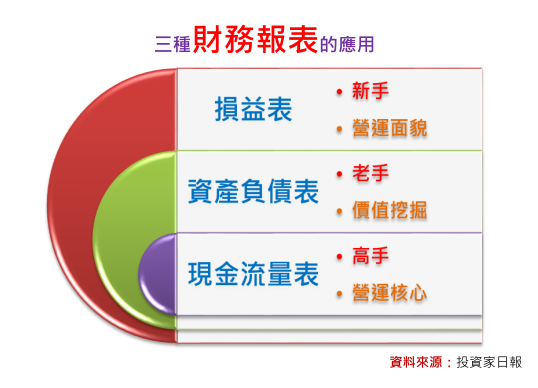
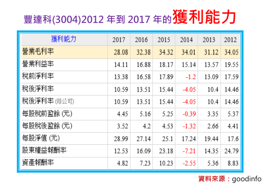
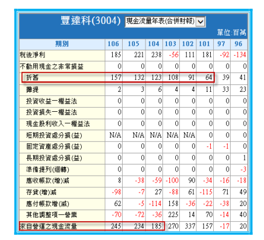

# 高手看現金流量表，以豐達科(3004)為例!

一般而言，財務報表主要可分為三大類型，若從實務的經驗來看，慶龍認為損益表不僅可用來檢視一家公司的營運面貌，更是許多市場新手，剛開始學「財報分析」的入門課題，此外，資產負債表的功用，則是提供市場老手，挖掘一檔股票價值的重要線索，至於現金流量表，在市場高手的眼裡，可用來直搗黃龍、掌握一家公司營運核心與未來發展的依據。

舉例來說，日報長期追蹤的股票豐達科(3004)，從損益表的角度來看，隱約感受到營運面貌不甚理想的趨勢，畢竟2017年營收雖然達到17.48億元，較2016年成長6.72%，但由於毛利率從32.38%下降至28.08%，因此不僅影響稅後淨利率從13.51%走弱到10.59%，每股稅後盈餘更從4.2元跌落到3.52元，此外，若再與2015年毛利率34.32%與4.53元EPS相比，2017年的豐達科完全出現了「向下沉淪」的疑慮。

不過若從現金流量表的角度來看，慶龍卻看了豐達科(3004)營運越來越好的核心變化。

其最重要的證據，就是「來自營運之現金流量」，2017年成長到2.45億元，不僅較2016年的2.34億元上揚，更較2015年的1.85億元，大增32%。

此外，進一步分析影響豐達科(3004)毛利率與EPS往下掉的主因，除了新台幣強勁升值的匯損之外，因公司大幅擴產導致折舊費用的上升，則是拖累毛利率下滑的重要關鍵，以2012年與2017年相比為例，2012年毛利率能夠繳出34.05%與4.41元EPS的成績單，是建立在折舊費用僅為0.64億的基礎上，但隨著2017年折舊費用跳升到1.57億元，這多出0.93億元的折舊費用，以5.26億元的股本計算，就相當於減少1.76元的EPS(計算方式為0.93/5.25*0.1)。

當然，折舊費用的大幅上升，影響豐達科(3004)這幾年獲利表現，是不爭的事實，但慶龍認為這是想要「大成長」，就必須得承受的代價，畢竟完成大擴產後的公司，只要能再進一步搭上產業成長的趨勢，通常伴隨而來的，就會是驚驚漲的多頭行情。