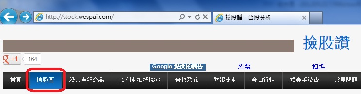
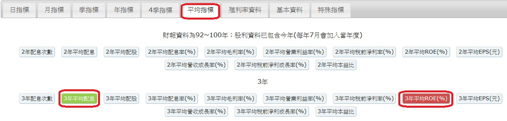
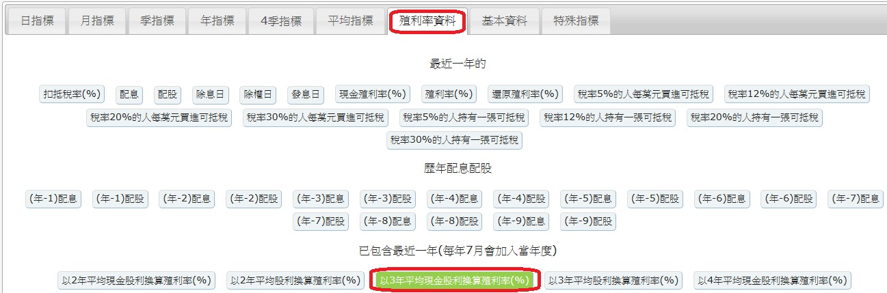
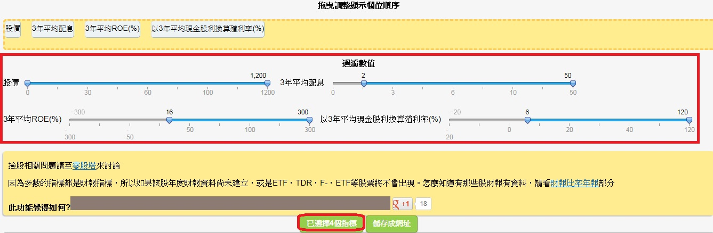
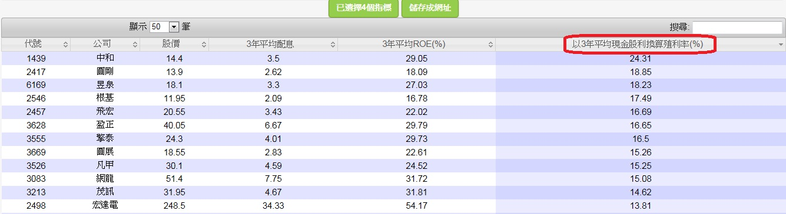

# 進階：麥克風選股法 (低檔價值選股、高檔順勢操作)

如果你和我一樣希望長期的投資績效能夠超越大盤，那麼最合理的方法就是採用價值投資，分散買進便宜的優質股票後，偶爾重建投資組合即可。

在過去，散戶要靠歷史資料進行投資決策非常困難，但投資網站和部落格的出現改變了一切。現在要建立自己的投資組合，甚至連功課都不太需要做，網路上一堆現成的篩選條件和優質股名單，只要花幾分鐘設定想要的條件，再按個篩選鍵就能輕鬆整理出口袋清單。

實際上要怎麼做呢？我以自己使用的方法為例來說明，首先來看下面的選股SOP：

##一、找好公司 

- 1.近3年股東權益報酬率（ROE）高於20% (基本上15%就及格)
 - a. 淨值過低可能會造成數字失真 
 - b. ROE的穩定性與趨勢比絕對數字重要 

- 2.近五年每年都賺錢
 - 代表公司即便遇到大環境或產業低檔都還不會虧錢

- 3.長期負債要低
 - 負債高在景氣收縮期容易出狀況

- 4.現金流量要為正且最好多半來自於本業
- 5.至少近三年都要能配發2元以上的現金股利

有足夠的現金流量支應營運還有閒錢給股東 
例外：小心`現增`當股息發的公司

##二、便宜買

- 1.現金股利殖利率高於8%
- 2.本益比(PE)在8倍以下
- 現金股利殖利率 &本益比最好看平均，3年以上較佳

- 3.股價淨值比(PB) 
    - 若獲利波動較大或ROE較低，則在股價跌破淨值再進場，低於0.6比較安全

- 4.處在歷史低量或低價區
    - 代表聽消息進出和追漲殺跌的一般散戶沒介入，反倒是大股東和主力會趁機吃貨
(你想當抬轎的還是坐轎的？)

##三、進出場加減碼

- 1.分批進場
    - 3p法則：保守者可在PE等於8、7、6時各買一份，如果沒跌到那麼便宜就放棄

- 2.出現警訊考慮減碼
    - a. EPS下滑：主要是跟該公司過去的軌跡比較  
    - b. 存貨或應收帳款：大幅增加要小心景氣反轉時的存貨跌價或呆帳  

- 3.基本面停損&加碼
    - 買進時夠便宜的股票不輕易停損(PE < 6，現金股利殖利率 > 10%)  
    - a.長期自由現金流量轉負，或季報由盈轉虧時考慮出場 
    - b.若公司營運正常，下跌反而該繼續加碼 
    - c.加碼時要注意「個別股票佔總資產的上限」 

- 4.價格停損，移動停利
    - a.除基本面停損，另可加設20-30%的價格停損 
    - b.在股價上漲一定程度，PE提高時(eg.PE>16) 開始使用`移動停利`，如`跌破季線或年線出場`
    

### 持股水位 
- `跌破季線或年線出場`(持有成本很低可以考慮不賣) 
-  跌破季線下口袋名單出現歷史低價區間部份資金可以買入一些
- `站上季線回覆高水位持股＆順便利用加減碼機會做換股操作`

##四、資產配置

- 1.如果沒辦法看太細，最好「平均」持有15檔以上，再積極也至少要分8-10檔 
- 2.持股要分散在不同的產業(eg.分散投資n檔績優營建股恐怕就不太妙) 
- 3.再看好個股也不要佔資產超過30%，不然一定要設價格停損，低於10%比較安全 
- 4.出場後若找不到好標的，不用硬把投資組合塞滿，寧可留現金  
- 5.另一種方式是永遠滿持股，但只持有相對最便宜的組合 

實際篩選口袋清單時，可以直接使用我在撿股讚設定的兩個簡易篩選：

- 1.[包租股](http://stock.wespai.com/p/5322)
- 2.[菸屁股](http://stock.wespai.com/p/17060)

當然也可以自己去設定想要的條件，以下為簡易教學：

1. 進入撿股讚（http://stock.wespai.com/）首頁後，點選左上方的撿股區

2.  選擇平均指標，點選「3年平均ROE」、「3年平均配息」

3. 選擇殖利率資料，點選「以3年平均現金股利換算殖利率」

4. 畫面往下拉，調整過濾的數值後，點選「已選擇4個指標」

5. 清單跑出來後，點選「以3年平均現金股利換算殖利率」兩次，讓清單從殖利率高的開始排

最後還是要強調，這樣篩出來的只是口袋清單，實際在建構投資組合的時候還是要做更多分析。