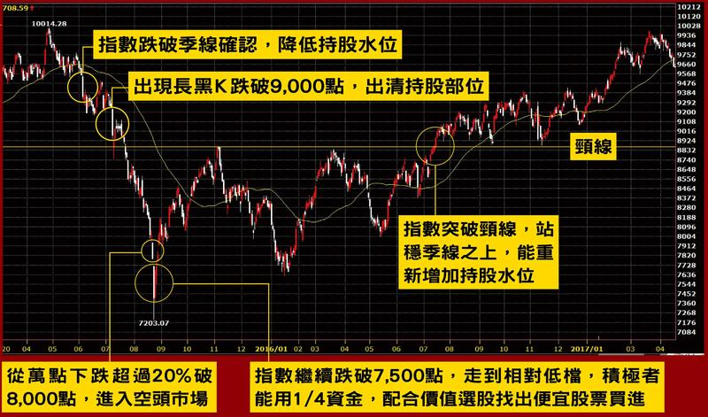

# 市場求生手冊 by 麥克風 (低檔價值選股、高檔順勢操作)

## 菸屁股選股

### 二低一高 年報酬率20% 穩穩賺 (價格溢酬) 這3個準則是選股大框架
- 低本益比 < 8
- 低股價淨值比  < 0.6%  
    - 配合股價創新高
    - 成交量週線帶量找進場點
    - 低檔盤旋很久沒帶量
    - 營收有大幅度成長但股價不動
- 高值利率 > 8%

#### 大盤高可放寬 `本益比設定在12倍以下、淨值比1倍以下，殖利率調降成5%`

### 策略 
- 至少15檔以上
- 分散不同產業
- 分散持股比率

## 買股原則
1. 股市跌 > 20% 找出超跌好股票
2. 股價創一段時間的新高 & 帶量
3. 挑出二低一高股票 過去沒量到有量出現去做布局

## 賣股原則
1. 跌破長期均線 (季線&年線)
2. `成交量週線暴大量(幾個月 or 幾年內可能是近期的高點) ＆高度討論`(人多地方不要去 ＆ 提早散場因為安全出口只有一個)

## 持股減碼 or 出清
- 大盤跌破季線 ＆ OTC跌破季線

https://www.youtube.com/watch?v=h8kEJGK7gMA

## 大盤指標季線控制持股水位

2015年6月大盤指數跌破季線確認，降低持股水位。假設投資部位有100萬元資金，此時可降至50萬元以下。7月指數長黑K跌破9,000點，出清持股部位。8月底指數跌破8,000點大關，從萬點行情下跌超過20%，定義上進入空頭市場，積極操作者此時能用1/4投資資金，配合價值選股低接便宜股票來「存股」。2016年7月指數站穩季線，同時突破頸線，重新增加持股水位。

--- 

##一、找好公司 

- 1.近3年股東權益報酬率（ROE）高於20% (基本上15%就及格)
 - a. 淨值過低可能會造成數字失真 
 - b. ROE的穩定性與趨勢比絕對數字重要 

- 2.近五年每年都賺錢
 - 代表公司即便遇到大環境或產業低檔都還不會虧錢

- 3.長期負債要低
 - 負債高在景氣收縮期容易出狀況

- 4.現金流量要為正且最好多半來自於本業
- 5.至少近三年都要能配發2元以上的現金股利

有足夠的現金流量支應營運還有閒錢給股東 
例外：小心`現增`當股息發的公司

##二、便宜買(菸屁股)

- 1.現金股利殖利率高於8%
- 2.本益比(PE)在8倍以下
現金股利殖利率 &本益比最好看平均，3年以上較佳

- 3.股價淨值比(PB) 
    - 若獲利波動較大或ROE較低，則在股價跌破淨值再進場，低於0.6比較安全

- 4.處在歷史低量或低價區
    - 代表聽消息進出和追漲殺跌的一般散戶沒介入，反倒是大股東和主力會趁機吃貨
(你想當抬轎的還是坐轎的？)

##三、進出場加減碼

- 1.分批進場
    - 3p法則：保守者可在PE等於8、7、6時各買一份，如果沒跌到那麼便宜就放棄

- 2.出現警訊考慮減碼
    - a. EPS下滑：主要是跟該公司過去的軌跡比較  
    - b. 存貨或應收帳款：大幅增加要小心景氣反轉時的存貨跌價或呆帳  

- 3.基本面停損&加碼
    - 買進時夠便宜的股票不輕易停損(PE < 6，現金股利殖利率 > 10%)  
    - a.長期自由現金流量轉負，或季報由盈轉虧時考慮出場 
    - b.若公司營運正常，下跌反而該繼續加碼 
    - c.加碼時要注意「個別股票佔總資產的上限」 

- 4.價格停損，移動停利
    - a.除基本面停損，另可加設20-30%的價格停損 
    - b.在股價上漲一定程度，PE提高時(eg.PE>16) 開始使用`移動停利`，如`跌破季線或年線出場`
    

### 持股水位 
- `大盤跌破季線或年線出場`(持有成本很低可以考慮不賣) 
-  大盤跌破季線下口袋名單出現歷史低價區間部份資金可以買入一些
- `大盤站上季線回覆高水位持股＆順便利用加減碼機會做換股操作`
- 當整體市場沒那麼便宜且指數跌破季線時跌按紀先砍
- 市場跌很多 股票普遍便宜時 即使在季線下我也會做多該操作邏輯(買價值股)

2017年4月19日大盤跌破季線時，麥克風就依照紀律先減碼，但隔了2天就漲回來，便趁勢`回補換股`，這種震盪時期`加減碼產生的交易成本`，就當作`保險費`，只要能閃過大跌造成的損失，這些成本其實都划得來

##四、資產配置

- 1.如果沒辦法看太細，最好「平均」持有15檔以上，再積極也至少要分8-10檔 
- 2.持股要分散在不同的產業(eg.分散投資n檔績優營建股恐怕就不太妙) 
- 3.再看好個股也不要佔資產超過30%，不然一定要設價格停損，低於10%比較安全 
- 4.出場後若找不到好標的，不用硬把投資組合塞滿，寧可留現金  
- 5.另一種方式是永遠滿持股，但只持有相對最便宜的組合 

##  補充`

我會先用價值面分析，找出便宜的股票，當大盤在相對低點時，積極低接存股，但`個股跌破季線`就出場；當大盤走到高檔時，獲利達3成以上，便分批獲利出場。」

### 起漲股票特點
- 股價創新高 & 成交帶量

###二低一高原則 追求相對報酬
 

很多上班族沒時間研究股票，麥克風建議：「可以買零股就好，但殖利率不會太高，就像中華電信殖利率只在4％、5％左右。」麥克風用「二低一高」選股法，就是「低本益比、低股價淨值比和高現金殖利率」，然後用一般的選股軟體，篩出符合這些條件的股票後，「再一檔一檔的去看每家公司的財報─損益表、資產負債表和現金流量表。」

 

麥克風會平均分散持股比例：「我通常會持有二十檔，甚至三十檔股票，每檔可能比例在3％到5％之間」，他認為，「只要建立一個相對便宜、公司體質還不錯的投資組合，不管怎麼樣都會有幾支大賺，加上小賺小賠的互相抵銷，照樣可以獲得超越指數的報酬。」他以三到五年為單位，「不追求絕對報酬，追求的是相對報酬」，年報酬率大概在指數的5％到10％左右。

 

針對`評估`一間公司，`未來會大賺、小賺的細節`，麥克風透露：`「不要有特別的問題，例如：負債比太高、應收帳款太多、存貨太高等，看公司長期三到五年是不是有足夠的現金，可以配股息，而且本益比最好是十倍以下，還有資產報酬率10％、股東權益報酬率18％，只要符合這些條件，股價夠便宜我就會去選。」`

 

###留意產業變遷  `每半年檢視投資組合`

 

但投資人不能只看每股稅後盈餘(EPS)，因為損益表可能作假，麥克風提醒：`「應收帳款和存貨比例太高，就算EPS很高，也要打個折扣。」`他舉例：「英格爾(8287)跟華美(6107)去年營收都很漂亮，但是季報應收帳款比例很高，占了將近八成，其實是收不回來的，這種股票就應該要避開。」

 

另一種情況是，獲利表面上增加，營收卻沒有增長，可能是折舊方式不同而高估：「假設一台機器是一千萬，一年折舊攤提兩百萬，分為五年或六年折舊，六年折舊獲利就會比五年好。」

 

「不要單看EPS的表現，有些原本長期獲利很好，但後來都變差」，麥克風呼籲投資人小心產業變遷，他舉例：「陞泰(8072)做類比式監視攝影機，過去是很領先的公司，後來市場主流逐漸變成數位、IP cam，雖然過去連續十年都賺錢，但是因為轉型太慢，加上大陸的海康集團把台灣的監視攝影機公司打得很慘，獲利都越來越差。」

 

所以麥克風`每半年檢視自己的投資組合`：`「便宜的就把它留著，如果股票漲很多，就會用季線當作停利點，股價突破季線就出掉，再去看看市場上有沒有相對便宜的股票，如果找不到便宜的，那就持有現金。」`

 

「我不太需要看盤，一年三百六十五天，交易搞不好十天都不到！」麥克風在馬祖當兵，也能利用休息時間打電話下單：「當時網龍(3083)營收大幅成長，而且遊戲產業本身毛利率很高，再加上網咖幾乎所有的人都在玩這檔遊戲，買的時候大概二十幾塊，賣的時候九十幾塊，不到兩個月，中間很多根漲停板。」

 

###價值選股 大賺小賠

 

麥克風的選股方向和別人不同，他提出相對安全的「價值選股法」：`「市場沒消息但公司有很多利多，股價跌不下去時去買股票，然後在大家覺得這檔股票很好，市場成交量爆量的時候把股票賣掉。」`只要能遵循這樣的簡單法則，賺的股票比賠的股票多，就能做到大賺小賠。`「譬如營建股的季報年報，可以知道接下來幾年會認列哪些建案，就可以從建案銷售金額，估出接下來每年會有多少EPS。」`麥克風說，在市場冷門時多做功課就可以先進場布局。

 

接著可以`「順勢操作」`：`「如果股價跌破季線就賣出，當一檔股票出現一段很大的波段，漲到一倍、兩倍、三倍時，大部分可以靠這一條均線待在場內，這是一個很棒的操作方式。」`

 

他進一步解釋，`漲多或跌破均線時就賣掉`，市場貴的時候，就多持有現金，`「像是大盤七千點時，我就百分百持股，因為市場上有很多便宜的股票，到一萬一千點，找不到相對便宜的股票，就降低持股到三成，提高現金比例，等到市場崩跌20％至30％再來撿股票。」只要遵守這樣簡單的法則，「就不會踩到大雷，買到幾百塊股票最後跌到幾十塊。」`

 

###新手先從冷門價值股下手

 

對於股市新手，麥克風建議，不要太刻意去挑成長股，先從冷門價值股下手。「例如現在最熱門的AI或挖礦題材，創意(3443)、撼訊(6150)目前本益比都很高，可以過兩年再檢視股價，`每年熱門題材股，通常後面表現都不會太好`。」

 

他認為便宜的股票，`好處是公司獲利變差，也不太會跌(利空)，「這就是所謂的安全邊際，只要獲利轉好，咻一下就漲上去了。」`他舉例2015年買了博智(8155)：`「從冷門價值股變成投信最熱門的成長股，買的時候十幾塊，最高漲到120至130元，我七十幾元就賣掉了。」果然現賺六、七倍`。

 

麥克風強調分散投資的重要：「`一年至少持二十、三十檔股票，最好不要低於十檔，因為功課做得再深，也可能因為公司作假帳，或九二一大地震廠房被震垮而受影響。`」他比喻：「就像五洲製藥的廣告詞，先求不傷身，再講求效果。」

--- 

### 不買熱門股20年來賺超過8位數的訣竅大公開

`「我的的投資目標很簡單，就是要長期打敗加權報酬指數，因此不想花時間在預測短期漲跌，只想花時間找出便宜的股票。」`從麥克風的言談中，能明顯感受到他屬於價值投資者。

進一步問起麥克風選股訣竅，他說，關鍵在找出便宜的股票，他認為「便宜」是進場買股的第一要件。`「若有一檔價值被低估很多的股票，跟一檔很會賺錢的股票，兩著硬要選一檔進場，我會選擇便宜的。」`

想找出能賺錢還能賺股息的股票並不容易，而他找便宜股票首重3指標：本益比、股價淨值比及現金殖利率。「這3個準則是選股大框架。」他繼續說，本益比要8倍以下，殖利率高於8%以上，「這兩個最好看平均，3年以上比較好。」最後，是股價淨值比最好低於0.6倍。但這些條件在大盤表現相對低檔或處中間位置時，可能會選出很多檔股票，`「不是每檔都一定能賺錢，必須再配合產業消息或營收表現細看。」`麥克風強調。

想找出能賺錢還能賺股息的股票並不容易，而他找便宜股票首重3指標：`本益比、股價淨值比及現金殖利率`。「這3個準則是選股大框架。」他繼續說，本益比要8倍以下，殖利率高於8%以上，`「這兩個最好看平均，3年以上比較好。」`最後，是股價淨值比最好低於0.6倍。但這些條件在大盤表現相對低檔或處中間位置時，可能會選出很多檔股票，「不是每檔都一定能賺錢，必須再配合產業消息或營收表現細看。」麥克風強調。

如今大盤站穩萬點，麥克風認為在相對高點位置，若用過去的框架來挑股，恐怕一檔股票都選不出來。因此他把這3個選股條件跟著`放寬`，「最粗略的方式，就是條件至少要優於大盤。」他透露，如今的選股條件，可將`本益比設定在12倍以下、淨值比1倍以下，殖利率調降成5%`。

在操作上，`他會在大盤位於相對低點時，積極低接存股，長期持有，股價跌破季線再出場；當大盤走到高檔時，改採順勢操作，不逆勢做空，若獲利達目標，例如3成以上，便分批獲利出場`。

麥克風操作相當靈活，選股策略會對應市場狀況做調整。他笑說，自己從來不算標準的存股族，像是大家常說的存股股票，如台積電、中華電、中鋼、台塑四寶、統一超等，基本上已經很多年沒有買過了，`「理由很簡單，這類熱門股票，基本上溢價程度都比較高，也就是貴了。」`

---

### 看季線操作 輕鬆打敗大盤

營運陷於谷底、等待翻身的低價高殖利率股，真的適合投資且能賺錢嗎？在大盤攀上9,000點時，仍舊以「包租公」方式選股的麥克風（本名陳彥文），2016年投資績效達18%∼19%，跟大盤相去不遠，雖然投資了十多檔股票，卻花很少時間管理，因為都是具有安全邊際股價的高殖利率股，不僅可長期收租（穩定領股利），分散單一個股、產業風險，也同時有機會賺到價差。

麥克風2017年以來的報酬率雖還未細算，但年初買進榮成（1909），1個月就達到60%獲利率，獲利了結。以他每檔持股僅約占資產5%來看，榮成最高曾占資產接近10%計算，2017年至少已實現4%∼6%報酬率。

對於大盤現狀，麥克風認為，加權指數雖曾碰到萬點（截至2017.05.11），但他認為只要堅守`「季線之下不做多，跌破就減碼」`的操作原則，就可以閃過股災的風險。`但如果指數又站上季線，就可再布局低本益比股。像2017年4月19日大盤跌破季線時，麥克風就依照紀律先減碼，但隔了2天就漲回來，便趁勢回補換股，這種震盪時期加減碼產生的交易成本，就當作保險費，只要能閃過大跌造成的損失，這些成本其實都划得來`。

但萬點是長期大盤箱型格局的天花板，常在漲過萬點後大幅度拉回，若漲過萬點應該先賣嗎？麥克風認為，仍是看季線順勢操作，只要沒有跌破季線就繼續持有，因為目前市場還沒有過熱，其實不用太保守或太悲觀。現在不像上次萬點時，整個市場都在討論1萬2,000點或是1萬4,000點會不會來，多數散戶也都極為保守。

