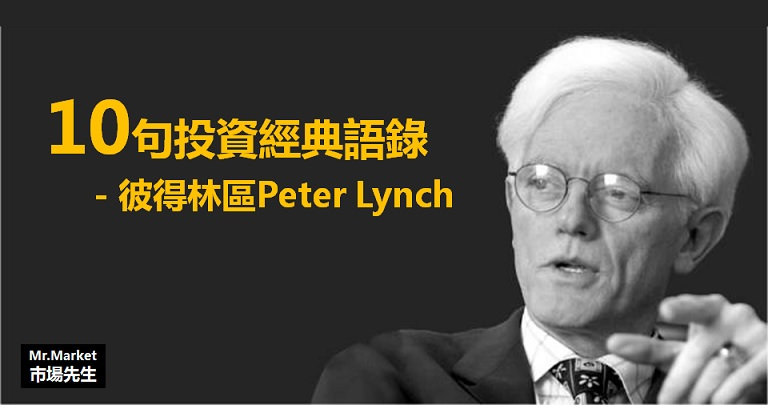

# 彼得林區選股戰略》10句投資經典語錄



彼得林區是一位傳奇基金經理人，
他在富達基金任職的期間操作的麥哲倫基金13年來的年化報酬率高達29.2%，
讓人比較意外的是，他的投資價值觀不同於大多數的基金經理人，是一種與市場大多數人認知方式相反，卻又非常有邏輯的操作，幫他創下很高的投資報酬率。

他有3本著作在台灣有上市
《彼得林區學以致富》《彼得林區選股戰略》《彼得林區征服股海》
這三本經典書上一個版本已經是2013年，絕版非常久了，
最近新版即將在2018年7月中再版上市。

以下分享市場先生整理《彼得林區選股戰略》這本書中的經典名言語錄，以及我個人的心得：

1.

```
投資人的命運，不是取決於股票市場或個別上市公司，而是取決於投資人本身。 –  《彼得林區選股戰略》
```

市場先生註解：

大多數人在投資前並不瞭解自己的目標，沒有對自己的投資做出設想，或是只設想好事但不去想壞事，因此完全沒有信念。
當不如預期的事情發生時，人們會立刻放棄所有希望、失去理智、賣在最差的位置。

沒信念為什麼會影響結果？甚至影響比投資標的本身的狀況還大？舉兩個例子：
一個男孩決定追另一個女孩，但一看到女孩和別的男孩聊天時他就覺得自己失敗而放棄…顯然問題並不是出在男孩自己的條件。
一個年輕人決定要創業開餐廳，開店之後遇到兩位顧客說他的菜難吃，他就決定收起來不做了…他的失敗甚至跟餐廳是否賺錢無關。
信念來自於知識、來自於努力、來自於對未來好壞的預先假設與判斷。沒有信念的人做什麼都注定失敗。

 

2.

```
基金經理人的問題在於，比起選擇可能會大賺的不知名小公司，他們寧願選擇會小賠的大型知名企業。 – 《彼得林區選股戰略》
```

市場先生註解：

這句話可以從2個面向去思考，巴菲特曾說：有任何好的標的都請聯絡我，但前提是你的公司市值1億美金以上。
如果他的資金規模和散戶一樣小，他認為自己可以創造的年化報酬率很可能超過50%(在巴菲特投資的最早幾年的確是如此)。
大多數管理大資金的經理人面臨的困境是：不得不買的大型股，因為這市場上能容納巨大資金的股票就只有那些。

而另一個面向則是，基金經理人「不被允許犯錯」：
當股東們質疑經理人投資大型股卻虧損時，他可以說：這間規模大、體質好，而且許多基金都有買。
但如果經理人投資不知名小型股虧損時，即使他的買進理由再好，很可能還是會被質疑。
事實上，在10檔投資組合中只要有一檔上漲10倍，那即使其他9檔都腰斬，報酬率仍會超過50%，
但股東不在意你整體組合成長多少，只在意你選了9檔腰斬的股票，換句話說他們只在意勝率，但不在乎賺不賺錢。
有些經理人會選擇堅持己見，但也有些人為了保住飯碗則是會選擇妥協，這種經理人根本永遠無法戰勝大盤。

一本偉大的著作或一首偉大的交響曲都不可能是集體創作的產物，投資組合也是如此。 – 彼得林區

 

3.

```
對我來說投資就是賭博，是一種能增加自己勝算的賭博。 – 《彼得林區選股戰略》
```
市場先生註解：

很多人想要再投資與賭博之間劃出明顯界線，大多數人劃界線的方法是用商品，
比方說大型股就叫投資，小型股有點投機、選擇權根本就是投機…。
但林區的觀點不同，他認為任何商品都沒有區別，因為即使投資大型股依然有人賠得很慘，
換句話說，有些人也許以為自己在投資，但實際上他們的行為跟賭博差不多。
關鍵是操作的人，是否是很有邏輯的知道自己如何贏，還是說隨意地在賭。

投資不做研究，就跟玩牌卻不看自己手牌一樣。

 

4.

```
買股票前先買房子，你有聽過哪個人買了房子卻賠了一屁股嗎？ – 《彼得林區選股戰略》
```


市場先生註解：

林區真正的觀點，並不是說你一定要買一間房子，而是你買股票時必須像買房子一樣仔細。

在買房子時，你會仔細看看這間房子天花板、地下室、採光和空間、檢查設備和管線是否老舊、了解周圍的學區和環境，
然後會好好評估自己的財務狀況、與銀行的債務與現金流問題、稅務問題，
在市場出現一些重大壞消息時，你也不會因為害怕房價下跌就將房子趕緊脫手。
這就是大多數人買房子不容易賠錢的原因。

有趣的是大家知道買房子該這樣做，買股票時卻都沒有做到該做的評估，
這也是大多數人投資股票賠錢的原因。

 

5.

```
在所有股票類型中，景氣循環股最常被誤解，很多不夠謹慎的投資人，就是栽在這種他們自認為很安全的股票上。 – 《彼得林區選股戰略》
```

市場先生註解：

景氣循環股不容易辨認的最大原因，就是因為它們大多是「大型知名企業」。
景氣循環的周期通常很長，市場多空一次循環平均是6~10年，有些循環則是依據政策、執政者、原物料的趨勢在變化，
在長期多頭的情況，你很難看出遇到空頭時，這些上漲好幾年的大型企業很可能跌掉一半甚至更多市值。

常見的景氣循環產業有汽車、航空、輪胎、鋼鐵以及化工業等，
操作景氣循環股對時機的掌控度要比其他類型的股票更高，適合有在相關產業工作經驗的人。


彼得林區是一位傳奇基金經理人，
他在富達基金任職的期間操作的麥哲倫基金13年來的年化報酬率高達29.2%，
讓人比較意外的是，他的投資價值觀不同於大多數的基金經理人，
是一種與市場大多數人認知方式相反，卻又非常有邏輯的操作，幫他創下很高的投資報酬率。

本篇市場先生繼續分享這本書中的經典名言語錄，以及我個人的心得：


6.

```
如果有人說「任何白痴都能經營這家公司」，對我來說這還有加分效果，因為遲早都可能會出現一個白痴來經營這家公司。 – 彼得林區《選股戰略》
```


市場先生註解：

白癡都能經營的公司我認為有兩個意涵：
第一個是這公司的業務有強烈的護城河優勢，在護城河投資優勢這本書中有提到，絕大多數人都誤以為經理人是企業擁有長久競爭力的關鍵，但實際上並不是，因為你不是創業家而是投資者，因此你不能把期望放在某個關鍵人物身上。
第二個是在這類公司的判斷上通常都違反我們直覺，比起聽起來厲害、高科技、有前景的公司，林區更喜歡的是無聊、無趣、甚至覺得不愉快的生意，例如生產瓶蓋的公司、葬儀社、有黑道疑雲的賭場等等，即使財報再好，許多基金經理人依然不喜歡這類股票，導致價格可能有利可圖。

 

7.
```
要是我可以避開一種股票的話，肯定是熱門產業中的最熱門股票。 – 彼得林區《選股戰略》
```

市場先生註解：

對於熱門股有2點要注意：
第一點是股價上漲不代表公司真實獲利能力成長，有時只是追捧的人多而已，
對林區來說，他要的是營運能長期持續成長的企業，而不是這種人潮一散就會暴跌的飆股。
當然這點也有些人會有反面意見，我有幾位朋友就是專門在短線上追逐熱門股而且做得不錯，
對他們而言反而長期怎樣一點都不重要，重點是短期內股價有動能就好。

另一點是所謂樹大招風、木秀於林 風必摧之，
高成長及熱門產業一定會吸引許多聰明人以及資本家投入，
導致一段時間後它不但不再有成長動能，整個產業環境還面臨巨大的競爭，
這時候除非企業已經有能力建立完整護城河，否則都一定會脫離快速成長期。
反之在負成長的產業中，因為不會有新廠商加入，
因此當中原本就很優秀且有利潤的企業更可能逆勢長期成長。

8.

```
另一種我想要避開的股票，就是那些被稱為「未來的IBM」、「未來的麥當勞」、「未來的英特爾」、「未來的迪士尼」等企業。經驗告訴我，那些被稱為「未來的什麼」（the next of something）的，幾乎都成不了大事。 – 彼得林區《選股戰略》
```

市場先生註解：

很多事情比喻的好，會讓一般人更容易理解。容易理解是好事，但在投資中覺得自己有能力預測未來就不見得是好事了。彼得林區補充了一句：如果有人這樣說，那連它原本拿來比喻的知名企業也要一起小心，這代表它即將面臨大量的競爭。

9.

```
如果公司的「錢」途真的如此遠大，那麼一、兩年後它還會是一支好的投資標的，何不等這些公司展現出績效在做投資呢?
```

市場先生註解：

在市場上我們往往會聽到很多小道消息，這些消息提供的通常不是公司的現狀，而是在描繪對未來的預期。
這些預期和願景看起來很大，大到可能能讓公司成長10倍甚至100倍，這種時候你該進場嗎?
彼得林區的答案是否定的，因為你不需要在沒有足夠證據的時候去行動，反正如果他真的這麼好，繼續成長個數年也是必然的，到時進場依然會有利潤。

高成長性的公司往往會伴隨高本益比，意思是人們願意為了還沒發生的未來獲利預先支付更高價格，股票的好壞並不是取決於本益比高低，而是取決於人們的預期是根據事實還是想像。

10.
```
我一向討厭「停損單」的做法 – 彼得林區《選股戰略》
```

市場先生註解：

彼得林區在操作一檔股票之前，會先對那間公司有明確的定位，任何的買進或賣出決定，都是根據公司的營運，而不是根據價格。它認為「上漲20%就停利賣出」、「下跌10%就停損」、「高檔拉回10%就停損」這類固定金額的說法都是非常愚蠢的，因為公司並不會因為你設定了20%它就只上漲或下跌20%。

我自己也非常不認同固定百分比或金額停損的想法，唯一只有在極短線這種隨機性極高，而且波動也非常穩定的操作策略之下，才可能設定這種固定的停損停利，否則大多狀況下固定百分比停損都不大適用。

看完這本書的語錄，更多的好書可以去看》市場先生的投資書單

彼得林區在《選股戰略》這本書中提到了他完整的策略評估方式，我認為非常值得學習。
更多林區的選股方法，他的三本著作可閱讀：《彼得林區學以致富》《彼得林區選股戰略》《彼得林區征服股海》
