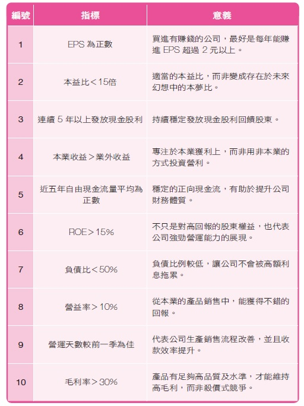

# Goodinfo

## 找出長期穩定獲低本益比
- 連續配發合計股利次數 > 5
- 現金股利 (元) > 1
- 本益比 (PER) < 10

```sh
https://goodinfo.tw/StockInfo/StockList.asp?SEARCH_WORD=&SHEET=%E4%BA%A4%E6%98%93%E7%8B%80%E6%B3%81&SHEET2=%E6%97%A5&MARKET_CAT=%E8%87%AA%E8%A8%82%E7%AF%A9%E9%81%B8&INDUSTRY_CAT=%E6%88%91%E7%9A%84%E6%A2%9D%E4%BB%B6&STOCK_CODE=&RANK=0&RPT_TIME=%E6%9C%80%E6%96%B0%E8%B3%87%E6%96%99&FILTER_SHEET=%E4%BA%A4%E6%98%93%E7%8B%80%E6%B3%81&FILTER_MARKET=%E4%B8%8A%E5%B8%82%2F%E4%B8%8A%E6%AB%83&FILTER_ITEM0=%E6%9C%AC%E7%9B%8A%E6%AF%94+%28PER%29&FILTER_VAL_S0=&FILTER_VAL_E0=10&FILTER_VAL_CHK0=&FILTER_ITEM1=%E7%8F%BE%E9%87%91%E8%82%A1%E5%88%A9+%28%E5%85%83%29&FILTER_VAL_S1=1&FILTER_VAL_E1=&FILTER_VAL_CHK1=&FILTER_ITEM2=%E9%80%A3%E7%BA%8C%E9%85%8D%E7%99%BC%E5%90%88%E8%A8%88%E8%82%A1%E5%88%A9%E6%AC%A1%E6%95%B8&FILTER_VAL_S2=5&FILTER_VAL_E2=&FILTER_VAL_CHK2=&FILTER_ITEM3=&FILTER_VAL_S3=&FILTER_VAL_E3=&FILTER_VAL_CHK3=&FILTER_ITEM4=&FILTER_VAL_S4=&FILTER_VAL_E4=&FILTER_VAL_CHK4=&FILTER_ITEM5=&FILTER_VAL_S5=&FILTER_VAL_E5=&FILTER_VAL_CHK5=&FILTER_ITEM6=&FILTER_VAL_S6=&FILTER_VAL_E6=&FILTER_VAL_CHK6=&FILTER_ITEM7=&FILTER_VAL_S7=&FILTER_VAL_E7=&FILTER_VAL_CHK7=&FILTER_ITEM8=&FILTER_VAL_S8=&FILTER_VAL_E8=&FILTER_VAL_CHK8=&FILTER_ITEM9=&FILTER_VAL_S9=&FILTER_VAL_E9=&FILTER_VAL_CHK9=&FILTER_ITEM10=&FILTER_VAL_S10=&FILTER_VAL_E10=&FILTER_VAL_CHK10=&FILTER_ITEM11=&FILTER_VAL_S11=&FILTER_VAL_E11=&FILTER_VAL_CHK11=&FILTER_RULE0=&FILTER_RULE_CHK0=&FILTER_RULE1=&FILTER_RULE_CHK1=&FILTER_RULE2=&FILTER_RULE_CHK2=&FILTER_RULE3=&FILTER_RULE_CHK3=&FILTER_RULE4=&FILTER_RULE_CHK4=&FILTER_RULE5=&FILTER_RULE_CHK5=&FILTER_RANK0=&FILTER_RANK1=&FILTER_RANK2=&MY_FILTER_RULE_NM=%E7%A9%A9%E5%81%A5%5F%E6%9C%AC%E7%9B%8A%E6%AF%94%EF%BC%8B%E8%82%A1%E5%88%A9%E6%AC%A1%E6%95%B8
```
## 低本益比 低淨值比 高值利率
- 直接平均–近3年平均PER < 8
- 直接平均–近3年平均現金殖利率 > 8
- PBR < 1     
    - 0.6 才是最好


```sh
https://goodinfo.tw/StockInfo/StockList.asp?SEARCH_WORD=&SHEET=%E5%B9%B4%E7%8D%B2%E5%88%A9%E8%83%BD%E5%8A%9B&SHEET2=%E7%8D%B2%E5%88%A9%E8%83%BD%E5%8A%9B&MARKET_CAT=%E8%87%AA%E8%A8%82%E7%AF%A9%E9%81%B8&INDUSTRY_CAT=%E6%88%91%E7%9A%84%E6%A2%9D%E4%BB%B6&STOCK_CODE=&RANK=0&RPT_TIME=%E6%9C%80%E6%96%B0%E8%B3%87%E6%96%99&FILTER_SHEET=%E5%B9%B4%E7%8D%B2%E5%88%A9%E8%83%BD%E5%8A%9B&FILTER_MARKET=%E4%B8%8A%E5%B8%82%2F%E4%B8%8A%E6%AB%83&FILTER_ITEM0=%E6%9C%AC%E6%B7%A8%E6%AF%94+%28PBR%29&FILTER_VAL_S0=0&FILTER_VAL_E0=1&FILTER_VAL_CHK0=&FILTER_ITEM1=%E7%9B%B4%E6%8E%A5%E5%B9%B3%E5%9D%87%E2%80%93%E8%BF%913%E5%B9%B4%E5%B9%B3%E5%9D%87PER&FILTER_VAL_S1=0&FILTER_VAL_E1=8&FILTER_VAL_CHK1=&FILTER_ITEM2=%E7%9B%B4%E6%8E%A5%E5%B9%B3%E5%9D%87%E2%80%93%E8%BF%913%E5%B9%B4%E5%B9%B3%E5%9D%87%E7%8F%BE%E9%87%91%E6%AE%96%E5%88%A9%E7%8E%87&FILTER_VAL_S2=8&FILTER_VAL_E2=100&FILTER_VAL_CHK2=&FILTER_ITEM3=&FILTER_VAL_S3=&FILTER_VAL_E3=&FILTER_VAL_CHK3=&FILTER_ITEM4=&FILTER_VAL_S4=&FILTER_VAL_E4=&FILTER_VAL_CHK4=&FILTER_ITEM5=&FILTER_VAL_S5=&FILTER_VAL_E5=&FILTER_VAL_CHK5=&FILTER_ITEM6=&FILTER_VAL_S6=&FILTER_VAL_E6=&FILTER_VAL_CHK6=&FILTER_ITEM7=&FILTER_VAL_S7=&FILTER_VAL_E7=&FILTER_VAL_CHK7=&FILTER_ITEM8=&FILTER_VAL_S8=&FILTER_VAL_E8=&FILTER_VAL_CHK8=&FILTER_ITEM9=&FILTER_VAL_S9=&FILTER_VAL_E9=&FILTER_VAL_CHK9=&FILTER_ITEM10=&FILTER_VAL_S10=&FILTER_VAL_E10=&FILTER_VAL_CHK10=&FILTER_ITEM11=&FILTER_VAL_S11=&FILTER_VAL_E11=&FILTER_VAL_CHK11=&FILTER_RULE0=&FILTER_RULE_CHK0=&FILTER_RULE1=&FILTER_RULE_CHK1=&FILTER_RULE2=&FILTER_RULE_CHK2=&FILTER_RULE3=&FILTER_RULE_CHK3=&FILTER_RULE4=&FILTER_RULE_CHK4=&FILTER_RULE5=&FILTER_RULE_CHK5=&FILTER_RANK0=&FILTER_RANK1=&FILTER_RANK2=&MY_FILTER_RULE_NM=PER%5FPBR%E4%BD%8E%5F%E5%80%BC%E5%88%A9%E7%8E%87%E9%AB%98
```

## 低本益比 低淨值比 高值利率  大盤高放寬條件
- 直接平均–近3年平均PER < 12
- 直接平均–近3年平均現金殖利率 > 5
- PBR < 1     

```sh
https://goodinfo.tw/StockInfo/StockList.asp?SEARCH_WORD=&SHEET=%E5%B9%B4%E7%8D%B2%E5%88%A9%E8%83%BD%E5%8A%9B&SHEET2=%E7%8D%B2%E5%88%A9%E8%83%BD%E5%8A%9B&MARKET_CAT=%E8%87%AA%E8%A8%82%E7%AF%A9%E9%81%B8&INDUSTRY_CAT=%E6%88%91%E7%9A%84%E6%A2%9D%E4%BB%B6&STOCK_CODE=&RANK=0&RPT_TIME=%E6%9C%80%E6%96%B0%E8%B3%87%E6%96%99&FILTER_SHEET=%E5%B9%B4%E7%8D%B2%E5%88%A9%E8%83%BD%E5%8A%9B&FILTER_MARKET=%E4%B8%8A%E5%B8%82%2F%E4%B8%8A%E6%AB%83&FILTER_ITEM0=%E6%9C%AC%E6%B7%A8%E6%AF%94+%28PBR%29&FILTER_VAL_S0=0&FILTER_VAL_E0=1&FILTER_VAL_CHK0=&FILTER_ITEM1=%E7%9B%B4%E6%8E%A5%E5%B9%B3%E5%9D%87%E2%80%93%E8%BF%913%E5%B9%B4%E5%B9%B3%E5%9D%87PER&FILTER_VAL_S1=0&FILTER_VAL_E1=12&FILTER_VAL_CHK1=&FILTER_ITEM2=%E7%9B%B4%E6%8E%A5%E5%B9%B3%E5%9D%87%E2%80%93%E8%BF%913%E5%B9%B4%E5%B9%B3%E5%9D%87%E7%8F%BE%E9%87%91%E6%AE%96%E5%88%A9%E7%8E%87&FILTER_VAL_S2=5&FILTER_VAL_E2=100&FILTER_VAL_CHK2=&FILTER_ITEM3=&FILTER_VAL_S3=&FILTER_VAL_E3=&FILTER_VAL_CHK3=&FILTER_ITEM4=&FILTER_VAL_S4=&FILTER_VAL_E4=&FILTER_VAL_CHK4=&FILTER_ITEM5=&FILTER_VAL_S5=&FILTER_VAL_E5=&FILTER_VAL_CHK5=&FILTER_ITEM6=&FILTER_VAL_S6=&FILTER_VAL_E6=&FILTER_VAL_CHK6=&FILTER_ITEM7=&FILTER_VAL_S7=&FILTER_VAL_E7=&FILTER_VAL_CHK7=&FILTER_ITEM8=&FILTER_VAL_S8=&FILTER_VAL_E8=&FILTER_VAL_CHK8=&FILTER_ITEM9=&FILTER_VAL_S9=&FILTER_VAL_E9=&FILTER_VAL_CHK9=&FILTER_ITEM10=&FILTER_VAL_S10=&FILTER_VAL_E10=&FILTER_VAL_CHK10=&FILTER_ITEM11=&FILTER_VAL_S11=&FILTER_VAL_E11=&FILTER_VAL_CHK11=&FILTER_RULE0=&FILTER_RULE_CHK0=&FILTER_RULE1=&FILTER_RULE_CHK1=&FILTER_RULE2=&FILTER_RULE_CHK2=&FILTER_RULE3=&FILTER_RULE_CHK3=&FILTER_RULE4=&FILTER_RULE_CHK4=&FILTER_RULE5=&FILTER_RULE_CHK5=&FILTER_RANK0=&FILTER_RANK1=&FILTER_RANK2=&MY_FILTER_RULE_NM=PER%5FPBR%E4%BD%8E%5F%E5%80%BC%E5%88%A9%E7%8E%87%E9%AB%98%E6%94%BE%E5%AF%AC
```

## 找出長期穩定獲利大型權值股票
- 股本 50~5000億
- 現金股利 (元) 1~30 
- 連續配發合計股利次數 5~30

```sh
https://goodinfo.tw/StockInfo/StockList.asp?MARKET_CAT=%E8%87%AA%E8%A8%82%E7%AF%A9%E9%81%B8&INDUSTRY_CAT=%E6%88%91%E7%9A%84%E6%A2%9D%E4%BB%B6&FILTER_ITEM0=%E8%82%A1%E6%9C%AC+%28%E5%84%84%E5%85%83%29&FILTER_VAL_S0=50&FILTER_VAL_E0=5000&FILTER_ITEM1=%E7%8F%BE%E9%87%91%E8%82%A1%E5%88%A9+%28%E5%85%83%29&FILTER_VAL_S1=1&FILTER_VAL_E1=30&FILTER_ITEM2=%E9%80%A3%E7%BA%8C%E9%85%8D%E7%99%BC%E5%90%88%E8%A8%88%E8%82%A1%E5%88%A9%E6%AC%A1%E6%95%B8&FILTER_VAL_S2=5&FILTER_VAL_E2=30&FILTER_ITEM3=---%E8%AB%8B%E9%81%B8%E6%93%87%E9%81%8E%E6%BF%BE%E6%A2%9D%E4%BB%B6---&FILTER_VAL_S3=&FILTER_VAL_E3=&FILTER_ITEM4=---%E8%AB%8B%E9%81%B8%E6%93%87%E9%81%8E%E6%BF%BE%E6%A2%9D%E4%BB%B6---&FILTER_VAL_S4=&FILTER_VAL_E4=&FILTER_ITEM5=---%E8%AB%8B%E9%81%B8%E6%93%87%E9%81%8E%E6%BF%BE%E6%A2%9D%E4%BB%B6---&FILTER_VAL_S5=&FILTER_VAL_E5=&FILTER_ITEM6=---%E8%AB%8B%E9%81%B8%E6%93%87%E9%81%8E%E6%BF%BE%E6%A2%9D%E4%BB%B6---&FILTER_VAL_S6=&FILTER_VAL_E6=&FILTER_ITEM7=---%E8%AB%8B%E9%81%B8%E6%93%87%E9%81%8E%E6%BF%BE%E6%A2%9D%E4%BB%B6---&FILTER_VAL_S7=&FILTER_VAL_E7=&FILTER_ITEM8=---%E8%AB%8B%E9%81%B8%E6%93%87%E9%81%8E%E6%BF%BE%E6%A2%9D%E4%BB%B6---&FILTER_VAL_S8=&FILTER_VAL_E8=&FILTER_ITEM9=---%E8%AB%8B%E9%81%B8%E6%93%87%E9%81%8E%E6%BF%BE%E6%A2%9D%E4%BB%B6---&FILTER_VAL_S9=&FILTER_VAL_E9=&FILTER_ITEM10=---%E8%AB%8B%E9%81%B8%E6%93%87%E9%81%8E%E6%BF%BE%E6%A2%9D%E4%BB%B6---&FILTER_VAL_S10=&FILTER_VAL_E10=&FILTER_ITEM11=---%E8%AB%8B%E9%81%B8%E6%93%87%E9%81%8E%E6%BF%BE%E6%A2%9D%E4%BB%B6---&FILTER_VAL_S11=&FILTER_VAL_E11=&FILTER_RULE0=---%E8%AB%8B%E6%8C%87%E5%AE%9A%E9%81%B8%E8%82%A1%E6%A2%9D%E4%BB%B6---&FILTER_RULE1=---%E8%AB%8B%E6%8C%87%E5%AE%9A%E9%81%B8%E8%82%A1%E6%A2%9D%E4%BB%B6---&FILTER_RULE2=---%E8%AB%8B%E6%8C%87%E5%AE%9A%E9%81%B8%E8%82%A1%E6%A2%9D%E4%BB%B6---&FILTER_RULE3=---%E8%AB%8B%E6%8C%87%E5%AE%9A%E9%81%B8%E8%82%A1%E6%A2%9D%E4%BB%B6---&FILTER_RULE4=---%E8%AB%8B%E6%8C%87%E5%AE%9A%E9%81%B8%E8%82%A1%E6%A2%9D%E4%BB%B6---&FILTER_RULE5=---%E8%AB%8B%E6%8C%87%E5%AE%9A%E9%81%B8%E8%82%A1%E6%A2%9D%E4%BB%B6---&FILTER_RANK0=---%E8%AB%8B%E6%8C%87%E5%AE%9A%E6%8E%92%E5%90%8D%E6%A2%9D%E4%BB%B6---&FILTER_RANK1=---%E8%AB%8B%E6%8C%87%E5%AE%9A%E6%8E%92%E5%90%8D%E6%A2%9D%E4%BB%B6---&FILTER_RANK2=---%E8%AB%8B%E6%8C%87%E5%AE%9A%E6%8E%92%E5%90%8D%E6%A2%9D%E4%BB%B6---&FILTER_SHEET=%E5%B9%B4%E7%8D%B2%E5%88%A9%E8%83%BD%E5%8A%9B&FILTER_SHEET2=%E7%8D%B2%E5%88%A9%E8%83%BD%E5%8A%9B&FILTER_MARKET=%E4%B8%8A%E5%B8%82%2F%E4%B8%8A%E6%AB%83&FILTER_QUERY=%E6%9F%A5++%E8%A9%A2
```

## 找出長期穩定獲利便宜股票
- 本益比 (PER) 5~15 
- 現金股利 (元) 1~30 
- 連續配發合計股利次數 5~30


```sh
https://goodinfo.tw/StockInfo/StockList.asp?MARKET_CAT=%E8%87%AA%E8%A8%82%E7%AF%A9%E9%81%B8&INDUSTRY_CAT=%E6%88%91%E7%9A%84%E6%A2%9D%E4%BB%B6&FILTER_ITEM0=%E6%9C%AC%E7%9B%8A%E6%AF%94+%28PER%29&FILTER_VAL_S0=5&FILTER_VAL_E0=15&FILTER_ITEM1=%E7%8F%BE%E9%87%91%E8%82%A1%E5%88%A9+%28%E5%85%83%29&FILTER_VAL_S1=1&FILTER_VAL_E1=30&FILTER_ITEM2=%E9%80%A3%E7%BA%8C%E9%85%8D%E7%99%BC%E5%90%88%E8%A8%88%E8%82%A1%E5%88%A9%E6%AC%A1%E6%95%B8&FILTER_VAL_S2=5&FILTER_VAL_E2=30&FILTER_ITEM3=---%E8%AB%8B%E9%81%B8%E6%93%87%E9%81%8E%E6%BF%BE%E6%A2%9D%E4%BB%B6---&FILTER_VAL_S3=&FILTER_VAL_E3=&FILTER_ITEM4=---%E8%AB%8B%E9%81%B8%E6%93%87%E9%81%8E%E6%BF%BE%E6%A2%9D%E4%BB%B6---&FILTER_VAL_S4=&FILTER_VAL_E4=&FILTER_ITEM5=---%E8%AB%8B%E9%81%B8%E6%93%87%E9%81%8E%E6%BF%BE%E6%A2%9D%E4%BB%B6---&FILTER_VAL_S5=&FILTER_VAL_E5=&FILTER_ITEM6=---%E8%AB%8B%E9%81%B8%E6%93%87%E9%81%8E%E6%BF%BE%E6%A2%9D%E4%BB%B6---&FILTER_VAL_S6=&FILTER_VAL_E6=&FILTER_ITEM7=---%E8%AB%8B%E9%81%B8%E6%93%87%E9%81%8E%E6%BF%BE%E6%A2%9D%E4%BB%B6---&FILTER_VAL_S7=&FILTER_VAL_E7=&FILTER_ITEM8=---%E8%AB%8B%E9%81%B8%E6%93%87%E9%81%8E%E6%BF%BE%E6%A2%9D%E4%BB%B6---&FILTER_VAL_S8=&FILTER_VAL_E8=&FILTER_ITEM9=---%E8%AB%8B%E9%81%B8%E6%93%87%E9%81%8E%E6%BF%BE%E6%A2%9D%E4%BB%B6---&FILTER_VAL_S9=&FILTER_VAL_E9=&FILTER_ITEM10=---%E8%AB%8B%E9%81%B8%E6%93%87%E9%81%8E%E6%BF%BE%E6%A2%9D%E4%BB%B6---&FILTER_VAL_S10=&FILTER_VAL_E10=&FILTER_ITEM11=---%E8%AB%8B%E9%81%B8%E6%93%87%E9%81%8E%E6%BF%BE%E6%A2%9D%E4%BB%B6---&FILTER_VAL_S11=&FILTER_VAL_E11=&FILTER_RULE0=---%E8%AB%8B%E6%8C%87%E5%AE%9A%E9%81%B8%E8%82%A1%E6%A2%9D%E4%BB%B6---&FILTER_RULE1=---%E8%AB%8B%E6%8C%87%E5%AE%9A%E9%81%B8%E8%82%A1%E6%A2%9D%E4%BB%B6---&FILTER_RULE2=---%E8%AB%8B%E6%8C%87%E5%AE%9A%E9%81%B8%E8%82%A1%E6%A2%9D%E4%BB%B6---&FILTER_RULE3=---%E8%AB%8B%E6%8C%87%E5%AE%9A%E9%81%B8%E8%82%A1%E6%A2%9D%E4%BB%B6---&FILTER_RULE4=---%E8%AB%8B%E6%8C%87%E5%AE%9A%E9%81%B8%E8%82%A1%E6%A2%9D%E4%BB%B6---&FILTER_RULE5=---%E8%AB%8B%E6%8C%87%E5%AE%9A%E9%81%B8%E8%82%A1%E6%A2%9D%E4%BB%B6---&FILTER_RANK0=---%E8%AB%8B%E6%8C%87%E5%AE%9A%E6%8E%92%E5%90%8D%E6%A2%9D%E4%BB%B6---&FILTER_RANK1=---%E8%AB%8B%E6%8C%87%E5%AE%9A%E6%8E%92%E5%90%8D%E6%A2%9D%E4%BB%B6---&FILTER_RANK2=---%E8%AB%8B%E6%8C%87%E5%AE%9A%E6%8E%92%E5%90%8D%E6%A2%9D%E4%BB%B6---&FILTER_SHEET=%E5%B9%B4%E7%8D%B2%E5%88%A9%E8%83%BD%E5%8A%9B&FILTER_SHEET2=%E7%8D%B2%E5%88%A9%E8%83%BD%E5%8A%9B&FILTER_MARKET=%E4%B8%8A%E5%B8%82%2F%E4%B8%8A%E6%AB%83&FILTER_QUERY=%E6%9F%A5++%E8%A9%A2
```

## 麥克風買便宜的條件

- 現金股利殖利率高於8%
- 本益比(PE)在8倍以下
- 股價淨值比(PB)若獲利波動較大或ROE較低，則在股價跌破淨值再進場，低於`0.6`比較安全
- 處在歷史低量或低價區

```sh
https://goodinfo.tw/StockInfo/StockList.asp?MARKET_CAT=%E8%87%AA%E8%A8%82%E7%AF%A9%E9%81%B8&INDUSTRY_CAT=%E6%88%91%E7%9A%84%E6%A2%9D%E4%BB%B6&FILTER_ITEM0=%E6%9C%AC%E6%B7%A8%E6%AF%94+%28PBR%29&FILTER_VAL_S0=0&FILTER_VAL_E0=1&FILTER_ITEM1=%E7%9B%B4%E6%8E%A5%E5%B9%B3%E5%9D%87%E2%80%93%E8%BF%913%E5%B9%B4%E5%B9%B3%E5%9D%87%E7%8F%BE%E9%87%91%E6%AE%96%E5%88%A9%E7%8E%87&FILTER_VAL_S1=5&FILTER_VAL_E1=20&FILTER_ITEM2=%E7%9B%B4%E6%8E%A5%E5%B9%B3%E5%9D%87%E2%80%93%E8%BF%913%E5%B9%B4%E5%B9%B3%E5%9D%87PER&FILTER_VAL_S2=0&FILTER_VAL_E2=8&FILTER_ITEM3=---%E8%AB%8B%E9%81%B8%E6%93%87%E9%81%8E%E6%BF%BE%E6%A2%9D%E4%BB%B6---&FILTER_VAL_S3=&FILTER_VAL_E3=&FILTER_ITEM4=---%E8%AB%8B%E9%81%B8%E6%93%87%E9%81%8E%E6%BF%BE%E6%A2%9D%E4%BB%B6---&FILTER_VAL_S4=&FILTER_VAL_E4=&FILTER_ITEM5=---%E8%AB%8B%E9%81%B8%E6%93%87%E9%81%8E%E6%BF%BE%E6%A2%9D%E4%BB%B6---&FILTER_VAL_S5=&FILTER_VAL_E5=&FILTER_ITEM6=---%E8%AB%8B%E9%81%B8%E6%93%87%E9%81%8E%E6%BF%BE%E6%A2%9D%E4%BB%B6---&FILTER_VAL_S6=&FILTER_VAL_E6=&FILTER_ITEM7=---%E8%AB%8B%E9%81%B8%E6%93%87%E9%81%8E%E6%BF%BE%E6%A2%9D%E4%BB%B6---&FILTER_VAL_S7=&FILTER_VAL_E7=&FILTER_ITEM8=---%E8%AB%8B%E9%81%B8%E6%93%87%E9%81%8E%E6%BF%BE%E6%A2%9D%E4%BB%B6---&FILTER_VAL_S8=&FILTER_VAL_E8=&FILTER_ITEM9=---%E8%AB%8B%E9%81%B8%E6%93%87%E9%81%8E%E6%BF%BE%E6%A2%9D%E4%BB%B6---&FILTER_VAL_S9=&FILTER_VAL_E9=&FILTER_ITEM10=---%E8%AB%8B%E9%81%B8%E6%93%87%E9%81%8E%E6%BF%BE%E6%A2%9D%E4%BB%B6---&FILTER_VAL_S10=&FILTER_VAL_E10=&FILTER_ITEM11=---%E8%AB%8B%E9%81%B8%E6%93%87%E9%81%8E%E6%BF%BE%E6%A2%9D%E4%BB%B6---&FILTER_VAL_S11=&FILTER_VAL_E11=&FILTER_RULE0=---%E8%AB%8B%E6%8C%87%E5%AE%9A%E9%81%B8%E8%82%A1%E6%A2%9D%E4%BB%B6---&FILTER_RULE1=---%E8%AB%8B%E6%8C%87%E5%AE%9A%E9%81%B8%E8%82%A1%E6%A2%9D%E4%BB%B6---&FILTER_RULE2=---%E8%AB%8B%E6%8C%87%E5%AE%9A%E9%81%B8%E8%82%A1%E6%A2%9D%E4%BB%B6---&FILTER_RULE3=---%E8%AB%8B%E6%8C%87%E5%AE%9A%E9%81%B8%E8%82%A1%E6%A2%9D%E4%BB%B6---&FILTER_RULE4=---%E8%AB%8B%E6%8C%87%E5%AE%9A%E9%81%B8%E8%82%A1%E6%A2%9D%E4%BB%B6---&FILTER_RULE5=---%E8%AB%8B%E6%8C%87%E5%AE%9A%E9%81%B8%E8%82%A1%E6%A2%9D%E4%BB%B6---&FILTER_RANK0=---%E8%AB%8B%E6%8C%87%E5%AE%9A%E6%8E%92%E5%90%8D%E6%A2%9D%E4%BB%B6---&FILTER_RANK1=---%E8%AB%8B%E6%8C%87%E5%AE%9A%E6%8E%92%E5%90%8D%E6%A2%9D%E4%BB%B6---&FILTER_RANK2=---%E8%AB%8B%E6%8C%87%E5%AE%9A%E6%8E%92%E5%90%8D%E6%A2%9D%E4%BB%B6---&FILTER_SHEET=%E5%B9%B4%E7%8D%B2%E5%88%A9%E8%83%BD%E5%8A%9B&FILTER_SHEET2=%E7%8D%B2%E5%88%A9%E8%83%BD%E5%8A%9B&FILTER_MARKET=%E4%B8%8A%E5%B8%82%2F%E4%B8%8A%E6%AB%83&FILTER_QUERY=%E6%9F%A5++%E8%A9%A2
```


## 大跌後找出跌幅最多 

- 累計漲跌幅(%)–近10日

```sh
https://goodinfo.tw/StockInfo/StockList.asp?MARKET_CAT=%E8%87%AA%E8%A8%82%E7%AF%A9%E9%81%B8&INDUSTRY_CAT=%E6%88%91%E7%9A%84%E6%A2%9D%E4%BB%B6&FILTER_ITEM0=%E7%B4%AF%E8%A8%88%E6%BC%B2%E8%B7%8C%E5%B9%85%28%25%29%E2%80%93%E8%BF%9110%E6%97%A5&FILTER_VAL_S0=-50&FILTER_VAL_E0=-10&FILTER_ITEM1=---%E8%AB%8B%E9%81%B8%E6%93%87%E9%81%8E%E6%BF%BE%E6%A2%9D%E4%BB%B6---&FILTER_VAL_S1=&FILTER_VAL_E1=&FILTER_ITEM2=---%E8%AB%8B%E9%81%B8%E6%93%87%E9%81%8E%E6%BF%BE%E6%A2%9D%E4%BB%B6---&FILTER_VAL_S2=&FILTER_VAL_E2=&FILTER_ITEM3=---%E8%AB%8B%E9%81%B8%E6%93%87%E9%81%8E%E6%BF%BE%E6%A2%9D%E4%BB%B6---&FILTER_VAL_S3=&FILTER_VAL_E3=&FILTER_ITEM4=---%E8%AB%8B%E9%81%B8%E6%93%87%E9%81%8E%E6%BF%BE%E6%A2%9D%E4%BB%B6---&FILTER_VAL_S4=&FILTER_VAL_E4=&FILTER_ITEM5=---%E8%AB%8B%E9%81%B8%E6%93%87%E9%81%8E%E6%BF%BE%E6%A2%9D%E4%BB%B6---&FILTER_VAL_S5=&FILTER_VAL_E5=&FILTER_ITEM6=---%E8%AB%8B%E9%81%B8%E6%93%87%E9%81%8E%E6%BF%BE%E6%A2%9D%E4%BB%B6---&FILTER_VAL_S6=&FILTER_VAL_E6=&FILTER_ITEM7=---%E8%AB%8B%E9%81%B8%E6%93%87%E9%81%8E%E6%BF%BE%E6%A2%9D%E4%BB%B6---&FILTER_VAL_S7=&FILTER_VAL_E7=&FILTER_ITEM8=---%E8%AB%8B%E9%81%B8%E6%93%87%E9%81%8E%E6%BF%BE%E6%A2%9D%E4%BB%B6---&FILTER_VAL_S8=&FILTER_VAL_E8=&FILTER_ITEM9=---%E8%AB%8B%E9%81%B8%E6%93%87%E9%81%8E%E6%BF%BE%E6%A2%9D%E4%BB%B6---&FILTER_VAL_S9=&FILTER_VAL_E9=&FILTER_ITEM10=---%E8%AB%8B%E9%81%B8%E6%93%87%E9%81%8E%E6%BF%BE%E6%A2%9D%E4%BB%B6---&FILTER_VAL_S10=&FILTER_VAL_E10=&FILTER_ITEM11=---%E8%AB%8B%E9%81%B8%E6%93%87%E9%81%8E%E6%BF%BE%E6%A2%9D%E4%BB%B6---&FILTER_VAL_S11=&FILTER_VAL_E11=&FILTER_RULE0=---%E8%AB%8B%E6%8C%87%E5%AE%9A%E9%81%B8%E8%82%A1%E6%A2%9D%E4%BB%B6---&FILTER_RULE1=---%E8%AB%8B%E6%8C%87%E5%AE%9A%E9%81%B8%E8%82%A1%E6%A2%9D%E4%BB%B6---&FILTER_RULE2=---%E8%AB%8B%E6%8C%87%E5%AE%9A%E9%81%B8%E8%82%A1%E6%A2%9D%E4%BB%B6---&FILTER_RULE3=---%E8%AB%8B%E6%8C%87%E5%AE%9A%E9%81%B8%E8%82%A1%E6%A2%9D%E4%BB%B6---&FILTER_RULE4=---%E8%AB%8B%E6%8C%87%E5%AE%9A%E9%81%B8%E8%82%A1%E6%A2%9D%E4%BB%B6---&FILTER_RULE5=---%E8%AB%8B%E6%8C%87%E5%AE%9A%E9%81%B8%E8%82%A1%E6%A2%9D%E4%BB%B6---&FILTER_RANK0=---%E8%AB%8B%E6%8C%87%E5%AE%9A%E6%8E%92%E5%90%8D%E6%A2%9D%E4%BB%B6---&FILTER_RANK1=---%E8%AB%8B%E6%8C%87%E5%AE%9A%E6%8E%92%E5%90%8D%E6%A2%9D%E4%BB%B6---&FILTER_RANK2=---%E8%AB%8B%E6%8C%87%E5%AE%9A%E6%8E%92%E5%90%8D%E6%A2%9D%E4%BB%B6---&FILTER_SHEET=%E5%B9%B4%E7%8D%B2%E5%88%A9%E8%83%BD%E5%8A%9B&FILTER_SHEET2=%E7%8D%B2%E5%88%A9%E8%83%BD%E5%8A%9B&FILTER_MARKET=%E4%B8%8A%E5%B8%82%2F%E4%B8%8A%E6%AB%83&FILTER_QUERY=%E6%9F%A5++%E8%A9%A2
```

## 菸屁股  PB淨值比 < 1 

- https://stock.wespai.com/p/17060


```sh
https://goodinfo.tw/StockInfo/StockList.asp?MARKET_CAT=%E8%87%AA%E8%A8%82%E7%AF%A9%E9%81%B8&INDUSTRY_CAT=%E6%88%91%E7%9A%84%E6%A2%9D%E4%BB%B6&FILTER_ITEM0=%E6%9C%AC%E6%B7%A8%E6%AF%94+%28PBR%29&FILTER_VAL_S0=0&FILTER_VAL_E0=1&FILTER_ITEM1=---%E8%AB%8B%E9%81%B8%E6%93%87%E9%81%8E%E6%BF%BE%E6%A2%9D%E4%BB%B6---&FILTER_VAL_S1=&FILTER_VAL_E1=&FILTER_ITEM2=---%E8%AB%8B%E9%81%B8%E6%93%87%E9%81%8E%E6%BF%BE%E6%A2%9D%E4%BB%B6---&FILTER_VAL_S2=&FILTER_VAL_E2=&FILTER_ITEM3=---%E8%AB%8B%E9%81%B8%E6%93%87%E9%81%8E%E6%BF%BE%E6%A2%9D%E4%BB%B6---&FILTER_VAL_S3=&FILTER_VAL_E3=&FILTER_ITEM4=---%E8%AB%8B%E9%81%B8%E6%93%87%E9%81%8E%E6%BF%BE%E6%A2%9D%E4%BB%B6---&FILTER_VAL_S4=&FILTER_VAL_E4=&FILTER_ITEM5=---%E8%AB%8B%E9%81%B8%E6%93%87%E9%81%8E%E6%BF%BE%E6%A2%9D%E4%BB%B6---&FILTER_VAL_S5=&FILTER_VAL_E5=&FILTER_ITEM6=---%E8%AB%8B%E9%81%B8%E6%93%87%E9%81%8E%E6%BF%BE%E6%A2%9D%E4%BB%B6---&FILTER_VAL_S6=&FILTER_VAL_E6=&FILTER_ITEM7=---%E8%AB%8B%E9%81%B8%E6%93%87%E9%81%8E%E6%BF%BE%E6%A2%9D%E4%BB%B6---&FILTER_VAL_S7=&FILTER_VAL_E7=&FILTER_ITEM8=---%E8%AB%8B%E9%81%B8%E6%93%87%E9%81%8E%E6%BF%BE%E6%A2%9D%E4%BB%B6---&FILTER_VAL_S8=&FILTER_VAL_E8=&FILTER_ITEM9=---%E8%AB%8B%E9%81%B8%E6%93%87%E9%81%8E%E6%BF%BE%E6%A2%9D%E4%BB%B6---&FILTER_VAL_S9=&FILTER_VAL_E9=&FILTER_ITEM10=---%E8%AB%8B%E9%81%B8%E6%93%87%E9%81%8E%E6%BF%BE%E6%A2%9D%E4%BB%B6---&FILTER_VAL_S10=&FILTER_VAL_E10=&FILTER_ITEM11=---%E8%AB%8B%E9%81%B8%E6%93%87%E9%81%8E%E6%BF%BE%E6%A2%9D%E4%BB%B6---&FILTER_VAL_S11=&FILTER_VAL_E11=&FILTER_RULE0=---%E8%AB%8B%E6%8C%87%E5%AE%9A%E9%81%B8%E8%82%A1%E6%A2%9D%E4%BB%B6---&FILTER_RULE1=---%E8%AB%8B%E6%8C%87%E5%AE%9A%E9%81%B8%E8%82%A1%E6%A2%9D%E4%BB%B6---&FILTER_RULE2=---%E8%AB%8B%E6%8C%87%E5%AE%9A%E9%81%B8%E8%82%A1%E6%A2%9D%E4%BB%B6---&FILTER_RULE3=---%E8%AB%8B%E6%8C%87%E5%AE%9A%E9%81%B8%E8%82%A1%E6%A2%9D%E4%BB%B6---&FILTER_RULE4=---%E8%AB%8B%E6%8C%87%E5%AE%9A%E9%81%B8%E8%82%A1%E6%A2%9D%E4%BB%B6---&FILTER_RULE5=---%E8%AB%8B%E6%8C%87%E5%AE%9A%E9%81%B8%E8%82%A1%E6%A2%9D%E4%BB%B6---&FILTER_RANK0=---%E8%AB%8B%E6%8C%87%E5%AE%9A%E6%8E%92%E5%90%8D%E6%A2%9D%E4%BB%B6---&FILTER_RANK1=---%E8%AB%8B%E6%8C%87%E5%AE%9A%E6%8E%92%E5%90%8D%E6%A2%9D%E4%BB%B6---&FILTER_RANK2=---%E8%AB%8B%E6%8C%87%E5%AE%9A%E6%8E%92%E5%90%8D%E6%A2%9D%E4%BB%B6---&FILTER_SHEET=%E5%B9%B4%E7%8D%B2%E5%88%A9%E8%83%BD%E5%8A%9B&FILTER_SHEET2=%E7%8D%B2%E5%88%A9%E8%83%BD%E5%8A%9B&FILTER_MARKET=%E4%B8%8A%E5%B8%82%2F%E4%B8%8A%E6%AB%83&FILTER_QUERY=%E6%9F%A5++%E8%A9%A2
```

## 包租公選股法

- https://stock.wespai.com/p/5322

## 飆股

- 季–固定資產季增減率(%) 15~50%


```sh
https://goodinfo.tw/StockInfo/StockList.asp?SEARCH_WORD=&SHEET=%E5%AD%A3%E8%B3%87%E7%94%A2%E7%8B%80%E6%B3%81%5F%E8%BF%91N%E5%AD%A3%E4%B8%80%E8%A6%BD&SHEET2=%E5%9B%BA%E5%AE%9A%E8%B3%87%E7%94%A2%E5%AD%A3%E6%88%90%E9%95%B7%E7%8E%87%28%25%29&MARKET_CAT=%E8%87%AA%E8%A8%82%E7%AF%A9%E9%81%B8&INDUSTRY_CAT=%E6%88%91%E7%9A%84%E6%A2%9D%E4%BB%B6&STOCK_CODE=&RANK=0&RPT_TIME=%E6%9C%80%E6%96%B0%E8%B3%87%E6%96%99&FILTER_SHEET=%E5%B9%B4%E7%8D%B2%E5%88%A9%E8%83%BD%E5%8A%9B&FILTER_MARKET=%E4%B8%8A%E5%B8%82%2F%E4%B8%8A%E6%AB%83&FILTER_ITEM0=&FILTER_VAL_S0=&FILTER_VAL_E0=&FILTER_VAL_CHK0=&FILTER_ITEM1=%E5%AD%A3%E2%80%93%E5%9B%BA%E5%AE%9A%E8%B3%87%E7%94%A2%E5%AD%A3%E5%A2%9E%E6%B8%9B%E7%8E%87%28%25%29&FILTER_VAL_S1=15&FILTER_VAL_E1=50&FILTER_VAL_CHK1=&FILTER_ITEM2=&FILTER_VAL_S2=&FILTER_VAL_E2=&FILTER_VAL_CHK2=&FILTER_ITEM3=&FILTER_VAL_S3=&FILTER_VAL_E3=&FILTER_VAL_CHK3=&FILTER_ITEM4=&FILTER_VAL_S4=&FILTER_VAL_E4=&FILTER_VAL_CHK4=&FILTER_ITEM5=&FILTER_VAL_S5=&FILTER_VAL_E5=&FILTER_VAL_CHK5=&FILTER_ITEM6=&FILTER_VAL_S6=&FILTER_VAL_E6=&FILTER_VAL_CHK6=&FILTER_ITEM7=&FILTER_VAL_S7=&FILTER_VAL_E7=&FILTER_VAL_CHK7=&FILTER_ITEM8=&FILTER_VAL_S8=&FILTER_VAL_E8=&FILTER_VAL_CHK8=&FILTER_ITEM9=&FILTER_VAL_S9=&FILTER_VAL_E9=&FILTER_VAL_CHK9=&FILTER_ITEM10=&FILTER_VAL_S10=&FILTER_VAL_E10=&FILTER_VAL_CHK10=&FILTER_ITEM11=&FILTER_VAL_S11=&FILTER_VAL_E11=&FILTER_VAL_CHK11=&FILTER_RULE0=&FILTER_RULE_CHK0=&FILTER_RULE1=&FILTER_RULE_CHK1=&FILTER_RULE2=&FILTER_RULE_CHK2=&FILTER_RULE3=&FILTER_RULE_CHK3=&FILTER_RULE4=&FILTER_RULE_CHK4=&FILTER_RULE5=&FILTER_RULE_CHK5=&FILTER_RANK0=&FILTER_RANK1=&FILTER_RANK2=&MY_FILTER_RULE_NM=%E9%A3%86%E8%82%A1
```
- 本益比 (PER) 3~10
- 季–固定資產季增減率(%) 15~50%
- 直接平均–近3年EPS(元)  5~30

```sh
https://goodinfo.tw/StockInfo/StockList.asp?SEARCH_WORD=&SHEET=%E5%B9%B4%E7%8D%B2%E5%88%A9%E8%83%BD%E5%8A%9B&SHEET2=%E7%8D%B2%E5%88%A9%E8%83%BD%E5%8A%9B&MARKET_CAT=%E8%87%AA%E8%A8%82%E7%AF%A9%E9%81%B8&INDUSTRY_CAT=%E6%88%91%E7%9A%84%E6%A2%9D%E4%BB%B6&STOCK_CODE=&RANK=0&RPT_TIME=%E6%9C%80%E6%96%B0%E8%B3%87%E6%96%99&FILTER_SHEET=%E5%B9%B4%E7%8D%B2%E5%88%A9%E8%83%BD%E5%8A%9B&FILTER_MARKET=%E4%B8%8A%E5%B8%82%2F%E4%B8%8A%E6%AB%83&FILTER_ITEM0=%E6%9C%AC%E7%9B%8A%E6%AF%94+%28PER%29&FILTER_VAL_S0=3&FILTER_VAL_E0=10&FILTER_VAL_CHK0=&FILTER_ITEM1=%E5%AD%A3%E2%80%93%E5%9B%BA%E5%AE%9A%E8%B3%87%E7%94%A2%E5%AD%A3%E5%A2%9E%E6%B8%9B%E7%8E%87%28%25%29&FILTER_VAL_S1=15&FILTER_VAL_E1=50&FILTER_VAL_CHK1=&FILTER_ITEM2=%E7%9B%B4%E6%8E%A5%E5%B9%B3%E5%9D%87%E2%80%93%E8%BF%913%E5%B9%B4EPS%28%E5%85%83%29&FILTER_VAL_S2=5&FILTER_VAL_E2=30&FILTER_VAL_CHK2=&FILTER_ITEM3=&FILTER_VAL_S3=&FILTER_VAL_E3=&FILTER_VAL_CHK3=&FILTER_ITEM4=&FILTER_VAL_S4=&FILTER_VAL_E4=&FILTER_VAL_CHK4=&FILTER_ITEM5=&FILTER_VAL_S5=&FILTER_VAL_E5=&FILTER_VAL_CHK5=&FILTER_ITEM6=&FILTER_VAL_S6=&FILTER_VAL_E6=&FILTER_VAL_CHK6=&FILTER_ITEM7=&FILTER_VAL_S7=&FILTER_VAL_E7=&FILTER_VAL_CHK7=&FILTER_ITEM8=&FILTER_VAL_S8=&FILTER_VAL_E8=&FILTER_VAL_CHK8=&FILTER_ITEM9=&FILTER_VAL_S9=&FILTER_VAL_E9=&FILTER_VAL_CHK9=&FILTER_ITEM10=&FILTER_VAL_S10=&FILTER_VAL_E10=&FILTER_VAL_CHK10=&FILTER_ITEM11=&FILTER_VAL_S11=&FILTER_VAL_E11=&FILTER_VAL_CHK11=&FILTER_RULE0=&FILTER_RULE_CHK0=&FILTER_RULE1=&FILTER_RULE_CHK1=&FILTER_RULE2=&FILTER_RULE_CHK2=&FILTER_RULE3=&FILTER_RULE_CHK3=&FILTER_RULE4=&FILTER_RULE_CHK4=&FILTER_RULE5=&FILTER_RULE_CHK5=&FILTER_RANK0=&FILTER_RANK1=&FILTER_RANK2=&MY_FILTER_RULE_NM=%E9%A3%86%E8%82%A1%5F%E4%BD%8E%E6%9C%AC%E7%9B%8A%E6%AF%94
```

## 均線 ＆ 月KD 配合籌碼股東持股 & 基本面

### 月季年線均線糾結

```sh
https://goodinfo.tw/StockInfo/StockList.asp?RPT_TIME=&MARKET_CAT=%E6%99%BA%E6%85%A7%E9%81%B8%E8%82%A1&INDUSTRY_CAT=%E6%9C%88%2F%E5%AD%A3%2F%E5%B9%B4%E7%B7%9A%E6%8E%A5%E8%BF%91%E6%88%96%E7%B3%BE%E7%B5%90+%28%E5%B7%AE%E5%B9%85%3C1%25%29%40%40%E5%9D%87%E5%83%B9%E7%B7%9A%E6%8E%A5%E8%BF%91%E6%88%96%E7%B3%BE%E7%B5%90%40%40%E6%9C%88%2F%E5%AD%A3%2F%E5%B9%B4+%28%E5%B7%AE%E5%B9%85%3C2%25%29&SHEET=%E7%A7%BB%E5%8B%95%E5%9D%87%E7%B7%9A&SHEET2=%E7%9B%AE%E5%89%8D%E4%BD%8D%E7%BD%AE%28%E5%85%83%29
```

### 月KD  


```sh
https://goodinfo.tw/StockInfo/StockList.asp?MARKET_CAT=%E8%87%AA%E8%A8%82%E7%AF%A9%E9%81%B8&INDUSTRY_CAT=%E6%88%91%E7%9A%84%E6%A2%9D%E4%BB%B6&FILTER_ITEM0=K%E5%80%BC+%28%E6%9C%88%29&FILTER_VAL_S0=0&FILTER_VAL_E0=20&FILTER_ITEM1=D%E5%80%BC+%28%E6%9C%88%29&FILTER_VAL_S1=0&FILTER_VAL_E1=20&FILTER_ITEM2=%E9%80%A3%E7%BA%8C%E9%85%8D%E7%99%BC%E7%8F%BE%E9%87%91%E8%82%A1%E5%88%A9%E6%AC%A1%E6%95%B8&FILTER_VAL_S2=5&FILTER_VAL_E2=20&FILTER_ITEM3=---%E8%AB%8B%E9%81%B8%E6%93%87%E9%81%8E%E6%BF%BE%E6%A2%9D%E4%BB%B6---&FILTER_VAL_S3=&FILTER_VAL_E3=&FILTER_ITEM4=---%E8%AB%8B%E9%81%B8%E6%93%87%E9%81%8E%E6%BF%BE%E6%A2%9D%E4%BB%B6---&FILTER_VAL_S4=&FILTER_VAL_E4=&FILTER_ITEM5=---%E8%AB%8B%E9%81%B8%E6%93%87%E9%81%8E%E6%BF%BE%E6%A2%9D%E4%BB%B6---&FILTER_VAL_S5=&FILTER_VAL_E5=&FILTER_ITEM6=---%E8%AB%8B%E9%81%B8%E6%93%87%E9%81%8E%E6%BF%BE%E6%A2%9D%E4%BB%B6---&FILTER_VAL_S6=&FILTER_VAL_E6=&FILTER_ITEM7=---%E8%AB%8B%E9%81%B8%E6%93%87%E9%81%8E%E6%BF%BE%E6%A2%9D%E4%BB%B6---&FILTER_VAL_S7=&FILTER_VAL_E7=&FILTER_ITEM8=---%E8%AB%8B%E9%81%B8%E6%93%87%E9%81%8E%E6%BF%BE%E6%A2%9D%E4%BB%B6---&FILTER_VAL_S8=&FILTER_VAL_E8=&FILTER_ITEM9=---%E8%AB%8B%E9%81%B8%E6%93%87%E9%81%8E%E6%BF%BE%E6%A2%9D%E4%BB%B6---&FILTER_VAL_S9=&FILTER_VAL_E9=&FILTER_ITEM10=---%E8%AB%8B%E9%81%B8%E6%93%87%E9%81%8E%E6%BF%BE%E6%A2%9D%E4%BB%B6---&FILTER_VAL_S10=&FILTER_VAL_E10=&FILTER_ITEM11=---%E8%AB%8B%E9%81%B8%E6%93%87%E9%81%8E%E6%BF%BE%E6%A2%9D%E4%BB%B6---&FILTER_VAL_S11=&FILTER_VAL_E11=&FILTER_RULE0=---%E8%AB%8B%E6%8C%87%E5%AE%9A%E9%81%B8%E8%82%A1%E6%A2%9D%E4%BB%B6---&FILTER_RULE1=---%E8%AB%8B%E6%8C%87%E5%AE%9A%E9%81%B8%E8%82%A1%E6%A2%9D%E4%BB%B6---&FILTER_RULE2=---%E8%AB%8B%E6%8C%87%E5%AE%9A%E9%81%B8%E8%82%A1%E6%A2%9D%E4%BB%B6---&FILTER_RULE3=---%E8%AB%8B%E6%8C%87%E5%AE%9A%E9%81%B8%E8%82%A1%E6%A2%9D%E4%BB%B6---&FILTER_RULE4=---%E8%AB%8B%E6%8C%87%E5%AE%9A%E9%81%B8%E8%82%A1%E6%A2%9D%E4%BB%B6---&FILTER_RULE5=---%E8%AB%8B%E6%8C%87%E5%AE%9A%E9%81%B8%E8%82%A1%E6%A2%9D%E4%BB%B6---&FILTER_RANK0=---%E8%AB%8B%E6%8C%87%E5%AE%9A%E6%8E%92%E5%90%8D%E6%A2%9D%E4%BB%B6---&FILTER_RANK1=---%E8%AB%8B%E6%8C%87%E5%AE%9A%E6%8E%92%E5%90%8D%E6%A2%9D%E4%BB%B6---&FILTER_RANK2=---%E8%AB%8B%E6%8C%87%E5%AE%9A%E6%8E%92%E5%90%8D%E6%A2%9D%E4%BB%B6---&FILTER_SHEET=KD%E6%8C%87%E6%A8%99&FILTER_SHEET2=%E6%97%A5%2F%E9%80%B1%2F%E6%9C%88&FILTER_MARKET=%E4%B8%8A%E5%B8%82%2F%E4%B8%8A%E6%AB%83&FILTER_QUERY=%E6%9F%A5++%E8%A9%A2
```


## 股海老牛選股條件



```sh
https://goodinfo.tw/StockInfo/StockList.asp?MARKET_CAT=%E8%87%AA%E8%A8%82%E7%AF%A9%E9%81%B8&INDUSTRY_CAT=%E6%88%91%E7%9A%84%E6%A2%9D%E4%BB%B6&FILTER_ITEM0=%E5%B9%B4%E5%BA%A6%E2%80%93ROE%28%25%29&FILTER_VAL_S0=15&FILTER_VAL_E0=100&FILTER_ITEM1=%E6%9C%AC%E7%9B%8A%E6%AF%94+%28PER%29&FILTER_VAL_S1=1&FILTER_VAL_E1=15&FILTER_ITEM2=%E9%80%A3%E7%BA%8C%E9%85%8D%E7%99%BC%E7%8F%BE%E9%87%91%E8%82%A1%E5%88%A9%E6%AC%A1%E6%95%B8&FILTER_VAL_S2=5&FILTER_VAL_E2=20&FILTER_ITEM3=%E5%B9%B4%E2%80%93%E8%B2%A0%E5%82%B5%E7%B8%BD%E9%A1%8D%E4%BD%94%E7%B8%BD%E8%B3%87%E7%94%A2%28%25%29&FILTER_VAL_S3=0&FILTER_VAL_E3=49&FILTER_ITEM4=%E5%B9%B4%E5%BA%A6%E2%80%93%E6%AF%9B%E5%88%A9%E7%8E%87%28%25%29&FILTER_VAL_S4=31&FILTER_VAL_E4=100&FILTER_ITEM5=%E5%B9%B4%E5%BA%A6%E2%80%93%E7%87%9F%E6%A5%AD%E5%88%A9%E7%9B%8A%E7%8E%87%28%25%29&FILTER_VAL_S5=10&FILTER_VAL_E5=100&FILTER_ITEM6=%E8%BF%91%E5%9B%9B%E5%AD%A3%E2%80%93EPS%28%E5%85%83%29&FILTER_VAL_S6=1&FILTER_VAL_E6=100&FILTER_ITEM7=---%E8%AB%8B%E9%81%B8%E6%93%87%E9%81%8E%E6%BF%BE%E6%A2%9D%E4%BB%B6---&FILTER_VAL_S7=&FILTER_VAL_E7=&FILTER_ITEM8=---%E8%AB%8B%E9%81%B8%E6%93%87%E9%81%8E%E6%BF%BE%E6%A2%9D%E4%BB%B6---&FILTER_VAL_S8=&FILTER_VAL_E8=&FILTER_ITEM9=---%E8%AB%8B%E9%81%B8%E6%93%87%E9%81%8E%E6%BF%BE%E6%A2%9D%E4%BB%B6---&FILTER_VAL_S9=&FILTER_VAL_E9=&FILTER_ITEM10=---%E8%AB%8B%E9%81%B8%E6%93%87%E9%81%8E%E6%BF%BE%E6%A2%9D%E4%BB%B6---&FILTER_VAL_S10=&FILTER_VAL_E10=&FILTER_ITEM11=---%E8%AB%8B%E9%81%B8%E6%93%87%E9%81%8E%E6%BF%BE%E6%A2%9D%E4%BB%B6---&FILTER_VAL_S11=&FILTER_VAL_E11=&FILTER_RULE0=---%E8%AB%8B%E6%8C%87%E5%AE%9A%E9%81%B8%E8%82%A1%E6%A2%9D%E4%BB%B6---&FILTER_RULE1=---%E8%AB%8B%E6%8C%87%E5%AE%9A%E9%81%B8%E8%82%A1%E6%A2%9D%E4%BB%B6---&FILTER_RULE2=---%E8%AB%8B%E6%8C%87%E5%AE%9A%E9%81%B8%E8%82%A1%E6%A2%9D%E4%BB%B6---&FILTER_RULE3=---%E8%AB%8B%E6%8C%87%E5%AE%9A%E9%81%B8%E8%82%A1%E6%A2%9D%E4%BB%B6---&FILTER_RULE4=---%E8%AB%8B%E6%8C%87%E5%AE%9A%E9%81%B8%E8%82%A1%E6%A2%9D%E4%BB%B6---&FILTER_RULE5=---%E8%AB%8B%E6%8C%87%E5%AE%9A%E9%81%B8%E8%82%A1%E6%A2%9D%E4%BB%B6---&FILTER_RANK0=---%E8%AB%8B%E6%8C%87%E5%AE%9A%E6%8E%92%E5%90%8D%E6%A2%9D%E4%BB%B6---&FILTER_RANK1=---%E8%AB%8B%E6%8C%87%E5%AE%9A%E6%8E%92%E5%90%8D%E6%A2%9D%E4%BB%B6---&FILTER_RANK2=---%E8%AB%8B%E6%8C%87%E5%AE%9A%E6%8E%92%E5%90%8D%E6%A2%9D%E4%BB%B6---&FILTER_SHEET=%E5%B9%B4%E7%8D%B2%E5%88%A9%E8%83%BD%E5%8A%9B&FILTER_SHEET2=%E7%8D%B2%E5%88%A9%E8%83%BD%E5%8A%9B&FILTER_MARKET=%E4%B8%8A%E5%B8%82%2F%E4%B8%8A%E6%AB%83&FILTER_QUERY=%E6%9F%A5++%E8%A9%A2
```


## 股海老牛看到別的社團分享理財節目上面的存股策略

1. 本益比 < 15
2. 董監持股 > 25%
3. 負債比率 < 50%
4. 現金股利發放率 > 70%
5. 殖利率 >7%
6. 公司必須有獲利

```sh
https://bit.ly/2mcmPlz
```

## 挖出月漲幅60%的飆股
- A.單月營收年增率（%）：n－1月，範圍：10；
- B.單月營收年增率（%）：n－2月，範圍：10；
- C.單月營收年增率（%）：n－3月，範圍：10；
- D.單月營收年增率（%）：n－4月，範圍：10；
- E.單季-毛利年成長率，範圍：10；
- F.單季-營業利益年成長率，範圍：10；
- G.單季-EPS（元），範圍：0；
- H.股本（億元），範圍：5；
- I.公司成立年數（年），範圍：10；
- J.市值（億元），範圍：50

```sh
https://goodinfo.tw/StockInfo/StockList.asp?SEARCH_WORD=&SHEET=%E5%B9%B4%E7%8D%B2%E5%88%A9%E8%83%BD%E5%8A%9B&SHEET2=%E7%8D%B2%E5%88%A9%E8%83%BD%E5%8A%9B&MARKET_CAT=%E8%87%AA%E8%A8%82%E7%AF%A9%E9%81%B8&INDUSTRY_CAT=%E6%88%91%E7%9A%84%E6%A2%9D%E4%BB%B6&STOCK_CODE=&RANK=0&RPT_TIME=%E6%9C%80%E6%96%B0%E8%B3%87%E6%96%99&FILTER_SHEET=%E5%B9%B4%E7%8D%B2%E5%88%A9%E8%83%BD%E5%8A%9B&FILTER_MARKET=%E4%B8%8A%E5%B8%82%2F%E4%B8%8A%E6%AB%83&FILTER_ITEM0=%E5%96%AE%E6%9C%88%E7%87%9F%E6%94%B6%E5%B9%B4%E5%A2%9E%E7%8E%87%28%25%29%E2%80%93n%2D1%E6%9C%88&FILTER_VAL_S0=10&FILTER_VAL_E0=&FILTER_VAL_CHK0=&FILTER_ITEM1=%E5%96%AE%E6%9C%88%E7%87%9F%E6%94%B6%E5%B9%B4%E5%A2%9E%E7%8E%87%28%25%29%E2%80%93n%2D2%E6%9C%88&FILTER_VAL_S1=10&FILTER_VAL_E1=&FILTER_VAL_CHK1=&FILTER_ITEM2=%E5%96%AE%E6%9C%88%E7%87%9F%E6%94%B6%E5%B9%B4%E5%A2%9E%E7%8E%87%28%25%29%E2%80%93n%2D3%E6%9C%88&FILTER_VAL_S2=10&FILTER_VAL_E2=&FILTER_VAL_CHK2=&FILTER_ITEM3=%E5%96%AE%E6%9C%88%E7%87%9F%E6%94%B6%E5%B9%B4%E5%A2%9E%E7%8E%87%28%25%29%E2%80%93n%2D4%E6%9C%88&FILTER_VAL_S3=10&FILTER_VAL_E3=&FILTER_VAL_CHK3=&FILTER_ITEM4=%E5%96%AE%E5%AD%A3%E2%80%93%E6%AF%9B%E5%88%A9%E5%B9%B4%E6%88%90%E9%95%B7%E7%8E%87&FILTER_VAL_S4=10&FILTER_VAL_E4=&FILTER_VAL_CHK4=&FILTER_ITEM5=%E5%96%AE%E5%AD%A3%E2%80%93%E7%87%9F%E6%A5%AD%E5%88%A9%E7%9B%8A%E5%B9%B4%E6%88%90%E9%95%B7%E7%8E%87&FILTER_VAL_S5=10&FILTER_VAL_E5=&FILTER_VAL_CHK5=&FILTER_ITEM6=%E5%96%AE%E5%AD%A3%E2%80%93EPS%28%E5%85%83%29&FILTER_VAL_S6=0&FILTER_VAL_E6=&FILTER_VAL_CHK6=&FILTER_ITEM7=%E8%82%A1%E6%9C%AC+%28%E5%84%84%E5%85%83%29&FILTER_VAL_S7=5&FILTER_VAL_E7=&FILTER_VAL_CHK7=&FILTER_ITEM8=%E5%85%AC%E5%8F%B8%E6%88%90%E7%AB%8B%E5%B9%B4%E6%95%B8+%28%E5%B9%B4%29&FILTER_VAL_S8=10&FILTER_VAL_E8=&FILTER_VAL_CHK8=&FILTER_ITEM9=%E5%B8%82%E5%80%BC+%28%E5%84%84%E5%85%83%29&FILTER_VAL_S9=50&FILTER_VAL_E9=&FILTER_VAL_CHK9=&FILTER_ITEM10=&FILTER_VAL_S10=&FILTER_VAL_E10=&FILTER_VAL_CHK10=&FILTER_ITEM11=&FILTER_VAL_S11=&FILTER_VAL_E11=&FILTER_VAL_CHK11=&FILTER_RULE0=&FILTER_RULE_CHK0=&FILTER_RULE1=&FILTER_RULE_CHK1=&FILTER_RULE2=&FILTER_RULE_CHK2=&FILTER_RULE3=&FILTER_RULE_CHK3=&FILTER_RULE4=&FILTER_RULE_CHK4=&FILTER_RULE5=&FILTER_RULE_CHK5=&FILTER_RANK0=&FILTER_RANK1=&FILTER_RANK2=&MY_FILTER_RULE_NM=%E6%9C%88%E6%BC%B2%E5%B9%8560%25%E7%9A%84%E9%A3%86%E8%82%A1
```


## 金融股

```sh
https://goodinfo.tw/StockInfo/StockList.asp?MARKET_CAT=%E5%85%A8%E9%83%A8&INDUSTRY_CAT=%E9%87%91%E6%8E%A7%E6%A5%AD&SHEET=%E4%BA%A4%E6%98%93%E7%8B%80%E6%B3%81&SHEET2=%E6%97%A5&RPT_TIME=%E6%9C%80%E6%96%B0%E8%B3%87%E6%96%99
```


## 二高二低
- 營收成長性 高
- 現金殖利率 高
- 本益比（PE）低
- 股淨比（PB）低

```sh
https://goodinfo.tw/StockInfo/StockList.asp?SEARCH_WORD=&SHEET=%E5%B9%B4%E7%8D%B2%E5%88%A9%E8%83%BD%E5%8A%9B&SHEET2=%E7%8D%B2%E5%88%A9%E8%83%BD%E5%8A%9B&MARKET_CAT=%E8%87%AA%E8%A8%82%E7%AF%A9%E9%81%B8&INDUSTRY_CAT=%E6%88%91%E7%9A%84%E6%A2%9D%E4%BB%B6&STOCK_CODE=&RANK=0&RPT_TIME=%E6%9C%80%E6%96%B0%E8%B3%87%E6%96%99&FILTER_SHEET=%E5%B9%B4%E7%8D%B2%E5%88%A9%E8%83%BD%E5%8A%9B&FILTER_MARKET=%E4%B8%8A%E5%B8%82%2F%E4%B8%8A%E6%AB%83&FILTER_ITEM0=%E6%9C%AC%E6%B7%A8%E6%AF%94+%28PBR%29&FILTER_VAL_S0=0&FILTER_VAL_E0=1&FILTER_VAL_CHK0=&FILTER_ITEM1=%E7%9B%B4%E6%8E%A5%E5%B9%B3%E5%9D%87%E2%80%93%E8%BF%913%E5%B9%B4%E5%B9%B3%E5%9D%87PER&FILTER_VAL_S1=0&FILTER_VAL_E1=14&FILTER_VAL_CHK1=&FILTER_ITEM2=%E7%9B%B4%E6%8E%A5%E5%B9%B3%E5%9D%87%E2%80%93%E8%BF%913%E5%B9%B4%E5%B9%B3%E5%9D%87%E7%8F%BE%E9%87%91%E6%AE%96%E5%88%A9%E7%8E%87&FILTER_VAL_S2=3&FILTER_VAL_E2=&FILTER_VAL_CHK2=&FILTER_ITEM3=%E8%BF%91%E5%9B%9B%E5%AD%A3%E2%80%93%E7%87%9F%E6%94%B6%E5%B9%B4%E6%88%90%E9%95%B7%E7%8E%87&FILTER_VAL_S3=10&FILTER_VAL_E3=&FILTER_VAL_CHK3=&FILTER_ITEM4=&FILTER_VAL_S4=&FILTER_VAL_E4=&FILTER_VAL_CHK4=&FILTER_ITEM5=&FILTER_VAL_S5=&FILTER_VAL_E5=&FILTER_VAL_CHK5=&FILTER_ITEM6=&FILTER_VAL_S6=&FILTER_VAL_E6=&FILTER_VAL_CHK6=&FILTER_ITEM7=&FILTER_VAL_S7=&FILTER_VAL_E7=&FILTER_VAL_CHK7=&FILTER_ITEM8=&FILTER_VAL_S8=&FILTER_VAL_E8=&FILTER_VAL_CHK8=&FILTER_ITEM9=&FILTER_VAL_S9=&FILTER_VAL_E9=&FILTER_VAL_CHK9=&FILTER_ITEM10=&FILTER_VAL_S10=&FILTER_VAL_E10=&FILTER_VAL_CHK10=&FILTER_ITEM11=&FILTER_VAL_S11=&FILTER_VAL_E11=&FILTER_VAL_CHK11=&FILTER_RULE0=&FILTER_RULE_CHK0=&FILTER_RULE1=&FILTER_RULE_CHK1=&FILTER_RULE2=&FILTER_RULE_CHK2=&FILTER_RULE3=&FILTER_RULE_CHK3=&FILTER_RULE4=&FILTER_RULE_CHK4=&FILTER_RULE5=&FILTER_RULE_CHK5=&FILTER_RANK0=&FILTER_RANK1=&FILTER_RANK2=&MY_FILTER_RULE_NM=%E4%BA%8C%E9%AB%98%E4%BA%8C%E4%BD%8E
```