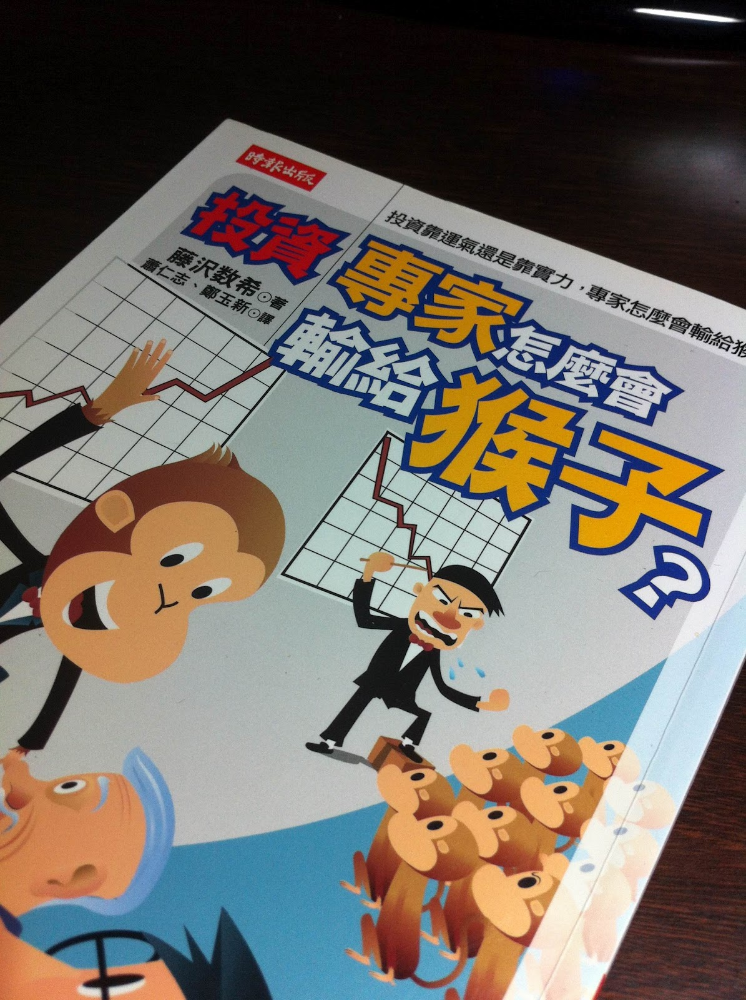

# 投資績效打敗大盤的「不做之事」

複習一個重要觀念，在A到A+這本書裡面提到過：`「不做之事」的清單比「需做之事」的清單更重要。`

賈伯斯也說過：「我們捨棄的和我們留下的同等重要。」

查理‧孟格則說：「迅速殲滅不該做的事情，然後在擅長的領域內發起熟練的跨領域攻擊。」

如果一個投資人想要獲利，並且要得到超越大盤帶來的報酬率，那麼，哪些事情是「不做之事」？

`第一點：不要買收費昂貴的開放式基金。`

大多數開放型基金，收了昂貴的管理費用、內扣費用、總開銷。這些成本都會直接減損投資人的報酬率。加上手續費，以及開放基金的先天限制，幾乎大多數的基金都無法打敗大盤。因此反過來說，只要不買開放的主動型基金，就能避開問題點。

`第二點：降低所有的交易成本與磨擦成本。`

某些成本可以視為投資，但是大多數來說，降低成本是最重要的事情，低成本不見得提高報酬率，但是高成本肯定降低報酬率。
降低成本最簡單的方法就是減少交易次數，只要買進股票的整體週轉率降低，那麼成本自然降低。降低交易的週轉率，意味著可以用更多時間慎選投資標的。

`第三點：不要在景氣熱烈的時候才投入股市。`

某些人可能會說，景氣好的時後股市才會漲。但是景氣熱烈的時後投入股市，買的價位成本就會變高，再者，這種情況下的股票價格大多數都被高估，所有公司幾乎沒有安全邊際可言。

買入股票是必須承受風險的行為，如果你承受了風險，那就必須得到一些優惠，安全邊際就是一種優惠。
如果沒有這種優惠，一旦景氣反轉、成長力道消失，投資人就必須承受虧損或者停損，停損也是一種磨擦成本。
普遍來說，買入價格「平均本益比16倍」以上的股票，幾乎可以確定導致災難。

上述三點是「不做之事」的清單，如果確切遵守，等於取得了一面防禦盾牌。但是要切換到進攻模式，則需要了解「應做之事」，這些事情就是價值投資者必須做的功課。
