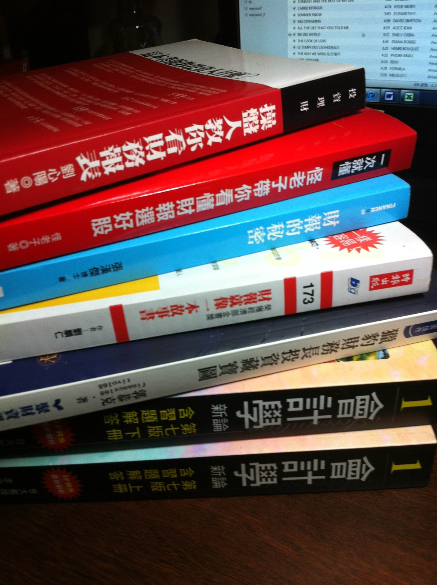

# 【財報新手學習地圖—-建議閱讀清單】

###打好基礎推薦：

`1.怪老子帶你看財報選好股`

  作者：怪老子
  優點：架構完整，清楚明白。按照四大報表解釋名詞，加上圖例。後續的財務比例分析解釋和基礎會計分錄都非常清楚，新手必備好書!

`2.獵報財務長投資藏寶圖`

  作者：獵豹郭恭克、薛教授、tivo168合著
  優點：內容清楚、以問答式的方式釐清觀念、每篇帶有一個excel表格與圖表製作，完成所有章節之後等於作好一個基本分析流程。

`3.會計學新論`

  作者：林蕙真、李宗黎
  優點：台大林蕙真老師的書非常推薦閱讀，打好根基必備好書，所有初會問題幾乎可以獲得解答。

###進階閱讀推薦：

`1.財報的秘密`

  作者：張漢傑博士
  優點：針對財報各名詞舉出不同公司豐富的例子，閱讀輕鬆，內容豐富、扎實。即使是財報新手閱讀也不艱難，財報老手多看之後必能體會到作者的深度和廣度。
  唯一可惜的是此書已經絕版，推薦給朋友後不少人直接打電話到出版社買庫存，不知道現在還有沒有。

`2.財報就像一本故事書`

  作者：劉順仁老師
  優點：本書已經不少人力推，必備好書。

`3.操盤人教你財務報表`

  作者：劉心陽
  優點：作者不只基礎功力扎實，更有許多範例，對股市投資者需要的基本面資訊與市場理解有很大的幫助。
