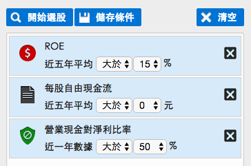
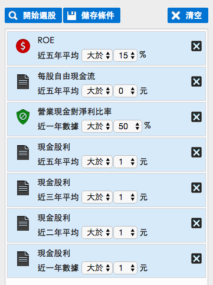
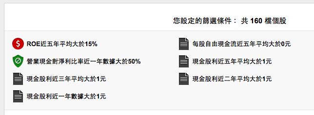
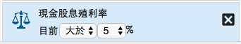
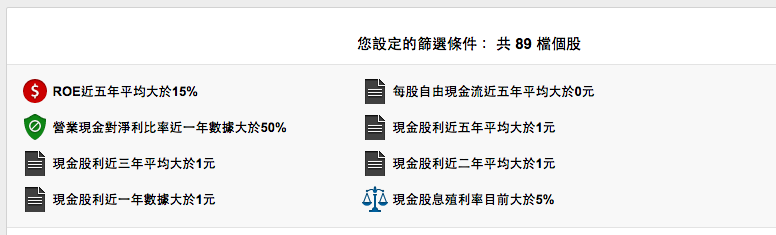

# 3步驟 撈出被低估的高殖利率好股

    
 
買入好公司，是投資成功的第一步。而投資成功的第二步就是：買在公司被低估的時候。股價低估和股票便宜這兩者不一樣，大部份的人常常有個迷思，以為股價下跌，就可以撿便宜貨。所以股票市場上有一種說法是：『百貨公司跳樓大拍賣的時候你敢買，股票變便宜的時候你怎麼不敢買？』

我剛學投資的時候聽到這句話，心裡往往有一大堆疑惑：『股票和百貨公司的商品不一樣，這種道理怎麼說得通？商品的價值我能大概判斷它值多少錢，股票變便宜很可能是出了問題，如果那間公司是地雷股怎麼辦？豈不是低接接到手軟？』&nbsp;

這個問題在我學會價值投資法得到了答案，所謂的『跳樓大拍賣』，不是指說股價便宜，而是被公司的內在價值低估， 
單純的股價下跌，叫做『便宜』 
低於內在價值，叫做『低估』

投資人應該買進被低估的公司，而不是買進便宜但是內在價值下滑的公司，被低估的公司，才有足夠的安全邊際。

&nbsp;

評估一間公司的內在價值，要同時進行財務分析和護城河質化分析，進行這兩項分析需要專業和時間，如果一個上班族時間有限，該怎麼辦呢？有一個很簡單的方法，找出年年發現金股息的好公司就可以了。

<strong>如何選出年年發出現金股息的好公司？選股條件設定！</strong>

&nbsp;

怎樣找出年年發股息的好公司？我們先用『找好公司三大財務指標』：『ROE五年平均大於15%，每股自由現金流近五年大於0元，營業現金流對淨利比率近一年大於50%』設定選股條件，你可以使用財報狗網站（https://statementdog.com/pick/tpe）設定選股條件如下：

圖片來源：財報狗網站）

接著，我們希望能找出每年都發出現金股息的公司，至少發一元以上，所以追加：『近五年、近三年、近兩年、近一年現金股息平均大於1元』這些條件。

用上述條件篩選，總共會跑出160檔個股。這些個股代表有穩定獲利和發出股息的能力。

接著我們要找出被低估的公司，因此追加一個條件『<strong>殖利率</strong><strong>5%</strong><strong>以上的公司』</strong>

加上這個條件之後重新選股，會過濾掉剩下89檔個股，我們把其中兩檔營建股排除掉，就會剩下87檔。 

&nbsp;

<strong>投資的獲利公式：股息、價差、獲利再投入！</strong>

&nbsp;

當你篩選出這些股票，難道隨便買就可以投資賺錢了嗎？當然不是！這套篩選機制可以幫你挑出不好的公司，留下比較有競爭力的公司，有了這些名單之後，投資人要再按照以下的步驟執行：

<ol>
<li>建立能力圈：找出你最熟悉和了解的十檔股票，開始花時間研究公司產業。</li>
<li>找出買點：殖利率5%表示被相對低估，不代表絕對是低點，你應該要找出這時間公司的歷史本益比低點或者歷史股價低點，把這些當成買入的參考點，當你買的越低，股息殖利率就會越高。</li>
<li>建立投資部位：如果還沒有遇到歷史低點，又很想買股票的話，你可以先用30%的資金建立部位，當股價下跌之後再買入20-30%，如果再跌就持續買入，直到部位買滿為止。</li>
</ol>

&nbsp;

年年發股息的公司有一點好處：股價下跌的風險相對有限，因為現金股息就代表了一定程度的緩衝，投資人就算短期套牢，當你領到現金股息之後可以加碼投入，用股息獲利投入的方式來降低買進成本。當未來股價反應公司的基本面之後，股價就會隨之上漲，你同時可以賺到股息和價差。

執行這上面的步驟之後，你還要持續的在自己的個股資料庫之中寫下你的投資筆記，筆記要包含自己的投資心得，對新聞的判斷，投資的操作。

這些資料才是投資人本身最重要的紀錄，大多數的人會抱怨自己的記憶不好，卻不會抱怨自己的決策不好，因為不好的決策你都忘記了，只記得良好的決策。寫下紀錄正是提高決策能力的重要關鍵，如何讓自己能有穩定的獲利？定期反省投資筆記是原因之一，現在就開始建立投資資料庫，打造屬於自己的存股現金流！

<strong><a style="color: #0000ff;" href="http://www.books.com.tw/products/0010687069" target="_blank">雷浩斯教你六步驟存好股</a></strong>&nbsp;<strong>打造一套投資sop<a href="http://search.books.com.tw/exep/prod_search.php?key=%E9%9B%B7%E6%B5%A9%E6%96%AF&amp;f=author" target="_blank"> 
</a></strong>

&nbsp;

      
