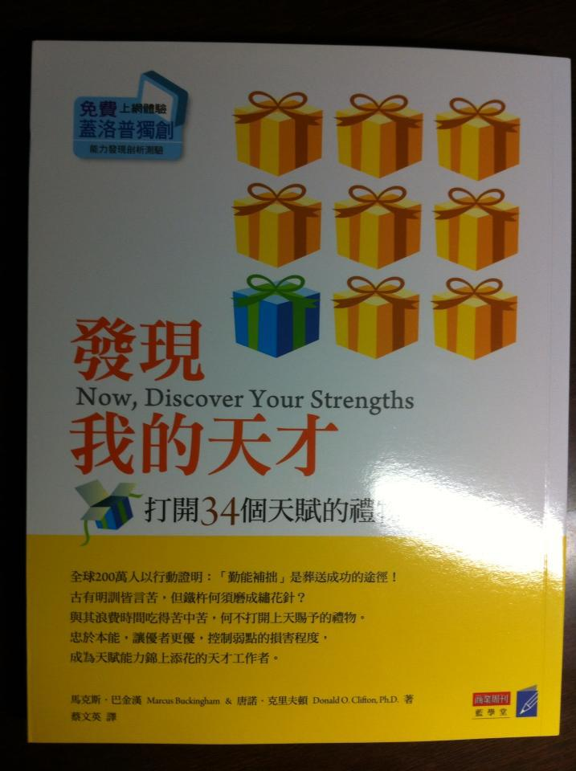

# 投資者的成功優勢三基石：知識、技能和天賦

成功的投資者，意味著能夠降低賠錢的機率，控制賠錢的損失值，在賺錢的高機率事件發生時切入，提高整體的投資報酬率，並且維持著常勝不敗。

簡單的說，就是大賺、小賺、小賠，控制自己不出現大賠的狀況。

要做到這點，需要累積「發現我的天才」這本書內的三個優勢：知識、技能和天賦

#知識：

知識是重要的基本基石。

有時候，你會看到很多人投資多年都沒賺錢，虧很多錢，在市場混很久。他們賺到小錢就跑，從來沒賺過大錢。或者一開始賺大錢，但這個經驗變成未來的詛咒，想重複之前的勝利因素，但是卻不知道某些客觀的因素缺乏，所以後來持續虧錢。

如果直接到股票市場學知識，學的是街頭知識，不是基本知識。
而缺乏基本知識，絕對會有問題。

知識是入門的門檻，區分為外顯型的知識和內隱性的知識。

外顯型的知識可以看書學會：

例如要學財務報表，可以看之前推薦過的財報新手學習清單。要學價值投資的基本觀念，可以看推薦過的價值投資學習清單。

外顯型知識可以傳遞，因為已經整理過，是屬於school smart的範圍。

內隱型的知識很難學會：

在以前，內隱型知識透過學徒制傳承，學徒出師了有時候還是要回去問師父，因為這些知識藏在經驗中，藏在流程中，藏在情境中，沒有經過編整、也難以編整，是屬於street smart的範圍。

有知識並不會變成優秀的投資者，但是優秀的投資者都知識豐富。

#技能：

技能是一種行動，是一種表現在外的行為。

有沒有知識會帶來不同的投資行動，知識越豐富，並且能採取正確行動的人，就能提高報酬率。

技能是需要培養的，培養的過程很重要，技能能夠幫助投資人的行為，告訴他甚麼該作，甚麼不該作。。

有些人管不了自己，因此雖然擁有知識，卻無法培養技能。

某些技能雖然本身有用，但是不見得能替使用者帶來價值，因為技巧必須適合使用者的天賦。

例如在投資上有不少類別的技能：
順勢交易、指數投資法、存股、價值投資法，都是技能。

這些技能特徵就是擁有投資的流程感，一種完整的交易系統、包含評估、買進、投資後管理、賣出…..等等

一套有系統的投資技能會很有魅力，讓人忍不住想去學習，有時候，一些投資人會以為這套交易系統就是聖盃，因為他看起來是如此的完整，充滿了說服力。

但是，交易系統的技能，必須視人而定。

順勢交易是一種操作，但是某些人學不會。
指數投資是高勝率的防禦型技巧，但是某些人不會滿足。
存股是一種方法，但是不見得適合所有人。
價值投資早以解密，但是很多人不相信。

選對系統絕對是非常重要的事情。
選對之後，培養的過程才有價值。因為技能是一種需要累積的東西，擁有時間不可逆的過程。必須結合天賦，才能夠徹底發揮價值的技巧。

#天賦：

你需要當個投資天才嗎？大部分的人都不需要。

如果你想要投資報酬率接近經濟成長率(意味著追平大盤)，那麼只有要「知識加上技能」就能做到。

如果你想要長期下來，投資報酬率持續多年超越大盤，那要知道你自己有沒有這方面的「天賦」。

天賦「不等於」知識+技巧

有天賦的人，意味著某個領域的學習曲線跑的很快，天賦有跡可尋，當你渴望學習某種東西，學的廢寢忘食，並且對自己的學習很滿意。

當你使用某種交易技巧很順手的時候，意味者你有這方面的天賦。

當沖交易員需要有殺進殺出的特點，培養出其獨特的積極性格。
程式交易者邏輯嚴謹，同時也要有處理大量細節的能力，培養出獨特的理工性格。

價值投資者充滿審慎的性格，與其形容有耐心，不如說是：深思熟慮、行為大膽。

因為深思熟慮，所以會進行全面性的分析、瞭解並且強調分析基本面的重要性、追求長期的投資報酬率、控制和規避風險、抵抗群眾心理。

也因為行為大膽，在高機率事件出現的時候會毫不客氣的大量買入，此刻、報酬遠高過風險，這就是成功的價值投資者會做的事。

#總結：成功的投資人必須要累積知識、培養技能、認識自己的天賦。
