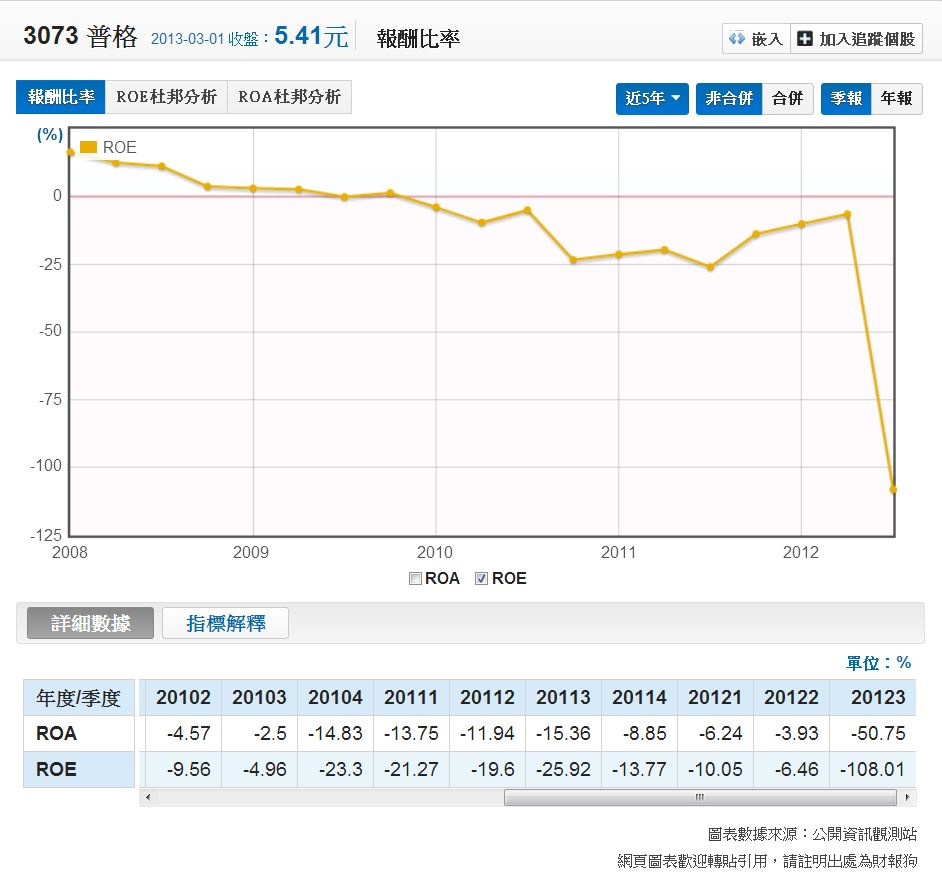

# 用財務指標篩選、避開炒作公司。

今天有一則新聞，三個資深得獎的基金經理人涉嫌和公司派聯手炒作股票，是一間叫做普格(3073)的公司


我們關心的重點在於，能否用財務分析的角度避開這類公司？

之前分享過一些初步篩選公司的選股條件，如下：
```
1.     ROE近五年大於10%
2.     營業現金流量對稅後淨利大於50%
3.     自由現金流量近五年大於0
```

先從第一點ROE來看，我們使用[財報狗網站](http://statementdog.com/)的功能，[選獲利能力分析→報酬比率](http://statementdog.com/analysis/tpe/3073#3073)：



