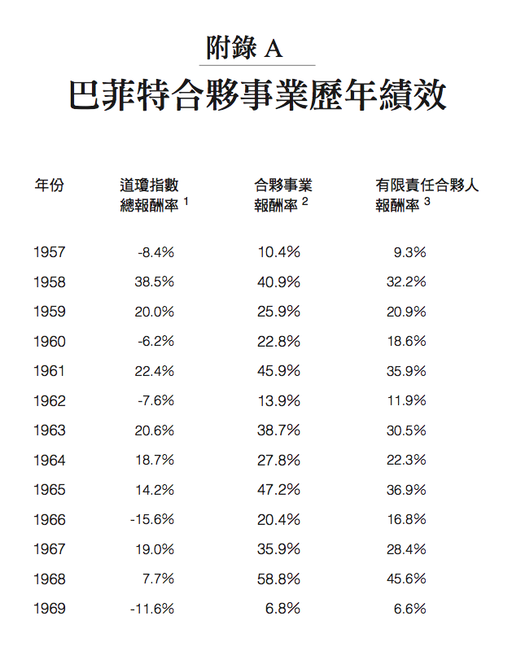
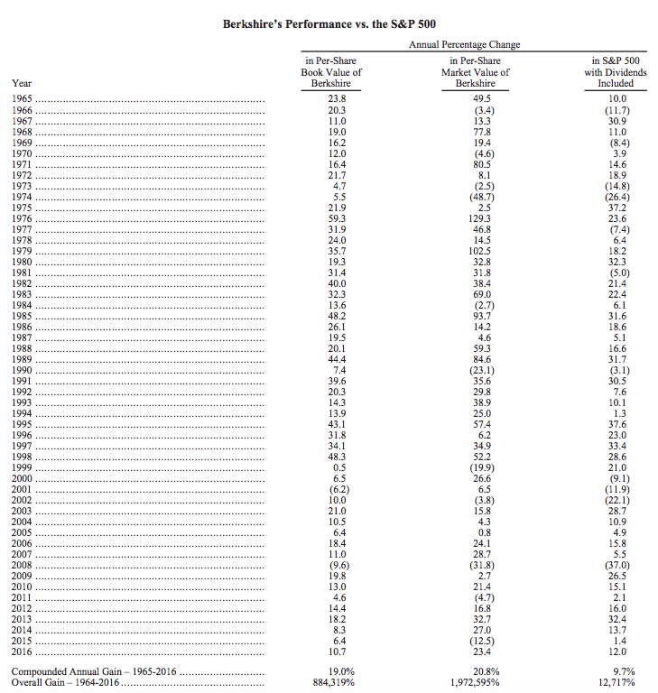

# 巴菲特的勝券在握之道

##到底要怎麼解釋巴菲特如此超凡的投資成就？

這是我最常被問到的，也是我在這裡想探討的問題。

一九六○年代末，我在芝加哥大學攻讀MBA時，接觸到前幾年發展的一個新財務理論。所謂的「芝加哥學派」（Chicago School）中，一個最重要的理論就是「效率市場假說」（efficient market hypothesis）。

根據這個假說，由於無數聰明、自動自發、客觀與消息靈通的投資人的共同努力，各種資訊會立刻反應在市場價格上，因此資產提供的是一種不多也不少、風險調整後的收益。

價格不會太高，但也不會太低，讓人有機會撿便宜，因此也沒有任何投資人可以不斷找到賺錢的機會。基於這個假說，芝加哥學派產生了一句眾所周知的名言：「一般人無法打敗市場。」

效率市場假說為這個結論提供了知識基礎，同時也有很多實證資料顯示，投資人雖然想方設法，無所不用其極，但大部分投資人仍然無法打敗市場。一般人無法超越大盤，似乎是很明顯的事實。

但這並不是說，沒有人可以打敗市場。三不五時，有些人的確可以做到。市場效率的力量還不至於強大到讓個別投資人的報酬率無法超越整體市場的表現。

它只是認為，沒有人可以做到很有效率或能持續不斷打敗市場，所以，效率市場假說依然正確。但凡事都有例外，只是他們的高報酬被描述成只是隨機的表現，所以也是短暫的。

我長大後，當時就有一句話是這樣說的：「如果在一個房間裡，放進夠多的黑猩猩與打字機，最後一定會有一隻猩猩可以寫出《聖經》（Bible）。」也就是說，如果隨機真的算數，那麼任何事偶爾都一定會發生。

就像我母親說的：「例外的事，正好證明這個原則的正確性。」任何通則都不可能百分之百正確，但因為例外太罕見，正好證明了通則基本上是正確的。畢竟，不管業餘或專業人士，每一天都有無數的投資人在證明，一般人確實無法打敗市場。

##直到出了一個巴菲特。

巴菲特和幾個傳奇投資人，其中包括班傑明．葛拉漢、彼得．林區（Peter Lynch）、史丹．德拉肯米勒（Stan Druckenmiller）、喬治．索羅斯（George Soros）與朱利安．羅伯遜（Julian Robertson），他們的投資績效紀錄都顛覆了芝加哥學派的假說。

簡單的說，他們打敗大盤的幅度夠大、時間夠長、金額也夠驚人，以至於效率市場假說的支持者被迫淪為守方立場。他們的績效紀錄顯示，藉由技巧，而不是機會，這些「例外」的投資人絕對可以打敗大盤。

尤其是巴菲特的績效，更是難以反駁的事實。在他的辦公室牆上，有一則由他自己打字的宣言，上面寫著，他在一九五六年以十萬五千美元`成立巴菲特合夥投資公司（Buffett Partnership）`。

 

從那之後，他吸引了更多資金，也賺到很多報酬，現在，波克夏海瑟威（Berkshire Hathaway）的總投資額達到一千四百三十億美元，公司淨值是二千零二十億美元。

`他已經打敗指數很多年`。

在這過程中，他也成為美國第二富有的人。這個成就並不是靠炒作房地產，也不是靠某個獨特的投資技術，那些都是《富比士》雜誌上很多富豪用的方法，巴菲特靠的就是對投資市場抱著認真的態度，並用心熟練技巧而已。

何況，這是一個對所有人開放的投資市場，並非專屬於少數人。

巴菲特的驚人成就到底原因何在？我認為有幾個關鍵：

1.他超級聰明。

有一個描述巴菲特的妙喻是：「如果你的智商一六○，可以賣掉其中的三○點。因為你並不需要。」就像美國暢銷作家麥爾坎．葛拉威爾（Malcolm Gladwell）在《異數》（Outliers）中指出的，成就豐功偉業不需要天才，只要夠聰明就好。

此外，智商更高也不會增加成功機會。事實上，很多聰明人在真實世界中，反而無法走出自己的路，或找到邁向成功和快樂的途徑。單純的高智商尚無法讓普通人變成厲害的投資人，如果可以，那麼美國最富有的人就應該是大學教授了。

除了智商之外，還要有點商業頭腦，有點「機靈」或「街頭智慧」，這些都很重要。

我私下猜測，巴菲特的智商可能超過一三○，只是他一點也不會刻意展現這些「不重要」的額外智商。

他總是對問題直指核心，並提出有根據的有力推論，而且，即使事情一開始的發展與他預估的不一樣，他也能保持耐心，平心靜氣堅守自己的推論，這就是他今天何以成為股神的關鍵要素。

簡單說，他非常、非常重視分析。

他的速度也令人咋舌，他做出一個推論，不需要花幾個星期或幾個月。他也不需要應用分析師的架構，才能推算數字。他認為根本不需要知道與考慮每一個數據點，只要掌握到重要數據就可以了。而他非常清楚那些是什麼數字。

2.他堅守一個整體哲學觀。

很多投資人認為，他們已經夠聰明到對每一件事都很專精，或至少他們表現出那個樣子。

甚至，他們也相信，世界不斷在變化，所以你必須不拘一格，並改變適應的方法，以便跟上最新的變化。這個想法的問題在於，沒有人真的知道每一件事，所以很難持續吸收新知學習新把戲，甚至，這樣的心態還會阻礙一個人發展出專門知識與實用捷徑。

相反的，巴菲特知道他有哪些不懂的領域，並堅守在他了解的領域，讓別人去應付剩下來的部分。這一點非常重要，就像美國小說家馬克．吐溫（Mark Twain）說的：「讓你摔一跤的往往不是你不了解的事，而是你自以為很了解，但卻和你以為的不一樣的事。」

巴菲特只投資他了解與感到自在的產業，他著重在相對平凡的領域，並避開高科技公司。在他的想法與知識範圍之外的東西，他一概不碰。最重要的是，別人因為投資他跳過的公司賺大錢，而他只能看著別人日進斗金時，他還是可以活得很自在（大部分的人沒辦法做到這一點）。

3.他的心理狀態夠彈性。

堅守一個整體哲學觀很重要，但並不表示改變就不好。面對劇烈變化的大環境，適應也是很值得的事，甚至會產生出更好的想法。關鍵在於知道何時要改變，何時要堅持。

巴菲特在投資初期採用他的偉大老師葛拉漢的方法。這個方法叫做「深度價值法」（deep value），也就是買被別人放棄的股票，特別是可以用低於公司淨現金的價錢買的股票，有時候也被稱為「撿菸屁股」。

不過，一段時間之後，他受到合夥人蒙格的敦促，改成投資由優秀經營者領導，有「護城河」保護與定價能力，股價合理（不一定是別人放棄不要）的優質公司。

長期以來，巴菲特都會特別避開資本密集的公司，但他後來也能克服這種偏見，利用二○○八年金融危機後的時機，以及看好未來鐵路運輸業的展望，以合理價格買了 伯靈頓北方聖達菲鐵路公司（Burlington Northern Santa Fe railway）。

想法應該提供指引，而不是讓自己變得僵化，就像和投資有關的其他事，這是一個蠻難駕馭的兩難。但巴菲特很有彈性，他既不會跟著流行而改變，也不會讓想法一成不變。

4.他不會情緒化。

很多阻礙投資成功的因素與人類的情緒有關，效率市場假說失的主要原因，就出在很少投資人能採取客觀行動。

當行情走高時，大部分的人會變得很貪婪、有自信，而且情緒亢奮，因此他們會因為買到賺錢股票而沾沾自喜，並加碼買進，而不是選擇獲利了結。當行情走低時，他們就會情緒低落，內心充滿恐懼，然後就會以便宜價格賣掉資產，根本提不起勇氣再買進。

但也許最糟糕的是，他們行動的準則是：別人怎麼做，他們就怎麼做。
因為羨慕別人成功，而願意承受更大的風險，因為別人就是這樣做。光是羨慕，就足以讓人跟隨群眾，甚至投資自己根本一無所知的資產。

很明顯的是，巴菲特對這一切的情緒作用免疫。增值時，他不會過度欣喜；貶值時，他也不會垂頭喪氣。對他來說，成功由他自己定義，而不是大眾或媒體。

他不在乎別人是否認為他是對的，或他的決策是否讓他馬上看起來是對的（二○○○年初，因為他沒投資科技業，被認為已經「過了人生顛峰期」，但結果，熱門的科技投資風潮變成一場科技泡沫。他依然始終如一）。他只在乎自己（與蒙格）的想法……以及股東是否賺錢。

5.他會逆向操作，而且會打破成規。

一般投資人都認為，就是應該跟著大家做；但最厲害的投資人卻與大眾相反，會在關鍵時刻採取不一樣的行動。

但是，只做和其他人相反的事還不夠，你還必須了解：別人在做什麼、為什麼這樣做是錯的，然後知道應該怎麼做才對。

還有膽識和別人相反（也就是說，採用並堅持美國投資家大衛．史雲生﹝David Swensen﹞所謂的「令人不安的特殊狀態」），而且在市場轉向證明你是對的之前，還要願意忍受自己看起來似乎錯得非常離譜的樣子。其中最後一點簡直會讓人覺得度日如年，就像有一句老話說的：「做得太早與做錯，是無法區別的。」要做到這一切，顯然並不容易。

但巴菲特非常有能力做到逆向操作。事實上，他對逆向操作很著迷。他有一次寫信告訴我，他發現高收益債券的市價有時候像鮮花，有時候像雜草，「當市價像雜草時，我會更喜歡。」逆向操作者喜歡買別人不想要的東西。巴菲特就是這樣做的，而且沒人像他一樣。

6.反週期操作。

投資行為包含了對未來的預測，但很多厲害的投資人會接受一個事實，他們其實無法預測總體經濟的未來，包括經濟發展、利率與市場波動。如果我們無法戰勝大部分的人都想跟上的事，該怎麼做？我個人認為，反週期操作會有很大的幫助。

當經濟情況好轉、公司獲利增加、資產價格上揚，承擔風險也得到報酬時，一般人在情緒上很容易想做更多投資。但是，買進升值的資產並不會帶來優渥的投資成果。事實上，當經濟情況與公司狀況不佳時，才能買到最物美價廉的東西，因為在這種情況下，資產價格更容易被低估。不過，這也同樣不容易做到。

但巴菲特卻一再證明他的非凡能力，事實上，在普遍不樂觀的經濟週期底部投資，應該是他的偏好。

在二○○八年金融危機重創時期，他各花了五十億美元投資高盛（Goldman Sachs）與奇異公司（General Electric）的一○％優先股，另外在二○○九年，還以三百四十億美元買了伯靈頓北方鐵路公司，這還只是兩個象徵性的例子。從今天回頭看，大家可以很清楚這三筆投資背後的智慧，但在金融體系猛烈崩壞之際，有多少人可以做出這麼大膽的行動？

7.長期聚焦且不受波動影響。

我在這一行已經超過四十五年，我發現投資人的投資週期已經愈來愈短。原因可能是媒體愈來愈注意投資成果（這是一九六○年代不曾有過的事），這也影響了投資機構與他們的客戶；另外也可能受到對沖基金年度獲利的影響，因為這些對沖基金每年都能收到獎勵費用。

但是，當其他人被荒謬的偏見影響到自己的想法與做法時，我們卻可以因為避免同樣的行為而獲利。因此，當大多數投資人過度關注季度與年度投資成果時，就會為長期思考型的投資人創造獲利機會。

巴菲特有兩句名言：

「持有期限，就是永遠。」

「我寧願要一年可能上下起伏一五％的獲利，也不要穩定的一二％。」

這讓他能長期堅持好的投資想法，並把所得投入再賺到複利，讓獲利持續累積，也不會被扣到稅，而不是每一年變更投資組合，還要根據短期利率繳稅。

這不僅讓他不至於在波動期間離開市場，更能讓他占到波動之利。事實上，與其堅持流動性與出場的能力，巴菲特很顯然非常樂於做永遠不出脫的投資。

8.他敢在最好的投資點子上下大注。

長期以來，在所謂的審慎投資管理中，分散投資一直是最重要的一環。簡單說，它可以降低大致上的個別損失（也不會在賠錢部位持有太多）。雖然這樣做能減輕賠錢項目的痛苦，但高度分散投資的同時也會降低潛在獲利。

和很多事一樣，巴菲特對分散投資也持相反意見：「我們採取的投資策略，絕對不會跟隨一般的分散投資教條。很多投資權威可能會因此認為，我們的策略風險一定比墨守成規的投資人更大。但我們認為，如果能提升投資人多思考一家公司，以及在買進之前能夠對該公司經營感到放心，集中投資策略就可以大幅降低風險。」

巴菲特非常明白，絕妙的投資點子很少出現，所以他不輕易出手；而且，只要讓他看到一個絕佳的投資機會，他就敢下大注。

因此，他會非常投入他信任的公司與經營者；他不會因為別人買，就跟著抱股；他也不會擔心，沒有他背書的股票竟然表現得很好；他更拒絕分散投資到他較少研究的公司，或只是為了減低做錯投資的衝擊，就去進行他所謂的「多慘化」（de-worstification）投資。

如果你有機會大賺一筆，這一切顯然都是很重要的元素。但在投資組合管理的相關論述中，這些做法都是例外，都不是投資組合管理的原則。

9.他願意維持不行動的狀態。

有太多投資人表現得好像隨時都有很棒的投資要做。也許他們認為，必須給別人一種印象，認為他們實在夠聰明，才能一直找到聰明的投資項目。但是絕妙的投資機會，絕對是罕見的例外。所以這表示了，你不會每天都遇到好的投資機會。

巴菲特很願意長期不採取行動，在發現對的投資出現之前，他絕不出手。

他拿最偉大的棒球打擊手泰德．威廉斯（Ted Williams）比喻：他靜靜站在本壘板上，球棒高舉在肩上，一直等到完美打擊點出現，才會出手。

巴菲特一向堅持，只有看到吸引人的機會，才會進場投資。畢竟，誰敢說好的投資案源都很穩定，或任何時候都是一樣好的投資時機？

10最後，他不擔心會丟工作。

很少投資人可以採取所有他們認為是正確的行動。很多人受限於能力，買入不具流動性、爭議性或不適宜的資產，並賣掉「每個人」都認為會繼續增值的資產，然後把投資組合集中在幾個最好的想法上。為什麼？因為他們害怕做錯的後果。

為他人理財的「經紀人」會擔心，大膽行動會害他們被公司開除，或客戶會跑掉。因此只能採取適當的行動，只做被認為謹慎而不具爭議性的事。這就是英國經濟學家凱因斯（John Maynard Keynes）觀察到的行為傾向：「世俗的智慧教導我們的是，墨守常規的失敗比不按牌理出牌的成功，更能贏得好名聲。」

但這種做法會帶來重大的難題：如果你不願意大膽做一旦失敗會讓你出糗的事，也一定不可能做如果順利會讓你大放異采的事。

偉大的投資人會在明智的推論之後，採取相應的行動，簡單說，他們敢於成為偉大的人。

很明顯的，巴菲特不必擔心有一天會被老闆解雇。他的地位就和他的資金一樣，幾乎是一種固定不變的狀態。

在市場崩盤期間，沒有一個客戶可以把資本拿回來，還要求用便宜價格賣掉資產。在任何偉大投資人的成功經驗中，這件簡單的事基本上發揮過重要的作用，而且我也深信，巴菲特把形勢導向這個方式，並把原本是對沖基金的結構，轉型為波克夏海瑟威的公司形態，並非出於巧合。

 

當然，巴菲特還有很多傑出投資人的共同特質。

他夠專心、有紀律，也有目標；

他也努力認真，會經常運算數字與邏輯；

他還會透過閱讀以及他敬重的人脈身上，孜孜不倦地收集資訊；

另外，他樂於投資是因為他享受解決問題的樂趣，而不是為了得到名聲或賺到錢。

我認為，賺錢只是他努力結果的副產品，而不是他的主要目標。

理論上，很多人可以做到巴菲特過去將近六十年所做的事。因為以上提到的特質雖然很少見，但並不獨特。而且每一種特質都很合理，誰會認為以上特質的相反特質，才是對的呢？

只是，很少人能夠在行動中做到這一切。

這一切的組合以及另外一點點讓特別的人之所以特別的「某種氣質」，讓巴菲特可以採取他自己的投資方法，達成如此不凡的成就。

（本文作者為美國知名投資家、目前為橡樹資本管理公司﹝Oaktree Capital Management﹞的聯合創始人兼董事會主席。）
