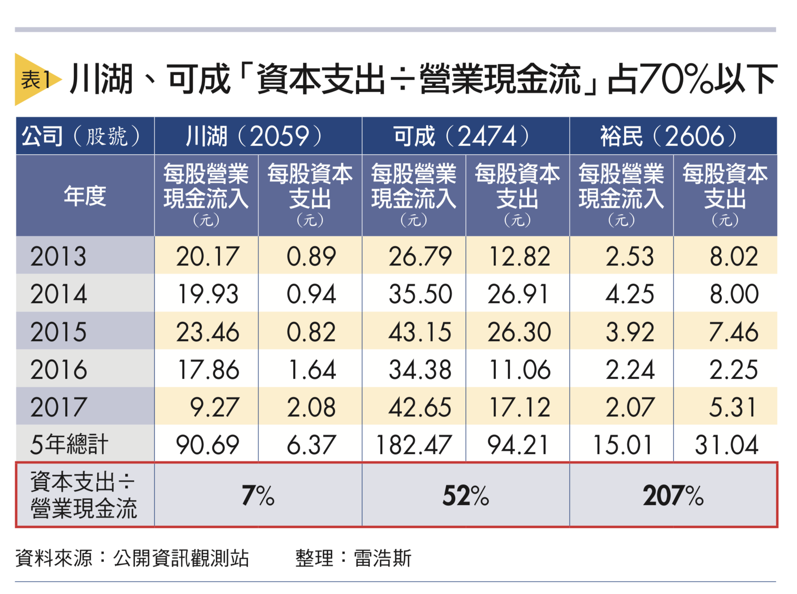

# 巴菲特選股法，從『資本支出』額度，篩出三種不同等級『自由現金流』的公司！

巴菲特喜歡買好公司，他說過：『最好的公司，就是能替投資人源源不絕創造現金的公司。』雖然我們知道這個概念，但是要用怎樣的數字標準來篩選？

 

在`<如果第一次投資就學巴菲特>`這本書裡面提到，巴菲特在2007年的股東信，把根據公司的需要的資本支出額度的不同，把投資標的事業`分類成三種：卓越、優秀、差勁`，並且舉了三個例子。

現在我們知道巴菲特的分類模式之後，我們來想想，台股有哪些公司符合『卓越和良好』，還有哪些是『差勁』的公司？

第一個例子是時思糖果（See’s candy），用來舉例卓越的公司。他說這間公司不斷的創造現金，而且不需要投入太多資本就能持續成長，只是卓越的公司是少數。

第二個例子是飛安公司（FlightSafety），用來舉例不錯的公司，他說這類公司需要投入大量的資金，才能賺到更多的獲利，雖然報酬率不如時思糖果，不過也很不錯，大多數的好公司都屬於這種。

 

前兩個例子都可以納入投資標的之中，第三個例子是航空公司，用來舉例差勁的事業，差勁的公司需要投入大量的資金，卻只能賺到微薄的獲利，因此這種公司很難找到競爭優勢，甚至可能賺不到錢。

 

現在我們知道巴菲特的分類模式之後，我們來想想，台股有哪些公司符合『卓越和良好』，還有哪些是『差勁』的公司？

##類型1》卓越的公司： 資本支出/營業現金流<30%
卓越的公司資本支出少，獲利充沛。根據我的研究，只要五年總計的 資本支出/營業現金流佔30%以下，就可以算是卓越的公司。

 

從下面的表格可以看到，川湖從2013年到2017年的每股營業現金流合計為90.69元，而這五年累計的資本支出為6.37元，把`資本支出/營業現金流為7%`。

 

也就是說這五年來賺到的現金，僅需要拿7%來做維持競爭力的資本支出，這可以說是很低的比率，而剩下的93%現金都可以自由運用，可以說是非常強大的現金製造機。

 

##類型2》優秀的公司： 資本支出/營業現金流<70%
優秀的公司資本支出相對多，這樣才能產生可靠的獲利。根據我的研究整理出來，只要五年總計的 資本支出/營業現金流佔70%以下，就可以算是優秀的公司。

 

從表格可以看到，可成從2013年到2017年的每股營業現金流合計為182.47元，而這五年累計的資本支出為94.21元，把資本支出/營業現金流為52%。

 

也就是說這五年來賺到的現金，需要拿52%來做維持競爭力的資本支出。

 

雖然這個比率跟川湖比起來高很多，但台股大多數的公司資本支出比率都差不多。

用同樣的方式計算，`台積電的五年累積資本支出比率為61%，皇田為57%，儒鴻是54%`。

這類需要資本支出的產業，一定程度上也成為競爭對手進入的障礙門檻，一些獲利不夠高的公司是沒辦法進入這個產業競爭。

 

##類型 3》差勁的公司： 資本支出＞營業現金流 
前兩個類型的公司都具備自由現金流，也都是可以納入投資標的的選擇之一，下一個類型則不一樣，是屬於差勁的公司，也就是所謂的燒錢公司。

 

從表格可以看到，裕民從2013年到2017年的每股營業現金流合計為15.01元，而這五年累計的每股資本支出為31.04元，資本支出/營業現金流的比率為207%，這表示賺的錢不夠資本支出。

 

我們可以看到它五年累積自由現金流為-16.03元，這表示裕民缺錢，需要和銀行借款來因應支出，所以裕民2017年的負債比達59.48%。這是航運產業的公司普遍具備的狀況。

 

我們了解前面三個類型之後，你就能知道，巴菲特執掌的波克夏之所以能長期的增加價值，就是把資金投入在前兩項公司上。他精明的調度資金，替波克夏打造出前所未有的成果，也替投資人帶來前所未有的豐厚成果。