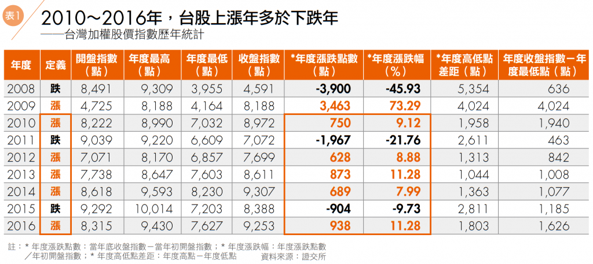
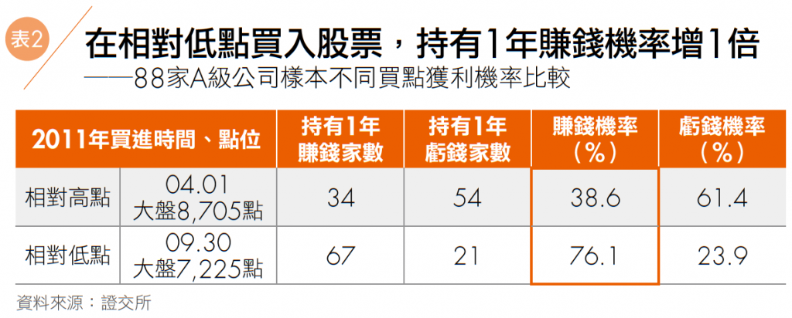

# 被動等待相對低點，投資勝率即可大幅提高！


選出你預定想買的A級股清單之後，投資人最常問的問題通常是：「哪個時間可以買股票？要買多少？」或者是「哪個時候應該賣？要賣多少？」在回答這個問題之前，先釐清一般投資人對買賣股票常有的一個迷思：`以為投資賺錢的人都「預先知道」買賣股票的時間點！`

這個迷思真是難以點清，總是有人認為投資高手有「抓買賣點的祕密絕技」，而且不會把這些密技告訴其他人。實際上根本沒有人可以預知買賣點！我投入股市十多年來，至今仍然沒有辦法事先知道哪檔股票幾時會漲、幾時會跌。

那要怎麼決定買賣時機呢？我用的方式很簡單：`「被動等待」`。

## `不必買在最低、賣在最高，相對高低點進出就能獲利`

網友sam大的部落格「TJ’sDad」（網址：tjdad.blogspot.tw），裡面有一篇很棒的文章叫做「[一個不曾在股市中虧過錢的人](http://tjdad.blogspot.tw/2009/03/blog-post.html)」。原文是約翰．特雷恩（JohnTrain）的著作《TheCraftofInvesting》裡面的一個章節，sam大將它翻譯出來。

這篇文章中的故事充分的說明了「被動等待」的投資方式，內容大意如下（sam大已授權本書分享此文章，完整全文請到「TJ’sDad」閱讀）：

美國1961年代，一位營業員看到一個年輕的投資人總是投資虧錢，就介紹一位「從來不曾在股市中虧過錢」的投資老手給他認識。這個老先生剛賣出他全部的股票，並且大方的分享操作內容給年輕人。年輕人看了他的績效非常驚訝，他的整體投資組合獲利高達50%，30檔股票裡只有1檔虧光，但是其他股票則有漲100%～500%的獲利，足以補足虧損還有賺。


老先生解釋他的投資法，他告訴年輕人：`每當股市空頭、報紙上出現預測未來股市會創下新低的時候，他就在標準普爾（Standard&Poor）的股票裡，找30檔便宜、獲利穩定、沒人聽過但是穩定發放股息的股票`，投入5萬美元的投資部位（約等於2015年的新台幣1,200萬元），買進這「一大包」股票，然後耐心的持有，可能是2年、3或4年。等到股市高漲，新聞紛紛報導即將創下新高點的時候，他就賣出這「一大包」股票，獲利了結！整個操作邏輯就是這樣簡單！


老先生教年輕人，買股票就像種稻一樣，要有季節性；你不可能每天、每週、每月買股票都賺錢，但是只要在正確的季節播種，未來就能收割。同時，你也不可能買在最低點或者賣在最高點，但是你只要買在相對低點，就算對一些個股判斷錯誤也沒關係，因為買進成本相對低，所以你的損失有限。在相對低點買股票，不必因為股價下跌做停損的動作，而是要再度加碼。在相對高點賣股票，不必賣在最高點，因為不管是相對高點或是最高點你都會賺到錢！這樣就可以投資獲利。


這篇「一個不曾在股市中虧過錢的人」講的就是價值投資的交易模式：「被動等待相對低點！」

你要等待2件事：`大盤相對低點、個股相對低點。`

## `大盤上漲時間多過下跌時間，但跌幅大過漲幅`

相對低點怎麼找？每個人都知道股票一定是有漲有跌，但是大部分的人對股價的認知都鎖定在幾個月內的漲跌波動；如果我們用年度的觀點來看股市，結果會如何呢？




表1資料取自證交所網站，我整理了9年來的台股大盤指數資料（點圖可看大圖）。只要當年度收盤指數高過開盤指數，就定義為「上漲年」，反過來，就定義成「下跌年」。從2008年到2016年的資料看來，上漲年合計有6年，下跌年合計有3年。

其中2008年和2009年因為金融海嘯，以及之後的量化寬鬆政策，導致股市的漲跌幅度都非常驚人，所以這兩年的漲跌幅度算是特例。如果不看這兩年的話，從2010∼2016年這7年來，上漲年度有5年，下跌年度有2年，所以我們可以知道：`「上漲年的次數多過下跌年的次數」`。


雖然上漲年的次數多過下跌年的次數，但是`下跌年的「跌幅」都遠遠超過上漲年的「漲幅」`。我們可以看到表格資料顯示，下跌年的2011年跌了1,967點，2015年跌了904點，跌幅分別是-21.76%和-9.73%。而2010年和2012∼2014年這些上漲年，漲幅則約600∼900點，漲幅約8%∼11%左右，2016年也是11%左右。

為什麼跌幅會大過漲幅？有一種說法是「利多總是逐漸醞釀、利空總是突然發生。」股市上漲的力道需要營收、財報獲利的成長消息推動，而這些都需要時間發酵；但股市下跌的情況是一種情緒上的恐慌，恐慌會讓人的判斷出錯，看到股價大跌，心就會慌張，因此跌幅才會又快又猛。


##`觀察近年大盤最低點，靠近低點時即可逢低布局`

接著我們觀察2010∼2016年的最低點，可以發現，除了2014年的低點是8,230點，其他5年來不管是上漲年還是下跌年，低點幾乎都在碰到7,000點∼7,700點左右：

```
2010年碰到7,032點；
2011年跌破7,000點，來到6,609點；
2012年跌破7,000點，來到6,857點；
2013年跌到7,603點；
2015年最低掉到7,203點；
2016年最低掉到7,627點。
```

所以你可以建立一個很簡單的買進策略：`「接近7,000點的時候就準備買進！」`這個7,000點也許是7,700點，或者是7,500點，又或者是7,300點，根據當時的情況自行調整。但是千萬不要一次買足！你可以一次建立30%或者50%的部位，之後分批買進。

也許有的人會覺得，大盤7,000多點還是很高啊？近年投資人有一個「等崩盤」迷思，這個迷思就是：`「我等崩盤再來買股票，例如等大盤跌到5,000點或者6,000點再進場好了！」`

如果你設定5,000點再買股票，那麼2010年以來你將完全沒有進場點。
如果你設定的條件是6,000點再買股票，那麼2013年之後你仍然沒有進場點，因此你會錯過之後的所有上漲獲利。

同時在這段時間，`通貨膨脹會每年以2%∼3%的複利效果來侵蝕你的購買能力`，到最後你會發現手上的錢愈來愈薄，能買的東西愈來愈少！


##`反過來想「何時不要買進」？買點應避開相對高點`

另外一個常聽到的問題則是：`「現在是8,000、9,000點，我知道股市漲高了，那還可以買股票嗎？」`這個問題顯示投資朋友進步多了，起碼大家都清楚相對高點有風險。那我們把這幾年的高點資料抓出來比較一下：

一樣看2008∼2016年這9個年度的最高點數據，你會發現這9年以來，竟然有`6次碰到9,000點左右（包含2010年的8,990點）`！難怪投資人老是認為股市在相對高點！

但是奇怪的是，每年有相對高點也有相對低點啊，怎麼相對高點想買股票的人就增加了呢？更有另一種存股概念說：「反正沒辦法知道股市的高低點，所以就算8,000點、9,000點也可以存股，只要買好公司，公司就會幫你賺錢！」聽起來有道理，但是我不完全認同，雖說好公司買在高點也能賺錢，但是我認為，在相對低點買入會更有勝算。

本書研究了2006∼2010年這5年內有3年以上是A級的88間公司，我們來計算一下，這88檔個股樣本，分別在2011年用兩個相對高低點買進，持有時間1年，然後看賺錢的有幾家、虧錢的有幾家？


由於2011年是個下跌年，開盤是9,039點。2011年4月1日大盤收盤為8,705點，我們可以把這個位置認定為相對高點。因為就一般投資人來說，會將這種9,039點下跌到8,705點的情況，視為回檔點而買入，因此用這個當計算基準很符合人性。

相對低點則設定在2011年9月30日，大盤收盤為7,225點，當大盤從年初高點跌入7,225點視為相對低點，而當年12月底收盤價為7,072點，因此這樣的計算基準也很符合常態。





表2是我整理出來的88間公司持有1年的報酬率，你可以看到，如果買在相對高點8,705點，持有1年後賺錢的家數只有34家、虧錢家數54家。我們假設你從88家公司裡面隨機挑出個股放1年，那麼挑中賺錢的機率只有38.6%，獲勝機率不到4成。

如果買在相對低點的7,225點，持有1年賺錢的家數則增加到67家，所以你挑到賺錢公司的機率提高到76%，和買在相對高點不到4成的獲勝率相比，大幅提高近1倍！

