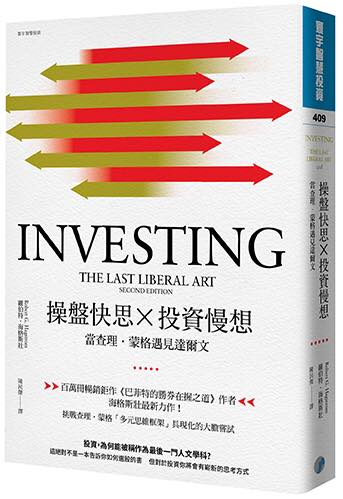

# 操盤快思Ｘ投資慢想



市面上有關巴菲特的書很多，但是寫到查理．蒙格的書卻很少，有一個顯而易見的原因：「查理．蒙格太難懂了。」

查理．蒙格幾乎可以被稱為世界上最有智慧的人，如果你看過他在南加大的演講稿，就能感受到他令人費解的深邃智慧，他每年在Daily Journal的年度問答會就像是蒙格版的波克夏股東會，網路上流傳問答筆記深受所有投資人的歡迎。

查理．蒙格推崇的「普世智慧」，就是將所有的問題採取「系統化思考」的解決方案，而一個巨大的系統之內必定包含許多的子系統，解決問題的方法就是將子系統一一拆解，並且探索其結構，同時又要看出關聯性。

我將這樣的普世智慧稱為「查理．蒙格學說」，他分為七個主要重點：
```
「多元思維模型框架」、
「能力圈」、
「反過來想」、
「人類誤判心理學」、
「檢查表」
「跨領域思考」、
「魯拉帕路薩(lollapalooza)效應」。
```

本書的作者羅伯特．海格斯壯最著名的是他撰寫的《勝券在握》系列書，但是比起《勝券在握》，我對這本`《操盤快思Ｘ投資慢想》`的評價更高，這本書並不是在探討查理．蒙格的生平或者替他的論點做闡述，而是談`如何實踐「查理．蒙格學說」`。

 

作者在這本書裡面，成功的讓讀者學習查理．蒙格「多元思維模型框架」和「跨領域思考」這兩個重點思維。這個成就非常驚人，要在一本書內完成這個巨大的工作可以說是近乎不可能，但他還是辦到了！

我特別喜歡本書第三章生物學的部分，其中生物學與經濟學類比的觀點解答了我許多思考上疑惑，第四章群眾智慧與烏合之眾的論點更是深入地解釋了集體行為如何提高或降低輸出功率。第七章的文學篇則讓你能更徹底提高閱讀的效益。

 

實踐「查理．蒙格學說」是很困難的，而本書如同一個鷹架，讓你更輕鬆地搭上「查理．蒙格學說」的巨大階梯。透過這本書，你無疑能讓自己的思考更接近蒙格想表達的意境，但你必須一個一個章節的逐步閱讀，才能理會作者想談的思考模式。

 

如果你從未探索過「查理．蒙格學說」，本書會讓你感到困惑，甚至認為這本書只是一堆知識的集合體。如果你致力於追求「查理．蒙格學說」所倡導的普世智慧，你會發現這本書是一個無窮無盡的寶庫，值得你花長久的時間深入探討其中的智慧。最後你會發現，這樣一個漸進的過程，其實是最快的道路。