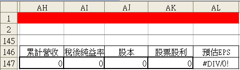
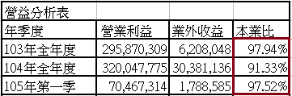
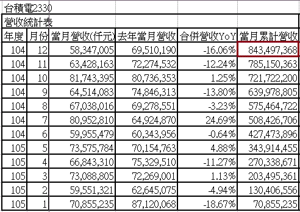
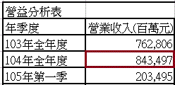
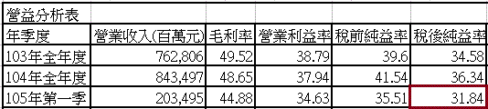
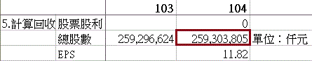
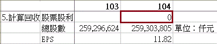
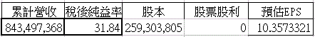

# 從營收成長率，預估EPS

投資人最常看的數字就是每股盈餘，EPS在使用上有三種：當期EPS、近四季EPS和預估EPS。

##當期EPS
通常分為當季EPS或者當年度EPS。影響估價法的是當年度EPS，這也是最重要的獲利數字之一。以台積電為例，2014年全年的EPS：10.18元。

##近四季EPS
如果年度EPS還沒公告，通常會把目前已知的EPS，和前一年的部分加起來當成最新的EPS，例如已經知道第一季到第三季的EPS，那麼把去年第四季的當季EPS加起來，就形成近四季EPS。

例如台積電2015年第1季的EPS是3.05，把2014年第2季到2015年第1季的數字加起來就是近四季EPS：11.38元。

上述這兩種EPS都是過去公告的數字，屬於「歷史盈餘」，但是估價的變數最大的是公司未來獲利，也就是「預估EPS」。

##預估EPS
預估EPS的方法很簡單：
- 先預估未來的營收成長率。
- 再預估稅後淨利率。

把去年營收乘上預估的營收成長率就是未來一年營收，再乘預估稅後淨利率，就得到預估的稅後淨利，除以在外流通股數，就是預估EPS。

由於未來還沒發生，所以預估EPS也不見得能完全相同，所以預估EPS，可以先分成保守版本、趨勢版、折衷版本。

##`1. 保守版預估EPS設定`

我們假設今年營收成長率，和去年相同，並且能維持相同的利潤率，那麼保守版的設定值為如下：

`營收成長率＝去年全年營收年增率` 
`稅後淨利率＝去年度稅後淨利率`

##`2. 趨勢版預估EPS設定`

趨勢版更進一步的抓緊今年的營收和利潤趨勢，所以都以最新的數字設定`營收成長率＝今年累計營收年增率`，這個數字會隨著月營收更新而改變。`稅後淨利率＝近四季稅後淨利率`。

##`3. 折衷版本預估EPS設定`

將保守版及趨勢版兩個版本的數字相加除以二。

這些簡單的設定可以自己使用excel來計算。

## 結語
為方便讀者「預估EPS」，我自己做了一個「預估EPS」的公式，位於價值線資料的總表右下方（146、147列的AH~AL行），給讀者們使用，如下圖：

##使用範例：台積電
由於此公式是從累計營收去預估EPS，所以儘量挑選「本業比」達90%以上。下圖是成長力資料台積電的「本業比」已超過90%以上。【有關本業比的說明，請參考：本業獲利率】

##步驟1：複製去年累計營收
首先，先複製成長力資料「營收統計表」去年（104年度）12月的當月累計營收。

千萬不要複製到成長力資料「營益分析表」的營業收入，主要原因是營業收入的單位是「百萬元」，跟公式設定的「仟元」不符。

##步驟2：複製稅後純益率
可到成長力資料的「營益分析表」中可找到，本例是複製台積電105年第一季的稅後純益率，如下圖：

##步驟3：複製股本
股本可在價值線資料台積電工作表中「5. 計算回收」項目「總股數」可找到，如下圖：是複製去年（104年度）財報總股數的數據。

##步驟5：複製股票股利

因為配發股票股利會使股本膨脹（會影響到EPS），所以這個因素必須考量到，股票股利的資訊，可在價值線資料台積電工作表中「5. 計算回收」項目「股票股利」可找到，如下圖：台積電104年度並沒配發股票股利，所以數值是0。

##步驟6：猜測今年營收，預估今年EPS
上述步驟複製結果如下：

當然你也可以只預估單一季的EPS，例如：累計營收只輸入成長力資料「營收統計表」4~6月單月營收的加總，就可以預估出第2季單季的EPS。

若要更詳細的「預估EPS」，可參考：`用EPS反推營收之合理性`

※參考資料：雷浩斯教你6步驟存好股
※更多的基本分析書目，請參考：汪汪書架的書–基本分析
