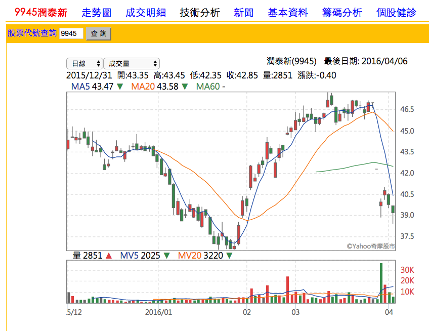
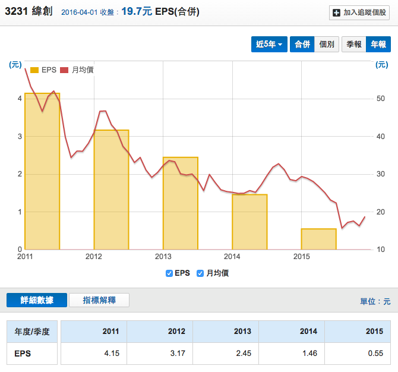
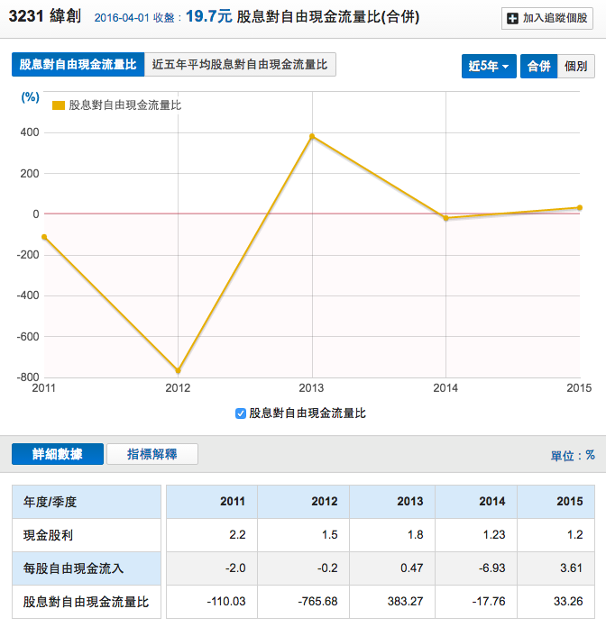

# 存股買了之後就不用再管了嗎？3狀況提醒你別再傻傻抱股！

很多人以為存股就是買了之後擺著股票就好，但這是一種錯誤的迷思。存股策略的特色在於『不短進短出，不隨便賣股。』，它把交易的頻率降低，避免短進短出所造成的決策品質不佳和過高的摩擦成本，但是它不建議傻傻存股，而是要持續的監控公司的營運狀況，以落實價值投資『買一張股票，如同買一間公司』的精神。

當你存股持有股票的時候，雖然不用看盤盯進盯出的，但是你反而要趁收盤後關心公司的營運狀況，以擬定後續的投資策略，畢竟公司營運一定會產生變化，會影響存股投資人通常有以下三種情況：

- 狀況一：減少現金股息發放
- 狀況二：營運獲利走弱
- 狀況三：獲利了結

我們針對這三個狀況來舉例說明。

##狀況一：減少現金股息發放

9945潤泰新是一檔8年都發放現金股息的公司，該公司2015年獲利EPS高達6.46元、該公司的營業利益也創下歷史新高，這間公司發股息的紀錄如此良好，照道理他應該會持續發出優越的現金股息。但是今年卻決定不發放現金股息，消息一出後股價馬上打入跌停，失望賣壓宣湧而出，股價從47元跌到39元。

原因在於公司董事會計算南山人壽的未實現損失之後，認為沒有盈餘可以分配，所以不發放股利。雖然這個案例並非公司失去競爭力，但投資人持有股票就是為了股息收益，如果公司決議不發股利，`基於機會成本的考量，應該將資金投入其他標的，才是有效率的應用`。

##狀況二： 營運獲利走弱

3231緯創是老字號公司，在過去獲利穩定的時候，會是一個投資的好選擇。但是這幾年來，緯創的獲利持續轉差。

（圖片資料來源：財報狗、公開資訊觀測站）
我們可以看到緯創這五年來的EPS持續下滑，獲利從2011年的4.15元下跌到2015年的0.55元，獲利衰退得非常嚴重。當獲利轉差的時候，股價就會隨之下跌，因此緯創股價也從50多元跌到最差16元左右。

（圖片資料來源：財報狗、公開資訊觀測站）
如果單單看現金股息，緯創這五年來每年都發1-2元的現金股息，其實相對穩定。但是股息的來源—自由現金流，卻是表現不佳。緯創五年有三年的自由現金流是負的，以2014年的數字最差，而合計五年-5.05元，這表示現金股息並不是用這幾年本業獲利分配，而是用過去的保留盈餘分配。

尤其2015年EPS獲利只有0.55元，現金股息卻發1.2元，股息發的比賺的多，這表示緯創開始逐步吃老本。雖然存股族重視的是股息收益，而不要在乎股價波動。但是要知道，價值投資的獲利來源來自於兩者：

- `內在價值的提昇：股息收益提高。`
- `本益比的變化：股價上升。`

內在價值的提昇代表的本業獲利的提升，有良好的本業獲利，才會有良好的現金股息。而好公司能夠增加本益比的提升，讓你的總資產增加，當你某天需要現金的時候，你賣出股票可以得到足夠的收益。

反過來說，如果公司獲利降低，你會遇到兩個缺點：

- `內在價值下降：股息減少，甚至沒有。`
- `本益比下滑：股價下跌`

這兩個缺點會讓你的投資出現損失，如果股息持續減少，原本的存股目的就沒了，報酬率也隨之下滑。加上股價下跌，要是你需要用錢的時候遇到這種狀況，那就會導致雙重損失。

要避開這個情況，最簡單的方法就是不要買任何EPS持續下滑的公司，這類公司很可能競爭力轉差，讓你的投資結果不利。

images/2016-04-06-2.15.35.png