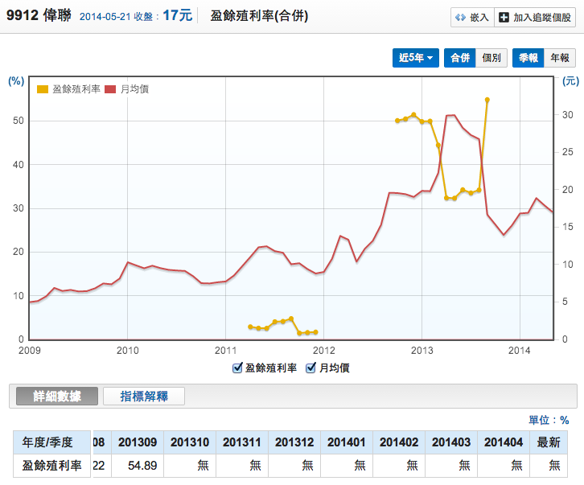

<article id="post-1069" class="post-1069 post type-post status-publish format-standard category-7 tag-earnings-yeild tag-125 tag-129">
  <header class="entry-header">
    <h1 class="entry-title p-name" itemprop="name headline"><a href="https://redhouse.statementdog.com/archives/1069" class="u-url url" title="Permalink to 打敗大盤的獲利公式（二）：盈餘殖利率（Earnings Yeild）找出便宜股 !" rel="bookmark" itemprop="url">打敗大盤的獲利公式（二）：盈餘殖利率（Earnings Yeild）找出便宜股 !</a></h1>

      

      

(圖片取自網路)

<a href="http://redhouse.statementdog.com/archives/1050" target="_blank">上一篇文章我們提到了葛林布雷的『神奇公式MAGIC FORMULA』</a>，這公式有兩個參數：高 盈餘殖利率（Earnings Yield）和高 資本報酬率（Return on capital），接下來我們來談什麼叫做 盈餘殖利率 （Earnings Yield）

<strong>什麼叫做 盈餘殖利率（Earnings Yield）？</strong>

台灣投資人對這個詞比較陌生，在葛林布雷的書裡面，<strong>盈餘殖利率（Earnings Yield）的公式是＝ EBIT / EV</strong>，這個數字在台灣比較少投資人使用。

我們把這個公式簡化修改，<strong>盈餘殖利率（Earnings Yield）公式＝EPS / 買進價格。</strong>

從公式我們可以了解到，盈餘殖利率（Earnings Yield）就是用你的買進股價，去買一間公司的獲利金額，而公司的獲利金額有可能成長，持平，或者衰退，造成盈餘殖利率的變動，投資人如果想要穩定的長期報酬率，就要買進一間有競爭優勢，持續獲利的公司。

因此盈餘殖利率（Earnings Yield）的定義就是：<strong>『用多少價格買入這間公司的獲利能力』</strong>，這個公式就等於『外部股東報酬率』。

&nbsp;

<strong>盈餘殖利率 = 本益比的倒數</strong>

我們把盈餘殖利率公式對調一下，就會知道盈餘殖利率等於本益比的倒數。

EPS ＊本益比(PE) = 股價 
盈餘殖利率 = EPS / 買進價格

舉例來說： 
如果Ａ公司EPS 4元，股價40元，那樣本益比就是10倍 （EPS 4元*PE 10＝40元） 
A公司的盈餘報酬率就是10％（EPS 4元 / 股價40元=10％）

大部份投資人最熟悉的就是本益比，高本益比代表股價上漲的兇！例如先前提的Ａ公司，如果他的本益比飆高到40倍，投資大眾會以為股價飆高！ 
但是它的股價還是40元，為什麼? 因為公司的EPS下降到1 元，所以本益比飆高，股價還是沒漲。 
改用盈餘殖利率（Earnings Yield）來看，就只剩2.5%，報酬率相當的低，如果只有這個報酬率，投資人還要承擔股價下跌的風險，非常不划算。

看本益比，你關心的是『股價有沒有漲』，看 盈餘殖利率 （Earnings Yield）你關心的是『公司的獲利能力』。

投資人投資股票，原本就是重視公司獲利能力大於市場波動，如果公司的獲利能力不變，股價暴跌，這時候就會產生安全邊際，當市場先生抓狂的時候，盈餘殖利率 （Earnings Yield）就會飆高！

<strong>盈餘殖利率突然飆高或消失？</strong>

有時候會突然出現一間公司盈餘殖利率突然飆高的狀況，這表示EPS提升，不過投資人不必高興的太早，因為很可能是一次性業外收益。

例如我的書&lt;<a href="http://www.books.com.tw/products/0010592907" target="_blank">雷浩斯教你小薪水存好股又賺波段</a>&gt;裡面提到9912偉聯，偉聯2012年第四季EPS飆高是因為賣土地，這是一次性收益，不是常態收益。

所以暫時性的盈餘殖利率飆高到50%不必高興，這種情況不會長久。投資人要買的股票是長期本業獲利的公司，不是靠土地收益的公司。

還有，虧錢公司就沒有盈餘殖利率，我們以1538正峰新為例，這間公司這幾年都虧錢，所以盈餘殖利率的當然是無。

遇到這種公司連看都不用看，投資要要賺錢，就是要買有獲利能力的公司，何必去買沒有EPS的公司呢？

&nbsp;

<strong>比對投資個股的機會成本</strong>

盈餘殖利率（EarningsYield）不是新鮮的東西，只是台灣比較少人提，在葛拉漢的選股法則之中，很早提出選股的高盈餘殖利率（EarningsYield）要打AAA級債卷的兩倍。

除了和債卷比，你也可以和你想投資的其他標的比較，例如中華電信是大家最常談到的定存股，如果你想考慮買進從2412中華電信、1537廣隆、9907統一實三間公司，可以比對這三間公司的盈餘殖利率的高低。

從中可以看到9907統一實這間高資本支出的公司目前盈餘殖利率低於中華電信，只有2.66%。而1537廣隆的盈餘殖利率高過中華電信，最新是7.04％！ 
所以投資人可以自行判斷看哪一個標的相對便宜，買入才划算。

&nbsp;

總結：

<ol>
<li>盈餘殖利率就是買一間公司的獲利，他是本益比的倒數，也是外部股東報酬率</li>
<li>使用盈餘殖利率的時候要扣掉一次性業外收益，虧錢的公司就沒有盈餘殖利率。</li>
<li>如果想比對投資標的那個划算，可以比較他們的盈餘殖利率。</li>
</ol>

&nbsp;

<strong>『工商服務時間』：</strong>

&nbsp;

買書是最好的投資，想學習更多專業價值投資知識，請看：<a href="http://www.books.com.tw/products/0010687069" target="_blank">『雷浩斯教你六步驟存好股，這樣做就能獲利翻倍』</a>

&nbsp;

警語：

本文純粹是個人就公開資訊進行分析思考，內容僅供參考，其觀點完全主觀，且不保證觀點正確無誤，資料如有未盡完善，恕不負責。讀者不可以此文內容作為投資操作依據。所有資訊不應視為投資建議，讀者需自行思考判斷，決定自己的投資行為與承受投資風險。

      
<!-- .entry-content -->
  
  <footer class="entry-meta">
  Posted    
    in <a href="https://redhouse.statementdog.com/archives/category/%e6%8a%95%e8%b3%87%e6%9b%b8%e6%91%98" rel="category tag">投資書摘</a>  
  
     | 
  
    Tagged <a href="https://redhouse.statementdog.com/archives/tag/earnings-yeild" rel="tag">Earnings Yeild</a>, <a href="https://redhouse.statementdog.com/archives/tag/%e6%89%93%e6%95%97%e5%a4%a7%e7%9b%a4%e7%9a%84%e7%8d%b2%e5%88%a9%e5%85%ac%e5%bc%8f" rel="tag">打敗大盤的獲利公式</a>, <a href="https://redhouse.statementdog.com/archives/tag/%e7%9b%88%e9%a4%98%e6%ae%96%e5%88%a9%e7%8e%87" rel="tag">盈餘殖利率</a>  
  
     | 
  <a href="https://redhouse.statementdog.com/archives/1069#comments">10 Comments</a>
  
  </footer><!-- #entry-meta --></article>
