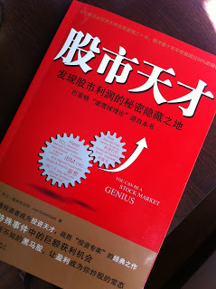

# 打敗大盤的獲利公式（一）：價值投資者：喬伊‧葛林布雷 (Joel Greenblatt)的神奇公式 MAGIC FORMULA

# 打敗大盤的獲利公式（一）：價值投資者：喬伊‧葛林布雷 (Joel Greenblatt)的神奇公式 MAGIC FORMULA

<article id="post-1050" class="post-1050 post type-post status-publish format-standard category-7 tag-joel-greenblatt tag-magic-formula tag-127 tag-125">
  <header class="entry-header">
    <h1 class="entry-title p-name" itemprop="name headline"><a href="https://redhouse.statementdog.com/archives/1050" class="u-url url" title="Permalink to 打敗大盤的獲利公式（一）：價值投資者：喬伊‧葛林布雷 (Joel Greenblatt)的神奇公式 MAGIC FORMULA" rel="bookmark" itemprop="url">打敗大盤的獲利公式（一）：價值投資者：喬伊‧葛林布雷 (Joel Greenblatt)的神奇公式 MAGIC FORMULA</a></h1>

        
      
      Posted on <a href="https://redhouse.statementdog.com/archives/1050" title="18:05:49" rel="bookmark" class="url u-url"><time class="entry-date updated published dt-updated dt-published" datetime="2014-05-19T18:05:49+00:00" itemprop="dateModified">2014-05-19</time></a><address class="byline">  by   <a class="url uid u-url u-uid fn p-name" href="https://redhouse.statementdog.com/archives/author/redhouse" title="View all posts by 雷浩斯" rel="author" itemprop="url">雷浩斯</a></address>    
<!-- .entry-meta -->
      </header><!-- .entry-header -->

      

    

（圖片取自網路）

喬伊‧葛林布雷 &nbsp;(Joel Greenblatt) 是哥倫比亞大學商學院的教授，他所成立的高譚資本投資（Gotham Capital），年化報酬率有40%，相當驚人。

我最早知道葛林布雷是看過他寫的<a href="http://www.kingstone.com.tw/book/book_page.asp?kmcode=2015630388969" target="_blank">『打敗大盤的獲利公式』</a>，這本書是the little book系列的書之一，英文原名是『The Little Book that Beats the Market』。

Ｔhe little book 系列的書都是比較輕鬆好讀一點的書，這本也不例外，此書是他寫的第二本書，難度不會很高，很適合輕鬆閱讀。 

其實葛林布雷更受價值投資者推崇的書是<a href="http://www.books.com.tw/products/CN10759096" target="_blank">『你能成為股市天才』</a>(You Can Be a Stock Market Genius)這本書，這也是他寫的第一本書。根據他本人的說法，這本書啟發了不少避險基金經理人。

傳奇價值投資者 賽斯・卡拉曼（Seth Klarman）的推薦書單中也有這本書。可惜台灣沒有翻譯本，如果要看只能從<a href="http://www.books.com.tw/products/CN10759096" target="_blank">博客來買簡體版</a>。

後來看<a href="http://www.books.com.tw/products/0010501935" target="_blank">『大賣空』（The Big Short）</a>的時候，書內的價值投資者麥克貝瑞也讀過『你能成為股市天才』這本書，很有趣的是葛林布雷竟然投資了一百萬美金到麥克貝瑞的傳人基金（Scion Capital），並且稱讚麥克貝瑞：『他實在太出色了，這種人才鳳毛麟角』。

葛林布雷的第三本書是『<a href="http://www.books.com.tw/products/0010533629" target="_blank">不買飆股，年均獲利40%</a>』（The Big Secret For the Small Investor），這本書更簡單了，可以站在書店把它翻完。

回頭談『打敗大盤的獲利公式』這本書，這本書號稱能打敗大盤，觀點在於提出用<strong>『神奇公式MAGIC FORMULA』</strong>建構投資組合。

<strong>『神奇公式MAGIC FORMULA』</strong>主要是用兩個參數做投資決策：

<ol>
<li><strong>高盈餘殖利率 （Earnings Yield）</strong></li>
<li><strong>高資本報酬率 （Return on Capital）</strong></li>
</ol>

&nbsp;

盈餘殖利率（Earnings Yield）是屬於『估價』的技巧，用來判讀股票是否有安全邊際，如果股票被嚴重低估，那個盈餘殖利率（Earnings Yield）就會飆高，投資人在這時候買股票的相對報酬率就高。如果股價上漲，空手的投資人去追高，那麼他就要承受追高風險，因為這時候的盈餘殖利率（Earnings Yield）很低，投資人只剩下追價差的報酬率，不具有安全邊際。

資本報酬率（Return on Capital）是屬於『分析』的技巧，用來判斷管理者運用公司資產經營能力的高低。買入經營能力好的公司，投資人的報酬率自然高，買入資本報酬率低的公司，投資人也很難期望有好的獲利。

這兩個參數會不會太簡單？有沒有可能導致判斷失誤？當然有可能，因為這本書是little book系列，也是為了寫個散戶的書，所以不可能說太多困難的判斷方式。同時，為了避開個股判斷錯誤或者意外風險，所以要盡可能地分散投資組合，避免失敗。其實用這兩個參數的結論很簡單，就是『買入便宜的好公司』，這就是價值投資的原則。

如果你有操作美股，你也可以使用葛林布雷的神奇公式官方網站，網址<a href="http://www.magicformulainvesting.com/" target="_blank">http://www.magicformulainvesting.com/</a>，（神奇公式的年化報酬率是30.8％，葛林布雷個人早期的報酬率是40%左右，的確驚人的要命，一般來說除非投入資金比較小，然後選上飆股才會有這種報酬率，如果投資使用金額越大，很有可能報酬率就會下滑）。

所以美國也有人提出質疑，並且進行回側，網站連結如下：

More Magic Formula Analysis：<a href="http://blog.empiricalfinancellc.com/2011/06/909/" target="_blank">http://blog.empiricalfinancellc.com/2011/06/909/ 
</a>Magic Formula and Small Caps–The Missing Link?<a href="http://blog.empiricalfinancellc.com/2011/07/magic-formula-and-small-caps-the-missing-link/" target="_blank">http://blog.empiricalfinancellc.com/2011/07/magic-formula-and-small-caps-the-missing-link/</a>

葛林布雷的相關採訪:<a href="http://online.barrons.com/news/articles/SB50001424052970203286304576313260557530894" target="_blank">http://online.barrons.com/news/articles/SB50001424052970203286304576313260557530894 
</a>葛林布雷採訪影片：<a href="https://www.youtube.com/watch?v=3PShSES5nBc" target="_blank">https://www.youtube.com/watch?v=3PShSES5nBc</a>

有興趣的朋友可以參考相關資訊。

＊打敗大盤的獲利公式(二)：<a href="http://redhouse.statementdog.com/archives/1069" target="_blank">盈餘殖利率(earnings yeild)找出便宜股</a>

      
<!-- .entry-content -->
  
  <footer class="entry-meta">
  Posted    
    in <a href="https://redhouse.statementdog.com/archives/category/%e6%8a%95%e8%b3%87%e6%9b%b8%e6%91%98" rel="category tag">投資書摘</a>  
  
     | 
  
    Tagged <a href="https://redhouse.statementdog.com/archives/tag/joel-greenblatt" rel="tag">Joel Greenblatt</a>, <a href="https://redhouse.statementdog.com/archives/tag/magic-formula" rel="tag">MAGIC FORMULA</a>, <a href="https://redhouse.statementdog.com/archives/tag/%e5%96%ac%e4%bc%8a%e2%80%a7%e8%91%9b%e6%9e%97%e5%b8%83%e9%9b%b7" rel="tag">喬伊‧葛林布雷</a>, <a href="https://redhouse.statementdog.com/archives/tag/%e6%89%93%e6%95%97%e5%a4%a7%e7%9b%a4%e7%9a%84%e7%8d%b2%e5%88%a9%e5%85%ac%e5%bc%8f" rel="tag">打敗大盤的獲利公式</a>  
  
     | 
  <a href="https://redhouse.statementdog.com/archives/1050#comments">1 Comment</a>
  
  </footer><!-- #entry-meta --></article>