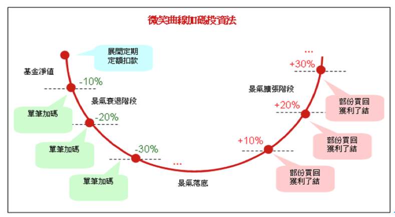
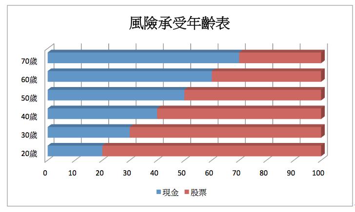
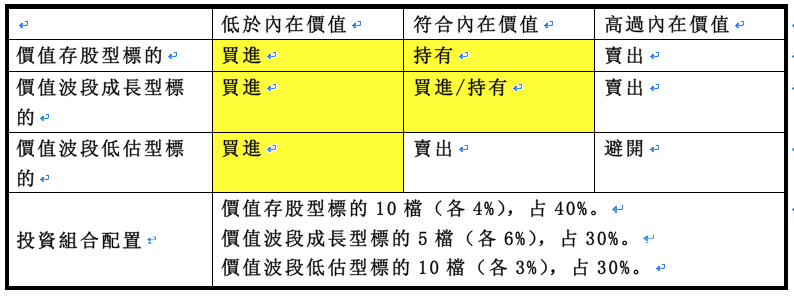
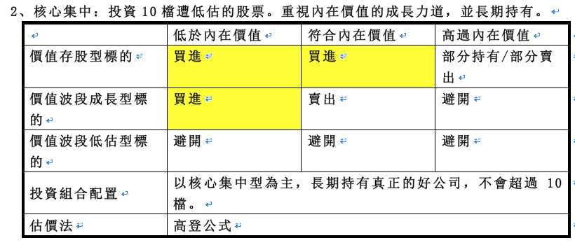
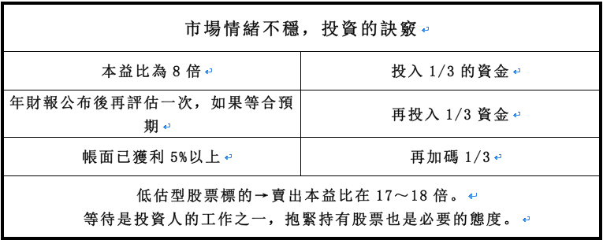

# 讀友蘇正仁：存好股又賺波段，資產配置＋微笑曲線！

##第一節：風險控管最後防線、用資產配置降低意外
###一、價值投資風險控制：「安全邊際」、「持股心態」買一間股票等於買一間公司的心態、「資產配置」。

###二、學術界的資產配置法：買入指數型基金，用分散布局、低周轉率、低成本持有。

###三、價值投資觀點：股票市場不是有效率的，投資人非理性（只看價格、不看價值），風險來自於企業本身的內在價值。

###四、建立投資組合條件：指數型基金→「市值加權」、價值股資→「低估」買、「高估」賣。

###五、資產配置：

####（一） 決定可投資資金（須扣除生活開支、存款、緊急預備金）。

####（二） 比率配置表：

###（三）2大配置策略，投入`不同產業抵銷風險`：股票部位應分散買入不同產業和公司。

####`1、極端分散`：買至少25檔便宜股票。以財務報表數字為主，質化分析為輔。

####`2、核心集中`：投資10檔遭低估的股票，重視內在價值成長力道，並長期持有。

##第二節：等待買點、抱穩好股，人生做對幾次就足夠了
###一、交易時要分清楚自己是「投資」還是「投機」。

###二、投資：「用現在的現金，換未來的現金。」

###三、投機：「賭博靠的是運氣」。

###四、投資紀律：

####（一）`降低買賣次數`，`有高勝算才行動`。因報酬率要扣掉交易成本（手續費）。「複利成本」會傷害到「複利報酬率」。買賣愈多、決策品質愈差，犯錯機率就會提高。

####（二）等待市場情緒不穩，將資金分批投入。賺大錢的訣竅，「等待買賣點」。

###五、等待是投資人的工作，抱緊持股也是投資人的工作，人生只要抓住幾次好機會，就能有好的獲利。

###六、學習「巴大的微笑曲線」投資法：

###七、聖經裡投資的話：

####（一）「螞蟻雖然弱小，卻知道在夏天儲備糧食」（箴言三○：25）。

####（二）「貪婪的人急於要發橫財，卻不曉得貧窮就要臨到」（箴言二八：22）。

####（三）（馬太福音二五:14-30）耶穌用主人按才幹受責任給三個僕人的比喻:

誇獎那加倍收益的領五千和二千的僕人，稱讚他們是「又良善又忠心的僕人」。（路加福音十九12-26）耶穌用主人交銀與十僕的比喻，誇獎那些賺十倍、五倍收益的僕人，也一樣稱讚他們是「又良善又忠心的僕人」。

※但對那些怕投資風險，只埋藏本金，連放利息都懶得去作的第三種僕人，主耶穌罵他們是「又惡又懶的僕人」。

從這兩個比喻，很明顯，主耶穌鼓勵我們傚法第一和第二種僕人，把神託付我們管理的錢財，努力理財賺錢，做「又良善又忠心的僕人」。

####（四）聖經中有一個好的投資案例，那就是「約瑟」的故事，他有很多來投資智慧值得我們去參考學習:

1、約瑟敬畏神，願意為神所使用。（雖被哥哥陷害遭賣出，也為波提乏商人認真的工作，而在監牢裏也不任意的抱怨生命）

2、約瑟提出好的經營模式，並讓法老重用他。（解夢：酒政、膳長、法老）

3、約瑟利用景氣循環的投資好時機。（七個大豐年、七個大荒年）

4、約瑟先儲蓄，有自己的投資計劃，將投資轉變成長期穩定的獲利。

5、約瑟所的「投資」最終救活並養活許多人。（救活埃及人，也解救了自己的家人）

### 八、巴大讓我看見的投資心態：

####（一）要投注於本業，專心的儲蓄，以便你能有多餘的錢去投資。（就像螞蟻一樣認真工作）

####（二）不要用財務槓桿去借錢來投資，千萬不可以去融資、融券。

####（三）不懂的不要投資，不懂的就去投資就像賭博一樣。

####（四）不要貪心想發快財，投資是需要等待。

####（五）要長期投資收取合理報酬，而不是賺取一時的價差或高額的投資報酬率，投資要能久抱。

####（六）物色好自己的標的物，投資時要能讓你晚上睡的著覺，不會妨害你的服事與工作。

####（七）在景氣不好的時後，以合理的價錢買下合理報酬率的標的物，並設定合理的投資報酬率目標。

####（八）投資要`合理的分散`，太多與太少都不好。