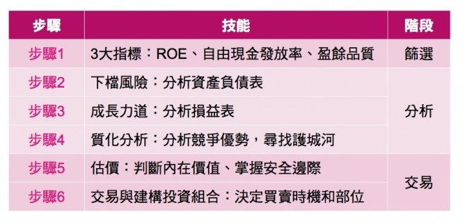

# 檢查清單：提高投資效率的簡單利器。

最近看了太多艱難的書，後來看到一本『`為什麼菁英都是清單控`』，這本書寫的輕鬆有趣，而且很好閱讀，就在咖啡廳花了一兩小時把它看完。

簡單的書會不會讓你沒有收穫呢？這是一種迷思，許多聰明人常常陷入解決難題的陷阱，畢竟你是個聰明人，如果你能解開難題，不但能證明你的能力，還能讓你很有收穫。
但是實際上，只要是好書、無論簡單還是艱澀，只要把握重點就能夠有收穫，簡單的書還能省下你的時間，節省你的腦力。

『為什麼菁英都是清單控』這本書有一些有用的觀點，例如：

- 1.清單能減輕焦慮，因為你比較不用擔心忘記事情。
- 2.讓你能夠專心做事，不用把力氣用在記憶事情。
- 3.每劃掉一筆工作，你的成就感就加深一點。
- 4.清單就是太簡單了，所以很多人才會忽略他，但是往往我們忽略的簡單事情會帶來問題。
- 5.列清單能幫助你做好規劃，提升你的腦力。

###聰明的投資人都會運用的工具：『檢查清單』

『檢查清單』是個好概念，查理蒙格告訴我們：『再優秀的飛行員都不會不使用檢查清單。』他在『`窮查理的普通常識`』裡面提到了許多次：『要培養使用檢查清單的習慣』、『沒有人能聰明到不使用檢查清單』。檢查清單能確保你不會遺漏、提高思考品質、減少大腦的使用功率，避免犯錯。雖然檢查清單只是小動作，但正是這些小動作的累積，提高了你的決策品質。

Guy Spier 在他那本好書<`與巴菲特共進午餐時，我頓悟到的5個真理`>之中，獨立了一個章節說明『檢查清單』的重要性，他說：『檢查清單是最後一道防線，防止不可靠的大腦忽略了警告，它以系統性的方式，把投資者分散的注意力抓回來』。

如果連全世界最聰明的查理蒙格和擁有哈佛和牛津學位的Guy Spier都使用檢查清單，那麼我們這些凡夫俗子為什麼能自信的說不需要靠這個簡單的低科技工具？

 

###SOP＋ 檢查清單：正確的方向＋防呆裝置

當我發現投資標的之後，會先替這個標的進行分類，看他是『成長力道型』還是『下檔風險型』，歸類之後再透過自己的六步驟SOP來分析。

但是SOP只能幫我們引導到正確的方向，他會有80%的可靠性，剩下20%的意外性就要設定一層防呆裝置，我的檢查清單就是防呆裝置，用來強化『質化分析』的效率，我使用的清單如下：

- 1.產業能力圈清單
- 2.五力分析檢查清單
- 3.護城河KSF檢查清單
- 4.四不投資清單

上述清單合計有20個項目以上，我在個人的投資課程中分享這些資料，用來加速學員快速上手。這種簡單的東西威力比你想像的還大，我們可以把自己的投資經驗納入清單之中，用來因應意外狀況，例如除了上述清單之外，我還有『`台股空頭檢查清單`』，這類清單如同山難的救助包一樣，緊急的時候能救你一命。

如果投資人同意每個人都要有自己的投資SOP，那你應該也要有屬於自己的投資檢查清單才對，如果你沒有，可以打開紙和筆，開始自己做一個。

