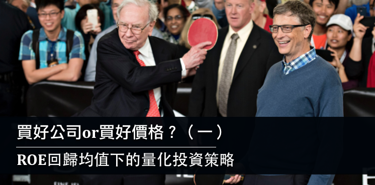
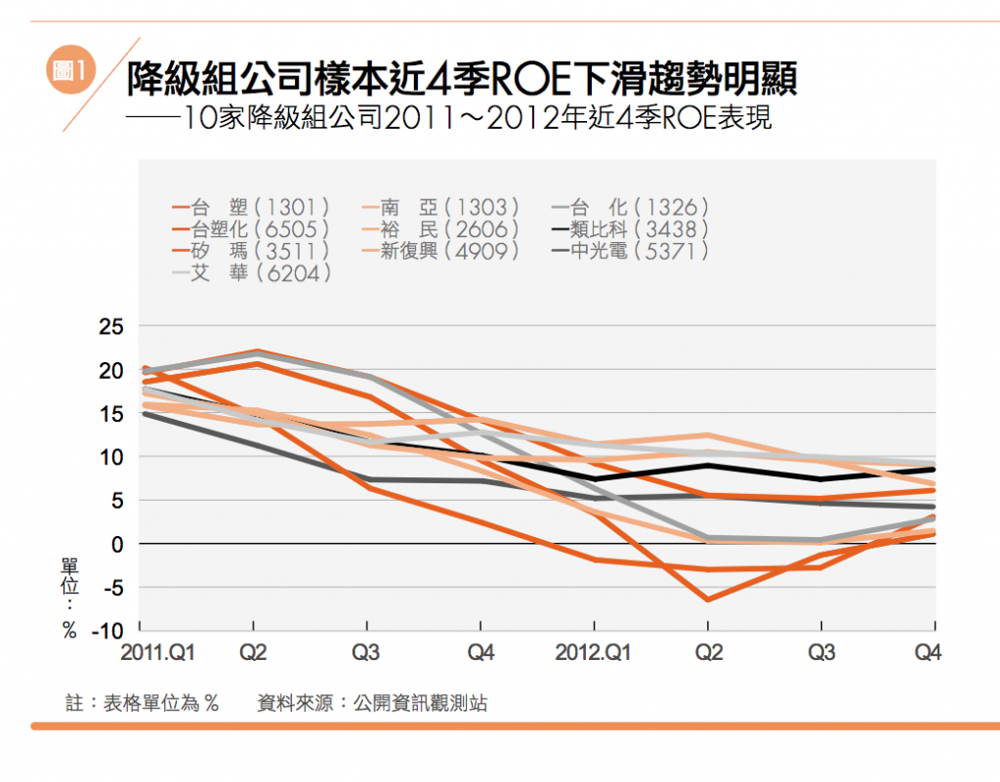
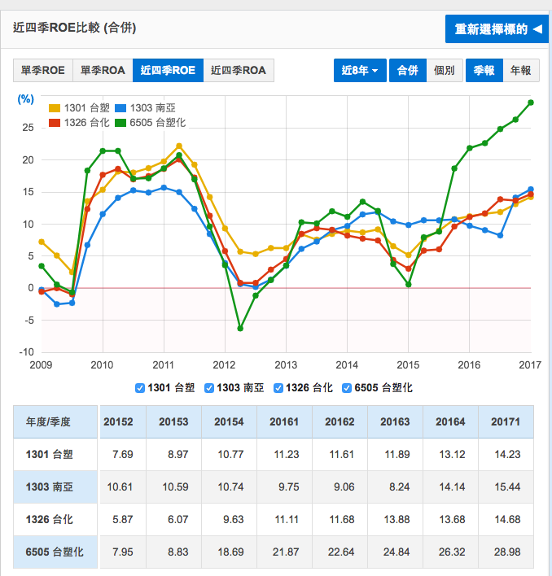
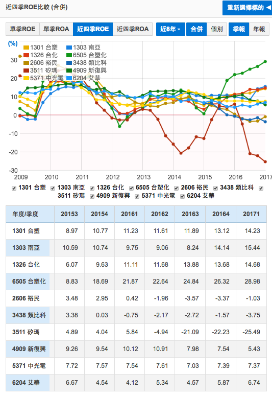
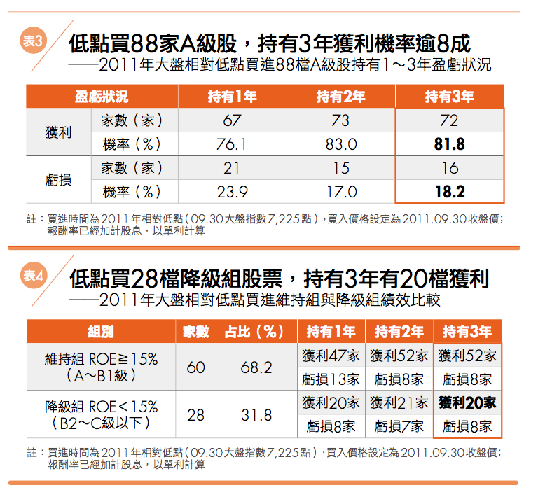

    

<ul>
<li>
<h3><strong>什麼叫做ROE</strong><strong>回歸均值？</strong></h3>
</li>
</ul>

有些公司以前基本面不錯，但是後來卻轉差了，這種狀況在過去歷史上經常發生，在未來也會持續發生。如果我們用ROE來評估的話，就會發現有些公司好的超過平均，但是最後卻下滑了。

主要因為高ROE代表利潤高，利潤高就會引來競爭者，競爭激烈導致利潤下滑，所以ROE就會下滑到平均水準，這就是ROE回歸均值，在矩陣式存股法來說，這就叫做降級。

上面的表格是<a href="http://www.books.com.tw/products/0010744360" target="_blank" rel="noopener noreferrer"><strong>矩陣存股法</strong></a>內舉出的降級股其中10檔的近四季ROE，你可以很清楚的看到他們下滑。

通常因為高ROE的公司市場評價就會很高，而一旦成長不如預期，或者開始衰退，那麼股價就會加速反應，假設原本的評價是30倍本益比，下滑之後就會降到10倍本益比，持有在相對高檔的投資人就會飽受虧損。反過來說，沒有持股的人就可以趁此找到被錯殺的好公司，開始投資。

<ul>
<li>
<h3><strong>回歸均值下的兩種投資策略</strong></h3>
</li>
</ul>

回歸均值是大數法則，它一定會發生，但是發生的時間點不得而知，所以對抗回歸均值有兩種策略：

<ol style="list-style-type: upper-alpha;">
<li><strong>量化策略：買好價格。</strong></li>
<li><strong>質化策略：買好公司。</strong></li>
</ol>

先討論<strong>Ａ量化策略：買好價格。</strong>

偏量化分析的回歸均值策略，簡單的說就叫做：『買好價格。』買好價格的策略不見得要買Ａ級股，買Ｂ級股也可以，但是一定要低於內在價值，而且要非常便宜。

使用量化策略的投資人會說：<strong>買好價格是降低風險最好的策略。</strong>

他們的投資組合同時會採取分散投資，只要分散的每一檔都低於內在價值，那麼出錯的機率就會降到最低。量化策略是打安打的策略，投資成果的確定性較高。

寫<strong><a style="color: #0000ff;" href="https://redhouse.statementdog.com/archives/3324">『投資最重要的事』</a></strong>的作者霍華馬克思就是標準的量化派，所以他採取防禦型投資和重視風險的風格。

&nbsp;

量化策略的實際應用也有不同的風格，在台灣知名者如下：

<ol>
<li><strong>冷門股回歸均值：以<a style="color: #0000ff;" href="https://stasistw.blogspot.tw/">麥克風</a>、<a href="http://pachuchin.statementdog.com/">左輪手槍</a>為代表</strong></li>
<li><strong>重整後成長回歸均值：以<a style="color: #0000ff;" href="http://nemochan.statementdog.com/">尼莫</a>為代表</strong></li>
<li><strong>大型股回歸均值：以<a style="color: #0000ff;" href="http://smart0806tw.statementdog.com/">巴大</a>為代表</strong></li>
</ol>

冷門股回歸均值的量化策略會<strong>『買人所不敢買』</strong>，首先篩出投資清單，之後配質化分析做出取捨，麥克風以個人的投資經驗和論文做出取捨判斷。左輪手槍以對財經會計和法規的了解加上產業的知識來做出判斷。這種策略有時候會持有一到兩年，有時候則需要催化劑，視情況而定。

重整後成長回歸均值主要就是『雪中送炭』的策略，當公司遇到倒霉事之後進行重整，同時取得成長動能，就能提高ROE，這是尼莫擅長的投資法，此法需要多年的會計能力和質化分析能力才能達成。

大型股回歸均值以巴大為代表，巴大的投資風格大家很了解，這邊補充大型股回歸的論點：

Ａ級公司經過ROE回歸均值的激烈競爭之後，某些公司失敗退場，某些公司存活，因此進入市場成熟的狀況，例如電信、保全、民生用品等等，這些公司如果規模很大，就會維持穩定的B2 等級多年，只要維持穩定，就算一時被錯殺，之後回歸原本的獲利也不會太難。

上面的表格是之前10檔降級之中的大型股，你可以看到在2011-2012年降級之後，2013-2014開始提高ROE，其中台塑化表現最好，之後ROE提高非常多。剩下三家則維持在Ｂ2等級左右。

但是其他的降級公司可不會這樣簡單的提高ROE。

表格加上了其他六間公司，你潰看到其中三間是虧損的，另外三間ROE是個位數字，回歸均值並不容易。

由於量化策略使用『買好價格』加上回歸均值，只要分散持有兩到三年，就能投資獲利。

上面表格是<strong><a style="color: #0000ff;" href="http://www.books.com.tw/products/0010744360" target="_blank" rel="noopener noreferrer">矩陣存股P188頁</a></strong>，你可以看到只要買在相對低點，就算降級的28家公司裡面都有20家獲利，買好價格加上回歸均值的雙重力量就能帶給你獲利。

由於回歸均值的力量，冷門股回歸均值的投資策略持有時間我認為是1-2年，重整後成長回歸均值要觀察基本面變化，不過最少也要一年。大型股回歸均值採取2-3年的持股會比較好。

下篇我們來討論質化分析策略。

————————————————————————————————————

<strong>博客來：<a style="color: #0000ff;" href="http://www.books.com.tw/products/0010744360" target="_blank" rel="noopener noreferrer">《雷浩斯教你 矩陣式存股法年賺18%》</a></strong>

<strong>隨書附贈：</strong> 
<strong>免費矩陣等級分析EXCEL檔隨書下載！</strong> 
<strong>6檔精選個股分析範例！</strong> 
<strong>涵蓋七大產業、64檔矩陣股簡表！</strong>

&nbsp;

      
