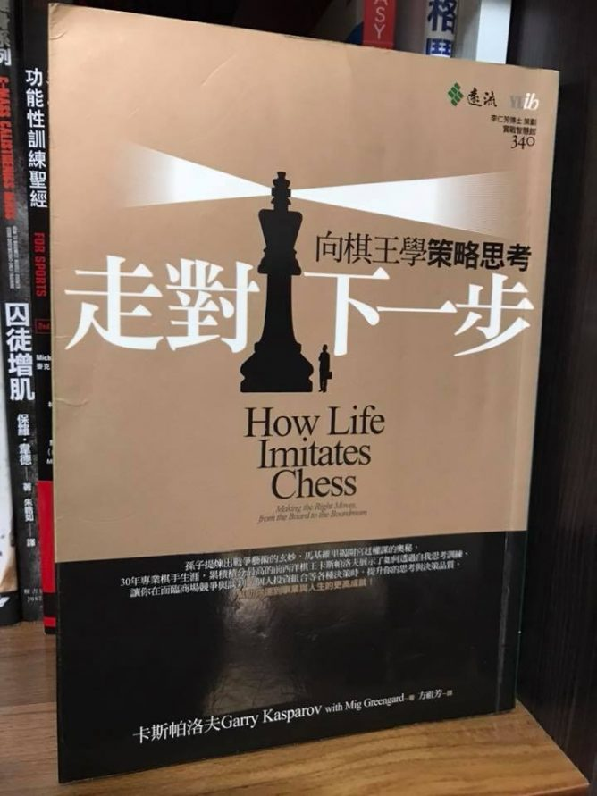

# 如何學以致用？透過要點解構，提高輸出功率！

如果你讀很多經典投資書，卻覺得沒什麼改變，那肯定是有問題了。

很多人認為問題在於『不夠努力。』這想法不免過度簡化問題：`如果你走到死路，再怎麼努力也只會撞破頭`。

要正確地解決問題，就要解構`輸入端`和`輸出端`的要素。

## 輸入端：書的要素

- 書的資料本身有問題：

有些書的資料來源可能有誤，一旦資料本身有問題，`垃圾進就會垃圾出`。

另一個可能性則是書或者文章的作者不見得立意良善，讀者要`小心那些過度簡化結論、褒貶參雜的斷章取義或者刻意的取樣偏誤`。

這些文章的共通點就是：`閱讀完後會產生不舒服的感覺`，這對你沒有幫助。
書店的書和網路上文章這樣多，你為什麼要去看那些讓人隱約感到不舒服的文章呢？

- 書本不適合你的個性：

書本是作者的人生經歷、思考模式和寫作後的成果。他的方式可能給你幫助，也可能不適合你。如果不適合你的，當作增加知識參考就好。

- 書本不適合你現階段的能力：

有些書是進階書，如果你`太快接觸進階的書`，就會有學習障礙。

這種障礙會阻斷你的學習興趣，遇到這種狀況先把書放旁邊，等一陣子再看。

如果輸入端都沒問題，那就改思考 輸出端：執行面的要素。

##輸出端：執行面的要素

- 輸出的精密度不足：

缺乏`有效果的筆記法，思維模式和練習次`數。

單單讀書很可能成效不彰，可以參考這篇：[如何閱讀經典](https://redhouse.statementdog.com/archives/4099)。

- 輸出的檢測機制不足：

有時候你可能需要檢測機制，在[《刻意練習](http://www.books.com.tw/products/0010752714)》這本書提過，你需要『矯正機制』來優化你的心智表徵。

當心智表徵優化之後，你會看到自己的進步。發現過去沒發現到的機會，進一步提高成效。

- 輸出成效需要時間：

有些成果需要時間醞釀，種稻子不可能一天兩天就收成，釀一壺好酒更是需要時間。

## 優化思維模型：提高輸出功率

解決輸入和輸出端的問題之後，`更重要的是持續自主練習，轉化成思維模型`。

自主練習是一種`心理紀律`，沒人喜歡練習，但是不練習的風險更高，如果要讓一個人擅長的技術變差，只要讓他三個月不練習舊有技能即可。

練習是沉悶的，很多人受不了沉悶的練習，這表示`大多數的人沒辦法把一件事情做到好`。

`反過來想：你只要願意練習，就可以領先他人`！

`如果你渴望某種掌握人生自主的力量，那麼心理紀律就是力量的基礎，克服沉悶的練習才能讓你的技能精益求精。`

西洋棋王卡斯帕洛夫在《`走對下一步`》說：

`『努力和成就之間有一種很玄妙，但非直接的關連。持之以恆絕對值得，即使不見得總是有立竿見影的回報。』`

自主練習的好處比你想像的還多，平常在心中練習運用[思維模型](https://redhouse.statementdog.com/archives/3677)的人，當遇到重大事件必須要你全力加速的時候，`展現出來的水準往往超乎常人`。

`透過持續練習，只要你想、就可以在你擅長的領域力臻完美`。