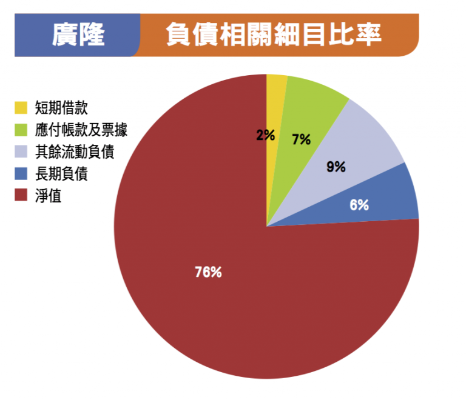
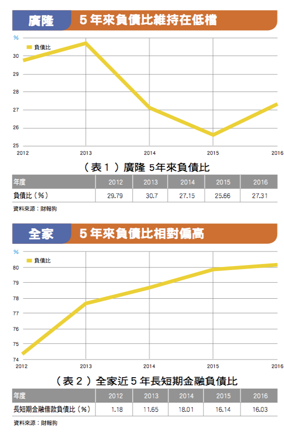
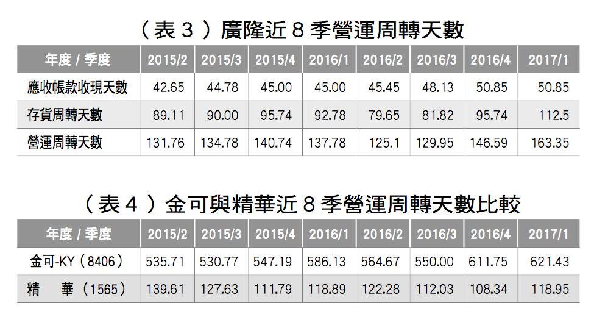
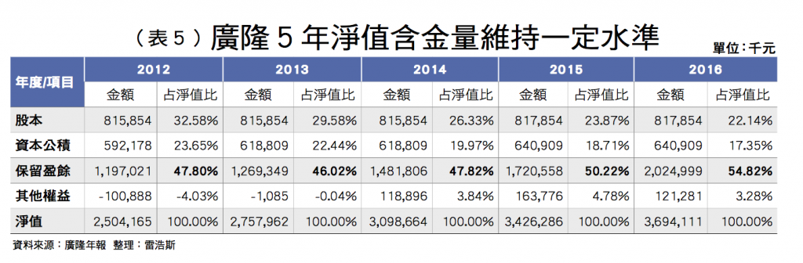
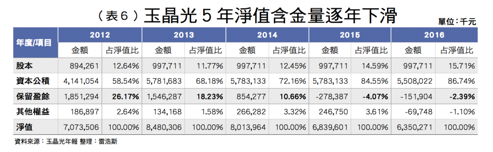

# 誰禁得起景氣榮枯？財務體質佳才值得長久抱股！

大多數的投資人看財報通常只看短期的營收數字或者EPS（每股盈餘），這些代表獲利的數字雖然重要，但是更重要的是公司能否持續維持良好的獲利！

而要維持良好獲利的公司，一定有穩定的財務體質，才能再景氣差的時候有本錢撐過低潮，景氣好的時候抓到成長的契機來提高獲利。

投資人要怎麼觀察一間公司有好的財務體質呢？我們從以下三個指標觀察：

## `指標一：低負債比`

當我們說一間公司財務結構穩定的時候，通常會認為該公司負債比很低，這個道理很簡單：`『賺錢的公司通常很少欠錢。』`

負債比的指標公式如下：`負債比=負債/總資產`

通常這個比率是越低越好，我們以廣隆(1537)為例，廣隆最新2017年第一季的負債比是23.72％，這個數字非常低，顯示財務結構相當良好。

負債比是一種靜態指標，是顯示某個時間點的財務狀況（例如某季季底或者某年年底），為了檢查長期的成效，通常要看連續五年的負債比，來了解他是長期維持低負債，還是財務結構好轉或者轉差。

底下我們繼續看廣隆的五年來的負債比：

從表格一可以看到，廣隆這五年來`負債比都在30.7%-25.66%`之間波動。

表示一直維持穩定的低負債，這是長期財務結構良好的狀況。

雖然負債比低的公司比較好，不過有些公司負債比很高，卻不見得有財務結構上的問題。

因為`負債根據類型的不同，分成跟銀行借款的長短期金融負債，和營運產生的應付款。`

如果負債比高之中`長短期金融負債相對低，應付款佔債務的比重相對高，那麼這種高負債比就不用擔心。`

表格二例如全家便利商店（5903）這五年來的負債比都在74.36%-80.12%之間，以負債比來看無疑是非常高的數字，但是其中大部分都是應付款。

如果我們把全家負債裡面的長短期金融負債的數字拉出來看，公式如下：`長短期金融借款負債比 = 長短期金融借款 / 總資產`

我們可以看到全家這五年來的`『長短期金融負債比』非常低，2016年只有就16.03%`，這表示該公司和銀行借款非常少，根本不用擔心負債的問題。

## `指標二：營運天數正常`
負債比可以看出公司借錢的情況，但是沒辦法看到公司營運的變化，而公司營運的好壞是財務體質好轉或者變差的關鍵之一。

如果營運轉差，很有可能後續財務體質會漸漸地變越來越遭。用來觀察營運變化的指標通常可以用`營運週轉天數。`

什麼叫做`營運週轉天數？`

###營運週轉天數就是`存貨週轉天數`加上`應收帳款收現天數`兩者的數字。

我們先瞭解什麼叫做存貨周轉天數，簡單的說這就是一間公司賣出存貨所需要時間，公司如果存貨賣的快，存貨周轉天數就低。

如果存貨賣得差，存貨周轉天數就會拉長，公司除了要負擔倉儲的空間費用。

甚至可能暗示了公司銷售的產品本身不佳，運氣好的話是降價銷貨，運氣差的話就要打銷存貨，這兩點都代表公司的營運能力劣化。

而公司賣出存貨之後不見得會馬上收到貨款，通常會變成一筆待收的應收帳款。

`應收帳款週轉天數代表的是收到應收帳款的時間。`

應收帳款的天數的長短通常看公司和客戶兩者相對規模大小而定，如果客戶是大公司就比較有拖貨款的談判空間，而小公司通常比較沒有談判力。

通常應收帳款天數如果持續攀高，就代表有可能被倒帳的危機，一旦被倒帳，公司的獲利和股價都會受到影響。

營運天數前兩項加起來的數字，同時也代表一個營運週期的循環，`基本上營運天數的數字是越短越好，這表示營運效率越高。`

但是各產業特性不同，所以沒有一個絕對數字。只要這個營運循環正常，就不用太過擔心公司營運。如果營運天數持續拉長，就代表營運狀況不佳，投資人就要有戒心。

 

表格三是廣隆近八季的存貨、應收帳款和營運天數，從表格可以看到廣隆2017年第一季的存貨週轉天數和2015年第二季比增加了23.39天，應收帳款天數增加了8.2天，營運天數增加了33.59天，來到了163.35天。雖然天數是增加的，但是還沒增加的太過誇張，尚屬於正常的範圍。

###那怎樣叫做營運天數`異常？`
###我們可以用同產業的營運天數做比較。

表格四是金可（8406）和精華(1565)這兩間公司的比較：

金可和精華都是隱形眼鏡產業，從表格可以看到，金可的營運週轉天數都在535-621天之間，精華的天數在139-118天之間`，這兩間公司的營運週轉天數差太多了，`金可的營運天數拖到將近兩年，這代表從出貨都收錢需要兩年的時間，很明顯有較高的營運風險！

把這兩間公司相比，投資人最好要避開數字不佳的公司。

## `指標三：淨值含金量高`

第三個指標是看淨值含金量，一間公司的淨值主要分為：`『股本、資本公積、保留盈餘，其他權益』`，這裡面前三個是投資人需要關注的主要項目。

而財務結構穩定的公司，該公司淨值含金量就高。淨值含金量的觀察在於股本沒有大幅度膨脹，和保留盈餘佔整體淨值的比重要最高。前者代表公司沒有不斷的伸手和股東增資要錢，後者代表公司累積的獲利能力。

表格五是廣隆的五年淨值含金量分析，其中可以看到股本的數字沒有大幅增加，`保留盈餘的比重一直在整體淨值約47%-54%左右`，代表廣隆的淨值含金量相當不錯。

淨值含金量低的公司則代表該公司的淨值不具備價值，我們以玉晶光為例：

表格六是玉晶光的五年淨值含金量分析，其中可以看到`保留盈餘的比重一直下滑`，近兩年甚至是負數的狀況，`2016年的保留盈餘佔淨值的比重只有-2.39%`，相當不佳。

這是因為這四年玉晶光都是虧損的狀態，所以`保留盈餘必須拿去填補虧損`。

這種淨值含金量低的狀況代表公司的營運成果低落，相對於含金量高的公司而言，這類公司的風險相對高。

如果投資人只看到高漲的股價就認為有轉機，那很可能會付出更高的風險，增加虧錢的機率。

本篇介紹三個指標，主要在於讓投資人能夠簡單的分辨財務結構良好或者較差的公司，`對任何想要長期投資的投資人來說，財務結構比獲利成長更加的重要。`

了解這些指標也能讓你在景氣好的時候提高投資表現，景氣差的時候對自己的持股懷抱信心，更重要的是

`『知識永遠是投資人最好的武器。』`