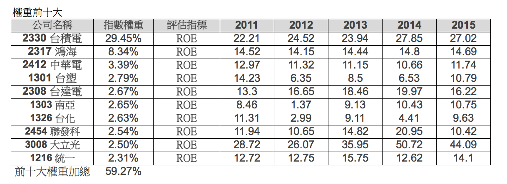
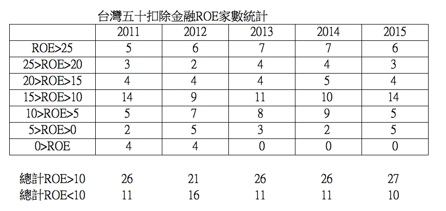

# 台灣五十ETF 的兩個結構性缺點！

基本上我很認同低成本的指數型基金，對大多數投資人來說，這是最好的投資方式！許多人都知道指數型投資有以下的優點：

- 1.個股如果買到地雷就慘了，指數不會變成地雷 。
- 2.是長期下來最有效率的投資法，只要長期持有加上股息投入，無需分神在股市。
- 3.低檔時有信心勇於加碼，降低平均成本 。

台股最知名的指數型基金就是台灣五十ＥＴＦ，它具備以下的成功優勢：`分散投資國家代表隊、整體基金的成本低、週轉率低，季度調整成分股`。

但是台灣五十也有兩個嚴重的結構性缺點：`成分股分散不足和營運表現不一`。

上面的表格是台灣五十排除金融股之後列出的前十大成分股，你可以發現`光是台積電就佔了29.45%，第二大的鴻海佔了8.34%。前十大成分股起來合計佔了59.27%`。剩下40檔個股佔剩下40%，在權重分配上明顯失衡 。

（雖然表格在列出的時候排除金融，但是權重來源參照 2016/07/15 證交所的資料http://www.twse.com.tw/ch/trading/indices/twco/tai50i.php ，並沒有因此改變比例。而台灣五十權重最大的金融股是 中信金、國泰金、富邦金、兆豐金，權重皆2%左右。 ）

再看權重前十大公司2015年的營運表現，我們使用ROE來評估，你會發現在`2015年ROE大於15%的只有台積電、台達電、大立光這三間公司`，ROE分別是27%、16%、44%。其他七間公司ROE 表現則在9%-14%之間。

 

接著我們再分析台灣五十排除金融股之後，其他公司的ROE表現。（排除金融是因為金融股不適合用ROE評估）

從上面表格可以看到，在排除金融後的37間公司之中，2015年ROE>10的有27家，ROE<10的則有10間，成分股長期營運成果表現不一。

 

##這些資料告訴我們什麼事情？

 

首先：`你的投資報酬率決定於三個變數：你的買進價格（買進本益比），你的賣出股價（賣出本益比），還有持有期間公司的獲利變化（內在價值/ROE）。`

假設買進和賣出的本益比皆不變，那麼你買入一檔股票，你的長期報酬率會趨近 ROE表現(註一)，如果你買入十檔股票，你的長期報酬率就是這十檔股票的加權ROE表現。

台灣五十的十多年來報酬率約年化 7％-8%（註二），這代表台灣五十的五十檔個股在加權平均後的ROE表現大約就是如此，你也會發現`台灣五十大多是靠高權重的台積電ROE表現來拉高整體報酬率`。

 

那麼，你要怎樣讓自己能夠得到超越台灣五十的報酬率呢？

做好『選股』和『管理投資組合』！ 