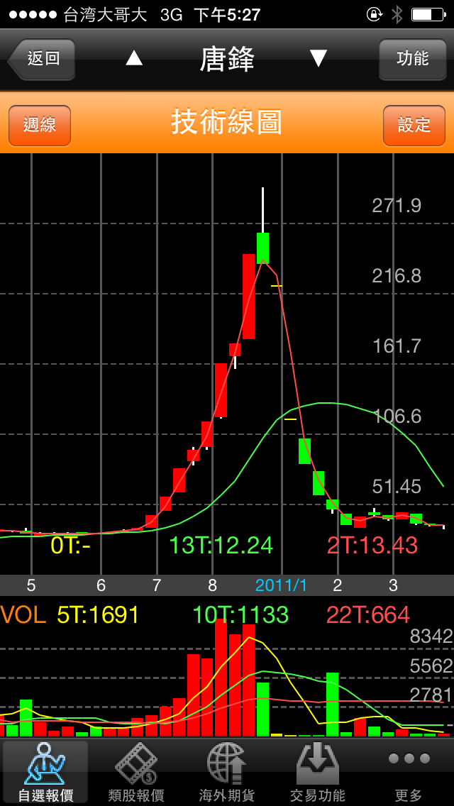

# 投資心法：價值投資，憑甚麼賺錢？

這是一個網友的問題：每天股票市場上都有比你更聰明和更勤勞的人，價值投資者憑甚麼贏過他們？

##第一點：讓我告訴你一件事情：「`投資不是智商160的人打敗智商130的遊戲`」

Why？大部分的人在股市裡面都是情緒化的，人不是貪婪、就是恐懼。漲的時候怕別人賺的比你多，跌的時候怕帳面虧損，當投資人的情緒主導大腦的時刻，智商是派不上用場的。

`非常潛力股的作者，菲利浦‧費雪`告訴我們：「`在股票市場，神經大條比智商還重要`。」，決定勝負的不是智商而是心態，保持理智就能讓你贏在起跑點。

那麼，智商和勤勞重不重要？仍然很重要，但是要瞭解這兩者對投資的影響。

先看智商，其實智商只有基本智能即可，你至少要能懂基本的加減乘除，看得懂資料，剩下智商的差異不大。

因為對投資人來智商就像籃球選手的身高，`他是一個門檻，但是不是絕對`。

麥克‧喬登不是最高的籃球選手，卻是最了不起的籃球之神。

那勤勞呢?勤勞沒用嗎？

勤勞當然有用，但是投資並不是算時薪，不是你投入的時間越多，報酬率越高。勤勞也不是廠房生產產品，不代表投資生產線越長，你的報酬率就越高。
`勤勞的目的是為了累積投資的知識`，在能力範圍內累積有用的知識，當機會來臨的時候，你才不會措手不及。

平常股市大漲的時候，很多人說等到股災就要來撿便宜。但是實際上…….會撿便宜的人少之又少，當大跌的時候，很多人不知道股票跌的原因，也許初跌段會撿便宜，但是套牢後股價繼續跌，發現子彈打光了，沒錢接了，而且接了又持續帳面虧損，心中不免會問：「`會不會這次不一樣？`」

於是開始找新聞，找資訊，但是這時候負面資訊滿天飛、消息都是營收減少，獲利大減、毛利率大降….等如果忍痛砍出股票……那就會剛好看在最低點……相當不幸的，通常這才是最好的買點。

如要克服這個問題，除了理智之外，平日的勤勞就可以派上用場了。

你會砍倉殺出的股票通常是不熟的股票，你不瞭解這間公司平常做甚麼生意，賺甚麼錢，對這間公司一點都不熟悉，因此對持股沒有信心。

勤勞是件重要的事情，在不景氣的時候透過財務分析，`預估初衰退版本的EPS`，和降低買進價格的本益比，可以避免在初跌段套牢。透過質化分析瞭解公司的護城河的強硬程度，就能避免亂殺出持股。

查理孟格告訴我們：「`我們從來不試圖成為非常聰明的人，而是持續避免讓自己成為蠢貨，久而久之，我們這種人就能取得非常大的優勢。`」(我認為說出這種話的人…..真的非常聰明!)

 

##第二點：價值投資不必贏過別人。

以交易來說，一個人的獲利等於另一個人的虧損，這叫零合遊戲。加上手續費之後，會變成「負和遊戲」。

但是價值投資不是交易，是投資，投資者的獲利長期下來會等於公司的獲利。

例如你投資了朋友開的一間餐廳，你就是股東，你的最終獲利就是這間餐廳的獲利，並且按照持股比例分紅。

把投資當交易的人，就會出現一個奇怪的觀念：「股票市場很有效率？」但是股票市場不只沒有效率，還很蠢。

如果股票市場很有效率，哪怎麼解釋「唐峰」這檔股票？你看這間公司二十九支漲停板，740%的漲幅，這叫作很有效率？`天下雜誌的報導稱其為荒謬`

股票市場的愚蠢不只唐峰，2013年十大飆股，裡面怪異又愚蠢的公司可不少，財報狗在：「`2013十大飆股—財報和產業分析`」的文章裡面點出了不少精華重點。

避開這種公司的重點不是在智商而是在心態，價值投資對於股票的比喻就是「市場先生」：

把股票市場想像成一位「市場先生」`他像是一位合夥人，每天都會出現向你報價，要買下你的股份，或將股票賣給你。不過他的情緒很不穩定，高興時只看到企業好的一面，常會提出很高的價格，以避免他的股份被你買走；但是當他鬱卒的時候，看到的儘是負面消息，這時他會提出一個非常低的報價，擔心你把股票賣給他。`

`市場先生有一個非常可愛的特質：他不在乎受到冷落，要是今天的報價無法引起你的興趣，隔天還是會重新出價，要買要賣隨便你，所以他的舉止愈失常，你就越能從中得到好處。`

股市的漲漲跌跌就是市場先生的情緒，價值投資者要在市場先生情緒失控時獲利。

效率市場理論上沒錯，`不過實際上…….理論和實際是不一樣的`。

某些信效率市場的人會產生奇妙的幻想，以為巴菲特只買未上市股票，避開市場先生。這個觀念大錯特錯「市場先生是價值投資者的好朋友，為什麼要避開？」，很可能是這個人看錯字了，才會有錯誤的觀念。

##第三點：價值投資憑甚麼賺？耐心

那麼，價值投資者憑甚麼賺錢？憑的是耐心。

我的朋友「左輪手搶」在他的blog寫到：「`不要看到黑影就開槍，聽到利多就高潮。當你只有六發子彈，六次扣板機的機會，想達到怎樣的神乎其技？`」

耐心才是關鍵，有安全邊際的股票，才能帶給價值投資者避免犯錯的機會，但是出現安全邊際的次數不多，投資人必須要有耐心，才能等待機會。 價值投資者不必有「殺進殺出的勇氣」，查理孟格說：「`有性格的人才能坐在在那邊不動，投資要成功、你需要的是極大的耐心，而不是過動症。`」

耐心不但讓你有機會買入股票，同時也讓你能長期持股，因為真正的利潤是坐等出來的。